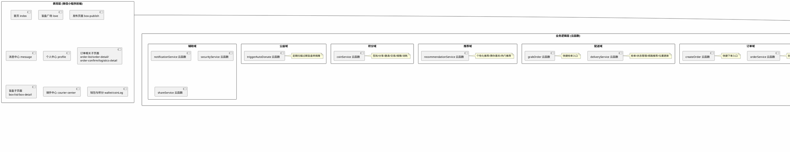
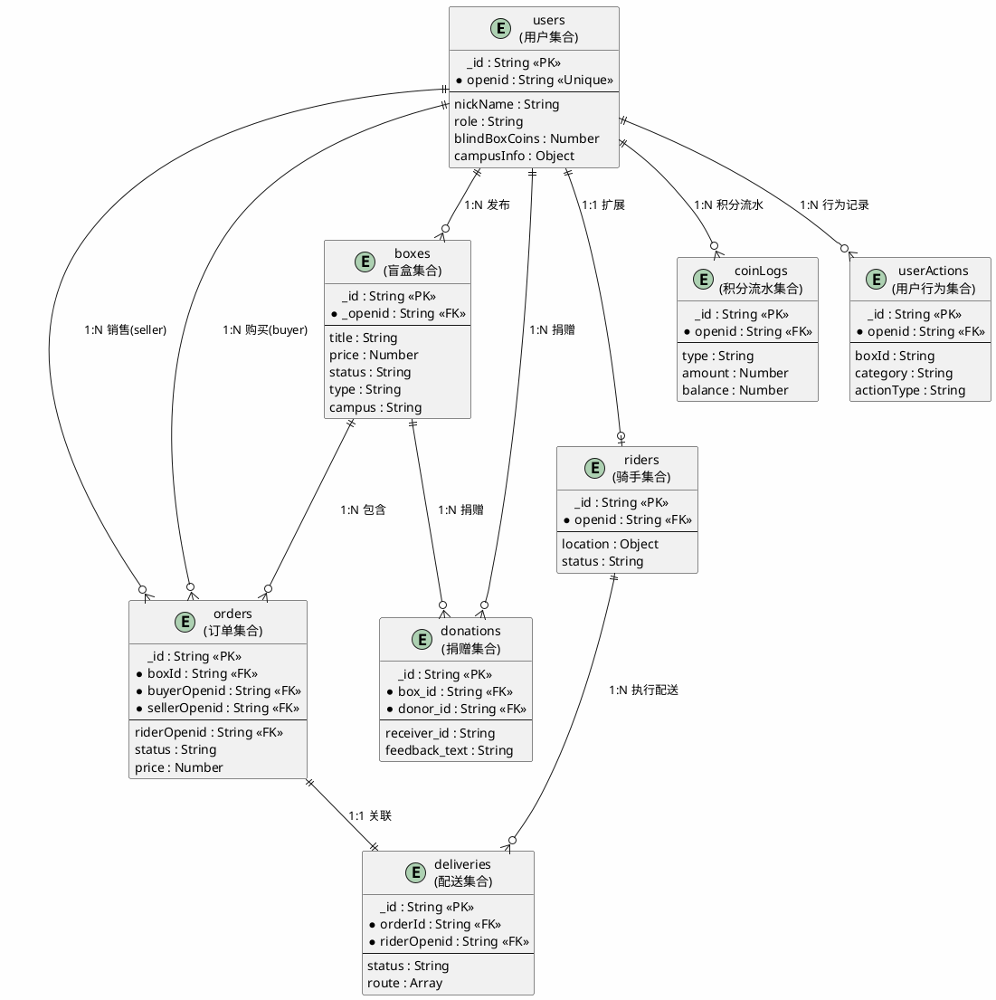
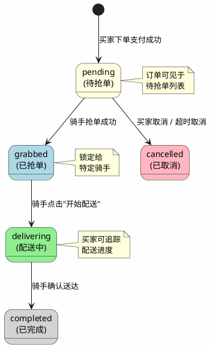

# 基于微信小程序的校园盲盒即时配送平台设计与实现

**作者**：[您的姓名]
**学号**：[您的学号]
**专业**：[您的专业]
**指导教师**：[指导教师姓名]

---

## 摘要

随着移动互联网技术的快速发展与校园经济的蓬勃兴起，盲盒消费模式在高校学生群体中获得了广泛关注。本研究针对武汉生物工程学院校园内物品流转与即时配送的实际需求，设计并实现了一款基于微信小程序的校园盲盒即时配送平台。平台采用微信小程序原生框架作为前端载体，结合腾讯云开发技术构建后端服务，实现了用户注册登录、盲盒发布与浏览、订单创建与管理、骑手抢单与配送、积分激励与公益捐赠等核心功能模块。在配送环节，研究设计了一种基于曼哈顿距离的顺路匹配算法，综合考虑距离权重（α=0.5）、时间权重（β=0.3）与路线质量权重（γ=0.2）三个维度对订单进行智能推荐，提升了配送效率。在用户运营方面，设计了涵盖签到、分享、邀请、首次交易、捐赠等场景的积分激励机制以及15天未售出自动转捐赠的公益机制。通过真机测试与初步反馈验证了平台的可行性与实用性。

**关键词**：微信小程序；校园盲盒；即时配送；云开发；顺路匹配算法

---

## Abstract

With the rapid development of mobile Internet technology and the booming campus economy, the blind box consumption model has gained widespread attention among college students. This study designs and implements a campus blind box instant delivery platform based on WeChat Mini Program, addressing the actual needs of item circulation and instant delivery at Wuhan University of Biosciences. The platform uses WeChat Mini Program native framework as the frontend and Tencent Cloud Development for backend services, implementing core modules including user registration and login, blind box publishing and browsing, order creation and management, rider order-grabbing and delivery, points incentive and public welfare donation. For delivery, a detour-friendly matching algorithm based on Manhattan distance is designed, comprehensively considering distance weight (α=0.5), time weight (β=0.3), and route quality weight (γ=0.2) for intelligent order recommendation. A points incentive mechanism covering sign-in, sharing, invitation, first trade, and donation scenarios is also designed, along with an auto-donation mechanism for unsold items after 15 days. Feasibility and practicality are verified through real device testing and preliminary feedback.

**Keywords**: WeChat Mini Program; Campus Blind Box; Instant Delivery; Cloud Development; Detour-friendly Matching Algorithm

---

## 目录

1. 引言 ................................................................................................. 1
  1.1 研究背景 ......................................................................................... 1
  1.2 国内外研究现状 ................................................................................. 2
  1.3 研究目的与意义 ................................................................................. 3
  1.4 研究内容与方法 ................................................................................. 4
  1.5 论文组织结构 ..................................................................................... 4
2. 相关技术介绍 ..................................................................................... 5
  2.1 微信小程序框架 ................................................................................. 5
  2.2 腾讯云开发技术 ................................................................................. 6
  2.3 即时配送相关算法 ............................................................................... 7
  2.4 协同过滤推荐算法 .............................................................................. 8
3. 系统需求分析 ..................................................................................... 9
  3.1 需求获取方式 .................................................................................... 9
  3.2 功能需求分析 ................................................................................... 10
  3.3 非功能需求分析 ................................................................................. 12
  3.4 用户角色分析 ................................................................................... 13
4. 系统总体设计 .................................................................................... 14
  4.1 架构设计原则 ................................................................................... 14
  4.2 总体架构设计 ................................................................................... 15
  4.3 功能模块设计 ................................................................................... 17
  4.4 数据库设计 ..................................................................................... 20
5. 系统详细实现 .................................................................................... 26
  5.1 用户管理模块实现 .............................................................................. 26
  5.2 盲盒管理模块实现 .............................................................................. 30
  5.3 订单管理模块实现 .............................................................................. 35
  5.4 配送服务模块实现 .............................................................................. 40
  5.5 推荐服务模块实现 .............................................................................. 46
  5.6 积分激励机制实现 .............................................................................. 50
  5.7 公益捐赠机制实现 .............................................................................. 54
6. 系统测试 ......................................................................................... 57
  6.1 测试环境与测试方法 ........................................................................... 57
  6.2 功能测试 ....................................................................................... 59
  6.3 性能测试 ....................................................................................... 63
  6.4 测试结果分析 ................................................................................... 64
7. 总结与展望 ..................................................................................... 66
  7.1 工作总结 ....................................................................................... 66
  7.2 局限性与改进方向 ............................................................................. 67
参考文献 ............................................................................................. 69
致谢 ................................................................................................. 75

---

## 1 引言

### 1.1 研究背景

近年来，移动互联网技术持续渗透到社会生活的各个领域。根据中国互联网络信息中心发布的第53次《中国互联网络发展状况统计报告》，截至2023年12月，我国网民规模已达10.92亿，其中手机网民占比达99.8%[^1]。在这一宏观背景下，微信小程序凭借其无需安装、用完即走的轻量化特性，已成为移动应用生态中不可或缺的组成部分。腾讯官方数据显示，微信小程序日活跃用户已突破6亿，覆盖超过200个行业细分领域[^2]。

与此同时，以盲盒为代表的"惊喜经济"消费模式在国内年轻群体中迅速兴起。盲盒的核心吸引力在于其不确定性的购买体验——消费者在购买时无法预知具体款式，这种随机性激发了强烈的收藏欲望和社交分享动力[^3]。艾瑞咨询发布的行业研究报告显示，2023年中国潮流玩具市场规模已突破800亿元，其中盲盒品类占据重要份额[^4]。在高校校园这一特定场景中，学生群体对盲盒类产品表现出较高的接受度与消费意愿。

从校园服务的角度来看，高校作为一个相对封闭但人口密集的社区，具有配送距离短、用户集中、需求规律性强等特点。传统的校园快递服务主要依赖校外物流体系，存在取件排队时间长、末端配送效率低等问题[^5]。将盲盒交易与校园即时配送相结合，一方面能够满足学生对个性化商品的需求，另一方面也为在校学生提供了灵活的兼职机会，具有一定的实践价值与社会意义。

武汉生物工程学院是一所全日制普通本科院校，拥有东西两个校区，在校生近2万人，校园面积约1700余亩。学校宿舍分布在多个生活园区，各园区之间的物品流转需求客观存在。基于上述背景，本研究选择该校园作为应用场景，设计并实现一套基于微信小程序的校园盲盒即时配送平台。

### 1.2 国内外研究现状

#### 1.2.1 校园服务平台研究

国内外学者围绕校园信息化服务开展了大量研究工作。在国外，Campus Marketplace[^6]、Student Exchange Platform[^7]等系统较早探索了校园二手物品交易平台的建设思路。国内方面，王志刚等人[^8]设计了一套基于SpringBoot的高校校园二手交易平台，采用前后端分离架构实现了商品发布、在线聊天、订单管理等核心功能。张晓丽等人[^9]则聚焦于校园跑腿服务，提出了一种基于位置的服务分配策略，通过计算配送员当前位置与任务点的距离来优化派单逻辑。李明辉等人[^10]研究了校园即时配送中的路径规划问题，利用Dijkstra算法求解最短配送路径。

然而，现有校园服务平台大多聚焦于单一业务场景（如二手交易或跑腿代购），较少将"盲盒经济"与"即时配送"进行有机结合。此外，多数系统采用传统服务器架构，部署和维护成本较高，对于个人开发者而言门槛偏大。

#### 1.2.2 盲盒经济研究

关于盲盒消费行为的研究主要集中在市场营销与消费者心理学视角。陈思等人[^11]通过问卷调查分析了Z世代消费者的盲盒购买动机，发现好奇心驱动、社交展示需求和收藏完整性是影响购买决策的三大核心因素。Resnick等人[^12]提出的协同过滤推荐算法为个性化盲盒推荐提供了理论支撑，该算法通过分析用户历史行为预测其潜在偏好，已被广泛应用于电商推荐系统中[^13]。

#### 1.2.3 即时配送算法研究

在即时配送领域，订单分配与路径规划是两大核心研究问题。代文强等人[^14]提出了一种动态时空匹配模型，综合考虑实时位置、预计送达时间和路网拥堵状况进行订单-骑手匹配。Linden等人[^15]在Amazon的商品推荐研究中提出了Item-to-Item协同过滤方法，该思想同样适用于配送场景中的"订单-骑手"匹配。Ricci等人[^16]在其专著中对推荐系统进行了全面综述，涵盖了基于内容的过滤、协同过滤及混合推荐等多种技术路线。上述研究成果为本系统的配送匹配算法设计提供了重要的理论参考。

综合来看，目前尚缺乏针对校园盲盒交易与即时配送一体化解决方案的系统研究与工程实现，这也是本研究的切入点所在。

### 1.3 研究目的与意义

本研究旨在设计并实现一款面向武汉生物工程学院的校园盲盒即时配送平台，其主要目的包括以下三个方面。

第一，构建一个便捷的校园盲盒交易平台。允许学生自主发布和购买各类盲盒商品，降低校园内物品交易的门槛，促进闲置资源的循环利用。

第二，设计高效的即时配送服务机制。引入骑手抢单模式，让学生可以注册成为骑手参与配送赚取收益；同时基于曼哈顿距离设计顺路匹配算法，为骑手智能推荐与其路线吻合度较高的待配送订单，提升整体配送效率。

第三，建立可持续的用户激励体系。通过积分奖励机制鼓励用户签到、分享、邀请好友、完成交易和参与公益捐赠，增强平台粘性；同时设计自动捐赠机制，使长期未售出的盲盒能够转化为公益资源。

本研究的意义体现在理论与实践两个层面。在理论层面，研究将协同过滤推荐算法与基于位置的顺路匹配算法应用于校园场景，为同类校园服务平台的设计提供了可参考的技术方案。在实践层面，平台采用微信小程序结合云开发的轻量级技术栈，降低了开发和运维成本，具有较高的可复制性与推广价值。

### 1.4 研究内容与方法

本研究的核心内容包括系统需求分析、总体架构设计、详细模块实现与系统测试四个部分。在需求分析阶段，主要通过日常交流与随机访谈的方式了解目标用户的功能期望和使用习惯，同时参考同类产品的功能设计确定系统边界。在架构设计阶段，遵循分层解耦的原则规划表现层、业务逻辑层与数据层的职责划分。在详细实现阶段，逐一完成用户服务（userService）、盲盒服务（boxService）、订单服务（orderService）、配送服务（deliveryService）、推荐服务（recommendationService）、积分服务（coinService）和自动捐赠服务（triggerAutoDonate）共七个核心云函数的开发工作。在测试阶段，通过功能测试、性能测试和真机体验验证系统的正确性与可用性。

研究采用的主要方法包括文献调研法、软件工程法和实验验证法。文献调研法用于了解微信小程序开发规范、云开发接口文档及相关算法原理。软件工程法贯穿需求分析、系统设计、编码实现与测试验证的全过程。实验验证法用于对关键算法（如顺路匹配算法）的效果进行分析评估。

### 1.5 论文组织结构

本文共分为七章。第一章介绍研究背景、国内外研究现状、研究目的意义及主要内容。第二章介绍微信小程序框架、腾讯云开发、顺路匹配算法和协同过滤推荐算法等相关技术。第三章进行系统的功能需求与非功能需求分析，明确用户角色与业务流程。第四章给出系统的总体架构设计、功能模块划分与数据库设计方案。第五章是论文的核心章节，详细介绍各功能模块的具体实现过程与关键技术细节。第六章描述系统测试的方法、环境与结果分析。第七章总结全文工作，指出存在的不足与未来改进方向。

---

## 2 相关技术介绍

### 2.1 微信小程序框架

微信小程序是腾讯公司于2017年1月正式推出的一种轻量级应用运行形态。与传统原生应用相比，小程序无需用户下载安装，通过扫码或搜索即可直接使用，大幅降低了用户的使用门槛[^17]。小程序的技术架构采用了双线程模型，即逻辑层（运行JavaScript代码）与渲染层（运行WXML/WXSS代码）相互分离，二者之间通过系统层提供的桥接机制进行通信，从而保证了界面渲染的流畅性[^18]。

在文件组织层面，一个小程序页面由四种类型的文件构成：WXML文件负责定义页面结构，类似于HTML；WXSS文件负责页面样式描述，大部分CSS属性均被支持并在其基础上增加了rpx响应式单位；JS文件包含页面的业务逻辑代码；JSON文件用于配置页面的窗口表现和引用的自定义组件。整个小程序的全局配置存储在根目录下的app.json文件中，其中包括页面路由表、窗口外观设置、底部TabBar配置等信息。本项目的app.json配置了五个Tab页面（首页、盲盒、发布、消息、我的）以及三十余个分包加载的子页面。

小程序的生命周期管理是其运行机制的另一核心概念。App实例的生命周期包含onLaunch（小程序启动）、onShow（前台显示）、onHide（后台隐藏）和onError（错误捕获）四个回调。Page实例的生命周期则包括onLoad（页面加载）、onShow（页面显示）、onReady（初次渲染完成）、onHide和onUnload（页面卸载）等回调。合理利用这些生命周期函数进行数据初始化和资源清理是保证小程序稳定运行的基础。

### 2.2 腾讯云开发技术

腾讯云开发（Tencent CloudBase）是腾讯云为开发者提供的一站式后端云服务。通过云开发，开发者无需自行搭建和维护服务器，即可使用云函数、云数据库、云存储和云调用等能力[^19]。这一特性使得个人开发者或小团队能够以较低的成本快速构建完整的全栈应用。

云函数是运行在云端Node.js环境中的代码片段，由事件触发执行。在本项目中，云函数承担了全部的后端业务逻辑处理工作，包括用户认证、数据CRUD操作、业务规则校验和第三方服务调用等。每个云函数都是一个独立的部署单元，支持按需自动扩缩容。当小程序端通过`wx.cloud.callFunction`接口发起调用请求时，云开发SDK会自动将请求路由至对应的云函数实例执行，并将返回结果回传给客户端。

云数据库是一种NoSQL类型的文档数据库，以集合（Collection）和记录（Document）的形式组织数据，本质上类似于MongoDB的数据模型。与关系型数据库不同，云数据库不需要预先定义固定的表结构（Schema），每条记录可以有不同的字段组成，这为敏捷开发提供了便利。云数据库提供了丰富的查询API，支持条件过滤、字段排序、分页截取、计数统计等操作，同时也支持事务（Transaction）以保证多步操作的原子性。本系统共使用了users、boxes、orders、riders、deliveries、donations、coinLogs、userActions、notifications等多个集合来存储不同类型的业务数据。

云调用是云开发提供的内置API调用能力，允许云函数直接调用微信开放接口而无需传入敏感的凭证信息。例如，通过云调用可以发送模板消息通知、获取用户UnionID或调用微信支付接口等。本项目中notificationService云函数即利用云调用能力向用户推送订单状态变更通知。

### 2.3 即时配送相关算法

即时配送系统的核心问题之一是如何高效地将待配送订单分配合适的骑手。这一问题在学术上通常被建模为一个二部图匹配问题或一个带约束的优化问题[^20]。常见的解决思路包括贪心策略、整数规划和启发式算法等。

本系统采用的顺路匹配算法基于曼哈顿距离（Manhattan Distance）度量空间位置的相近程度。曼哈顿距离又称城市街区距离，定义为两点在各坐标轴方向上投影距离之和。对于地理坐标（纬度φ，经度λ），两 点P₁(φ₁, λ₁)与P₂(φ₂, λ₂)之间的曼哈顿距离近似公式为：

$$d = (|\varphi_1 - \varphi_2| + |\lambda_1 - \lambda_2|) \times 111000 \quad \text{(米)} \tag{2-1}$$

式中111000为地球表面1个经纬度度数约对应的米数（在赤道附近）。相较于欧几里得直线距离，曼哈顿距离更符合实际道路网中沿街道行进的特点，尤其适用于校园内部的道路布局。

在计算出基础距离之后，系统进一步引入加权评分模型来综合衡量一笔订单与某位骑手的匹配程度：

$$Score = (\alpha \cdot S_{dist} + \beta \cdot S_{time} + \gamma \cdot S_{road}) \cdot S_{load} \quad \text{(式2-2)}$$

其中α=0.5为距离权重，β=0.3为时间权重，γ=0.2为路线质量权重，三者之和为1。S_dist表示距离匹配度的归一化值，S_time表示订单等待时间的衰减因子，S_road表示当前时段的路线质量系数，S_load表示骑手当前负载的惩罚因子。该公式的物理含义是：优先推荐距离近、等待时间适中且路况良好的订单给当前负载较低的骑手。

### 2.4 协同过滤推荐算法

协同过滤（Collaborative Filtering）是目前应用最为广泛的推荐算法之一，其核心思想是根据用户的历史行为或物品的相似性来预测用户的潜在兴趣[^12]。协同过滤主要分为两类：基于用户的协同过滤（User-CF）和基于物品的协同过滤（Item-CF）。

本系统的recommendationService云函数采用的是一种简化版的基于行为的协同过滤策略。具体做法是：首先收集用户在平台上的浏览、点击、购买等交互行为，将其存储在userActions集合中；然后对这些行为数据进行统计分析，提取用户的分类偏好（category preference）和价格区间偏好（price range preference）；最后根据提取出的偏好特征，在boxes集合中筛选出符合条件且用户尚未浏览过的盲盒作为推荐结果返回。这一策略的计算复杂度较低，能够在云函数的执行时限内完成，适合当前系统的数据规模。

---

## 3 系统需求分析

### 3.1 需求获取方式

本系统的需求获取主要依托两种途径。第一种是与身边同学进行的日常交流和非正式讨论，了解他们在日常校园生活中遇到的物品流转困难以及对盲盒类产品的态度。第二种是邀请部分同学对开发版小程序进行真机试用，收集他们在操作过程中提出的意见和建议。需要说明的是，受限于时间和人力条件，本研究并未开展大规模的标准化问卷调查，因此后续的需求陈述更多反映的是一种摸底层面的认知而非严格统计学意义上的结论。

通过与多位同学的交流，归纳出的核心痛点主要包括以下几点：校园内缺乏集中的二手或特色商品交易平台，现有的微信群/QQ群交易方式信息杂乱且难以追溯；从宿舍区到教学楼或其他园区的取件需求频繁，但专业配送服务缺失；学生对带有惊喜属性的购物形式（如盲盒）有较强的好奇心和尝试意愿；希望能够通过简单的操作完成发布、下单和配送的全流程，而不必在多个应用之间切换。

### 3.2 功能需求分析

基于前期的交流与试测反馈，将系统的功能需求梳理如下表所示。

**表3-1 系统功能需求列表**

| 需求编号 | 需求名称 | 需求描述 | 优先级 |
|---------|---------|---------|-------|
| FR01 | 用户注册登录 | 支持微信一键登录，自动获取openid和基本信息 | P0 |
| FR02 | 校园信息维护 | 用户可填写和修改所属学院和宿舍楼栋信息 | P0 |
| FR03 | 角色管理 | 支持普通用户和学生骑手角色的区分与切换 | P1 |
| FR04 | 盲盒发布 | 用户可上传图片、填写标题描述和定价，发布盲盒商品 | P0 |
| FR05 | 盲盒浏览 | 首页展示最新发布的盲盒列表，支持按类型/校区筛选 | P0 |
| FR06 | 盲盒详情 | 查看盲盒的完整信息，包括图片轮播、价格、描述等 | P0 |
| FR07 | 下单购买 | 选择盲盒后确认地址和联系方式，生成待抢单订单 | P0 |
| FR08 | 订单管理 | 买家和卖家均可查看各自关联的订单列表和状态详情 | P0 |
| FR09 | 骑手注册 | 普通用户可申请成为骑手，写入riders独立集合 | P1 |
| FR10 | 骑手抢单 | 骑手查看待抢单列表，点击抢单锁定订单 | P0 |
| FR11 | 配送管理 | 骑手更新配送状态（开始配送→完成送达），上报位置 | P0 |
| FR12 | 顺路推荐 | 基于骑手当前位置和负载，智能推荐匹配度高的订单 | P1 |
| FR13 | 积分获取 | 通过签到、分享、邀请好友、首次交易、捐赠获得积分 | P1 |
| FR14 | 积分消耗 | 使用积分参与摇一摇等互动功能 | P2 |
| FR15 | 积分记录 | 查看积分变动的流水日志 | P2 |
| FR16 | 自动捐赠 | 发布超15天仍未售出的盲盒自动转为待捐赠状态 | P1 |
| FR17 | 消息通知 | 订单状态变更时向买家和卖家推送通知 | P1 |
| FR18 | 个性化推荐 | 根据用户浏览行为推荐可能感兴趣的盲盒 | P2 |

### 3.3 非功能需求分析

除了功能性需求之外，系统还需满足以下非功能性约束。

**表3-2 非功能需求列表**

| 需求类别 | 具体要求 |
|---------|---------|
| 性能要求 | 页面首屏加载时间不超过2秒；云函数平均响应时间不超过500毫秒 |
| 可用性要求 | 界面操作直观简洁，新用户可在无指导下完成核心流程 |
| 安全性要求 | 用户敏感数据（如手机号）脱敏存储；订单操作权限基于 openid 校验 |
| 可扩展性要求 | 云函数采用action分发模式设计，便于新增操作类型 |
| 兼容性要求 | 支持微信iOS端和Android端的最新版本 |

### 3.4 用户角色分析

系统涉及三类用户角色，各自的职责和权限如下所示。

普通用户是平台的基础角色，注册后即可浏览盲盒、发布盲盒、下单购买、查看订单、参与积分活动和查看推荐内容。普通用户的典型使用场景包括：在首页浏览最新的盲盒商品，对自己感兴趣的盲盒点击进入详情页，确认后提交订单并等待骑手接单配送。

学生骑手是由普通用户申请升级而来的角色，除具备普通用户的所有权限外，还可以查看待抢单列表、执行抢单操作、管理自己的配送任务、接收顺路推荐的订单以及上报实时位置。骑手角色的引入使得配送任务的执行者同时也是平台的学生用户，形成了校内互助的配送生态。

管理员角色（本系统中暂由开发者兼任）负责平台的基础运营管理工作，包括审核商家入驻申请、处理用户举报、查看运营数据统计等。考虑到当前项目处于初期运营阶段，管理功能的设计以实用为主，未构建独立的管理后台界面。

```plantuml
@startuml 用例图
skinparam backgroundColor #FEFEFE
skinparam handwritten false
skinparam actorStyle awesome

actor "普通用户" as User
actor "学生骑手" as Rider
actor "管理员" as Admin
rectangle "校园盲盒即时配送平台" {
  usecase "微信登录" as UC1
  usecase "发布盲盒" as UC2
  usecase "浏览盲盒" as UC3
  usecase "下单购买" as UC4
  usecase "查看订单" as UC5
  usecase "参与积分活动" as UC6
  usecase "查看个性化推荐" as UC7
  usecase "申请成为骑手" as UC8
  usecase "查看待抢单列表" as UC9
  usecase "抢单" as UC10
  usecase "更新配送状态" as UC11
  usecase "接收顺路推荐" as UC12
  usecase "上报位置" as UC13
  usecase "审核商家申请" as UC14
  usecase "处理用户举报" as UC15
}

User --> UC1
User --> UC2
User --> UC3
User --> UC4
User --> UC5
User --> UC6
User --> UC7

Rider --> UC1
Rider --> UC2
Rider --> UC3
Rider --> UC4
Rider --> UC5
Rider --> UC6
Rider --> UC7
Rider --> UC8
Rider --> UC9
Rider --> UC10
Rider --> UC11
Rider --> UC12
Rider --> UC13

Admin --> UC14
Admin --> UC15

@enduml
```



**图3-1 系统用例图**

---

## 4 系统总体设计

### 4.1 架构设计原则

在进行系统架构设计时，遵循了以下几个基本原则。首先是关注点分离原则（Separation of Concerns），将表现层的界面渲染与交互逻辑完全交由小程序端处理，将业务规则和数据持久化交由云函数端处理，两者之间通过标准化的函数调用接口进行通信，避免跨层耦合。其次是单一职责原则（Single Responsibility），每个云函数只负责一类业务领域的操作。例如userService仅处理用户相关的逻辑，boxService仅处理盲盒相关的逻辑，orderService仅处理订单相关的逻辑。再次是数据一致性原则，涉及多集合联动的写操作（如创建订单同时更新盲盒状态）在同一云函数调用的事务上下文中完成，避免出现中间状态。最后是渐进降级原则，对于非关键路径的操作（如首页统计数据获取），在数据库查询异常时返回合理的默认值或模拟数据，确保前端不会因后端个别接口失败而白屏。

### 4.2 总体架构设计

系统整体采用三层架构模式，自上而下分别为表现层、业务逻辑层和数据层。表现层由微信小程序前端构成，负责页面渲染和用户交互。业务逻辑层由部署在腾讯云开发环境中的云函数集群构成，每个云函数对应一个独立的业务域。数据层由云数据库和云存储构成，分别负责结构化数据和文件资源的持久化存储。三层之间通过云开发SDK提供的调用链路进行连接。



**图4-1 系统总体架构图**

从上图可以看出，系统的云函数按照业务域进行了清晰的分组。用户域的userService负责处理登录认证和用户信息维护。盲盒域的boxService和publishBox共同完成盲盒的发布与展示功能。订单域的orderService和createOrder协作处理订单生命周期。配送域的deliveryService是最复杂的云函数，封装了抢单、状态管理和顺路匹配算法。推荐域的recommendationService提供基于用户行为的个性化推荐能力。积分域的coinService管理完整的积分获取与消耗流水。公益域的triggerAutoDonate实现定时扫描与自动状态转换逻辑。

### 4.3 功能模块设计

依据前述架构设计，将系统划分为以下六个核心功能模块。

```plantuml
@startuml 功能模块图
skinparam backgroundColor #FEFEFE
skinparam handwritten false

rectangle "校园盲盒即时配送平台" as System #LightBlue
rectangle "用户管理模块" as M1 #E0F0FF
rectangle "盲盒交易模块" as M2 #FFF0E0
 rectangle "订单管理模块" as M3 #E0FFE0
rectangle "配送服务模块" as M4 #F0E0FF
rectangle "推荐与激励模块" as M5 #FFFFD0
rectangle "公益捐赠模块" as M6 #FFE0E0

System: 微信小程序+云开发
M1: 用户登录注册\n校园信息维护\n角色管理(用户/骑手)
M2: 盲盒发布(标题/图片/价格/校区)\n盲盒列表(分类/筛选)\n盲盒详情
M3: 订单创建(买家/卖家/地址)\n订单状态流转\n订单列表查询
M4: 骑手注册\n抢单机制\n配送状态追踪\n顺路匹配算法
M5: 协同过滤推荐\n积分获取(签到/分享/邀请/交易/捐赠)\n积分消耗与记录
M6: 15天未售自动转赠\n捐赠池管理\n领取与反馈

@enduml
```

**图4-2 功能模块划分图**

下面针对每个模块的设计要点进行说明。

#### 4.3.1 用户管理模块设计

用户管理模块是系统的基础支撑模块，主要负责用户身份的识别与基本信息的维护。模块设计的核心实体是存储在users集合中的用户文档，其关键字段包括openid（微信唯一标识，用作主键索引）、nickName（昵称）、avatarUrl（头像URL）、campusInfo（嵌套对象，含college学院和dorm宿舍信息）、role（角色标识，取值为student/rider/admin）、blindBoxCoins（盲盒积分余额）、lovePoints（爱心值）以及verifyStatus（实名认证状态）。模块对外暴露三个操作接口：login（登录或注册）、updateCampusInfo（更新校园信息）和getUserInfo（查询用户信息）。登录接口的逻辑为：通过cloud.getWXContext()获取调用者的openid，以此在users集合中查找是否已有记录，若有则更新昵称和头像等易变字段后返回已有用户信息，若无则创建一条新的用户记录并赋予初始值（默认角色student，初始积分10）后返回新用户信息。

#### 4.3.2 盲盒交易模块设计

盲盒交易模块覆盖了盲盒商品从发布到被用户浏览查看的完整链路。模块的核心实体是存储在boxes集合中的盲盒文档，关键字段包括title（标题）、desc（描述文本）、type（类型，取值为secondhand二手或original原创）、mode（模式，取值为light轻度或dark深度）、price（价格，单位元）、campus（所在校区）、building（所在楼栋）、images（图片URL数组，最多9张）、status（状态，取值为available在售或sold已售出）以及openid（发布者标识）。模块对外暴露publish（发布盲盒）、list（分页列表查询）、detail（单条详情查询）和home（首页聚合数据）四个操作接口。发布接口在写入boxes集合的同时会自动计算并记录expire_time（7天后过期）和donate_time（15天后捐赠）两个时间戳，供后续自动捐赠逻辑使用。列表接口支持按type和campus进行过滤，并始终以createdAt字段倒序排列。首页接口除了返回最新的10条在售盲盒外，还会附加当日新增数量、配送中订单数和累计捐赠数三项统计指标，若数据库查询失败则返回预设的降级模拟数据以保证前端展示的健壮性。

#### 4.3.3 订单管理模块设计

订单管理模块负责处理买卖双方达成交易后产生的订单数据的全生命周期管理。模块的核心实体是存储在orders集合中的订单文档，关键字段包括boxId（关联的盲盒ID）、boxInfo（下单时快照的盲盒详情）、buyerOpenid（买家标识）、sellerOpenid（卖家标识）、price（成交价）、paymentMethod（支付方式）、address（配送地址对象）、contact（联系方式对象）和status（订单状态）。订单的状态机设计包含五种状态：pending（待抢单，即买家已下单支付成功，等待骑手接单）、grabbed（已抢单，某位骑手已成功锁定该订单）、delivering（配送中，骑手已出发正在配送）、completed（已完成，骑手确认送达）和cancelled（已取消，交易终止）。状态只能按照pending→grabbed→delivering→completed的正向路径流转，或在pending状态下被取消。模块对外暴露create（创建订单）、updateStatus（更新状态）、list（分页列表查询）和detail（详情查询）四个操作接口。创建订单时会同步检查关联盲盒的状态是否为available，若通过则写入订单并将盲盒状态置为sold，保证库存一致性。状态更新接口在完成数据库写入后，还会异步调用notificationService向买卖双方推送状态变更通知消息。

#### 4.3.4 配送服务模块设计

配送服务模块是系统中算法密集度最高的模块，负责骑手侧的全部业务逻辑。模块涉及两个核心实体：存储在riders集合中的骑手档案和存储在deliveries集合中的配送记录。骑手档案记录了骑手的openid、当前地理位置location（含latitude和longitude）、定位精度accuracy、最后位置更新时间等字段。配送记录则记录了orderId、riderOpenid、riderInfo（骑手快照信息）、status和route（配送路线坐标序列）。模块对外暴露的操作接口最为丰富，包括grab（抢单）、updateStatus（更新配送状态）、getRiderOrders（查询骑手自己的订单列表）、getPendingOrders（查询全局待抢单列表）、getRecommendedOrders（获取顺路推荐订单）和updateRiderLocation（更新骑手位置）。其中getRecommendedOrders接口是实现顺路匹配算法的核心入口，其处理流程为：先获取骑手当前信息和进行中的订单数作为负载指标，再拉取所有pending状态的订单逐笔计算匹配评分，最后按评分降序排列返回Top-N结果。

#### 4.3.5 推荐与激励模块设计

推荐与激励模块由两个独立的云函数构成。recommendationService负责个性化推荐功能，其设计思路是采集用户在userActions集合中的历史行为数据（包括浏览过的盲盒ID、所属分类、价格区间等），统计分析出用户的分类偏好和价格偏好，然后在boxes集合中筛选符合这些偏好条件且用户最近未曾浏览过的盲盒作为推荐结果返回。coinService负责积分的获取与消耗管理，定义了六种积分变更操作及其对应的分值：每日签到+1分、分享商品+2分（每日限3次）、邀请好友注册+10分、完成首次交易+5分、参与公益捐赠+5分、摇一摇消耗-10分。每次积分变动都会在coinLogs集合中追加一条流水记录，包含openid、操作类型、变动金额、变动后余额、描述文字和时间戳，以便用户随时查阅和运营端审计。

#### 4.3.6 公益捐赠模块设计

公益捐赠模块体现了平台的公益属性，由triggerAutoDonate云函数独立承载。其设计逻辑为：以当前时间为基准向前推算15天，在boxes集合中筛选出所有status仍为active且publish_time早于该时间节点的盲盒记录，然后将这些盲盒的status更新为donated_pending（待捐赠），同时在donations集合中为每一笔插入一条捐赠记录（包含box_id、donor_id、receiver_id初始为空表示待认领、反馈图文字段和创建时间）。该云函数可以被配置为定时触发器定期执行（如每日凌晨扫描一次），也可以由管理员手动调用执行。捐赠后的盲盒可以在爱心页面被其他用户免费领取，领取后填写反馈图文即可完成一次公益流转闭环。

### 4.4 数据库设计

由于系统基于腾讯云开发构建，其数据持久化层采用NoSQL风格的文档数据库。不同于传统关系型数据库需要预先定义严格的表结构和外键约束，云数据库的集合（Collection）允许每条文档（Document）拥有灵活的字段组合。下面列出系统中各核心集合的字段设计及其含义说明。

#### 4.4.1 users集合（用户集合）

**表4-1 users集合结构**

| 字段名 | 数据类型 | 是否必填 | 说明 |
|-------|---------|---------|------|
| _id | String | 自动生成 | 用户唯一标识，系统自动生成 |
| openid | String | 是 | 微信openid，用作业务主键 |
| nickName | String | 是 | 用户昵称 |
| avatarUrl | String | 否 | 用户头像URL |
| campusInfo.college | String | 否 | 所属学院 |
| campusInfo.dorm | String | 否 | 所在宿舍楼栋 |
| role | String | 是 | 角色：student（学生）/rider（骑手）/admin（管理员） |
| blindBoxCoins | Number | 是 | 盲盒积分余额，默认初始值为10 |
| lovePoints | Number | 是 | 爱心值，默认初始值为0 |
| verifyStatus | String | 是 | 认证状态，默认unverified |
| createdAt | Date | 是 | 记录创建时间 |
| updatedAt | Date | 是 | 记录最后更新时间 |

#### 4.4.2 boxes集合（盲盒集合）

**表4-2 boxes集合结构**

| 字段名 | 数据类型 | 是否必填 | 说明 |
|-------|---------|---------|------|
| _id | String | 自动生成 | 盲盒唯一标识 |
| title | String | 是 | 盲盒标题 |
| desc | String | 否 | 盲盒文字描述 |
| type | String | 是 | 类型：secondhand（二手）/original（原创） |
| mode | String | 是 | 模式：light（轻度）/dark（深度） |
| price | Number | 是 | 价格（单位：元） |
| campus | String | 是 | 所在校区 |
| building | String | 是 | 所在楼栋 |
| images | Array | 否 | 图片URL列表（最多9张） |
| _openid | String | 是 | 发布者openid |
| status | String | 是 | 状态：available（在售）/sold（已售）/donated_pending（待捐赠） |
| publish_time | Number | 是 | 发布时间戳 |
| expire_time | Number | 是 | 过期时间（发布后7天） |
| donate_time | Number | 是 | 捐赠时间（发布后15天） |
| from_dorm | String | 否 | 起始宿舍（快捷发布用） |
| to_dorm | String | 否 | 目标宿舍（快捷发布用） |
| note | String | 否 | 备注信息 |
| createdAt | Date | 是 | 创建时间 |
| updatedAt | Date | 是 | 更新时间 |

#### 4.4.3 orders集合（订单集合）

**表4-3 orders集合结构**

| 字段名 | 数据类型 | 是否必填 | 说明 |
|-------|---------|---------|------|
| _id | String | 自动生成 | 订单唯一标识 |
| boxId | String | 是 | 关联的盲盒ID |
| boxInfo | Object | 是 | 下单时盲盒信息的快照 |
| buyerOpenid | String | 是 | 买家openid |
| sellerOpenid | String | 是 | 卖家openid |
| riderOpenid | String | 否 | 接单骑手的openid（抢单后填入） |
| price | Number | 是 | 盲盒价格 |
| paymentMethod | String | 否 | 支付方式 |
| address | Object | 是 | 配送地址信息 |
| contact | Object | 是 | 联系方式 |
| status | String | 是 | pending/grabbed/delivering/completed/cancelled |
| grabbed_at | Date | 否 | 抢单时间 |
| delivery_fee | Number | 否 | 配送费（快捷下单用） |
| delivery_status | String | 否 | 配送状态（快捷下单用） |
| create_time | Number | 否 | 创建时间戳（快捷下单用） |
| createdAt | Date | 是 | 创建时间 |
| updatedAt | Date | 是 | 更新时间 |

#### 4.4.4 riders集合（骑手集合）

**表4-4 riders集合结构**

| 字段名 | 数据类型 | 是否必填 | 说明 |
|-------|---------|---------|------|
| _id | String | 自动生成 | 骑手记录唯一标识 |
| openid | String | 是 | 对应用户的openid（关联users集合） |
| location.latitude | Number | 否 | 当前纬度 |
| location.longitude | Number | 否 | 当前经度 |
| accuracy | Number | 否 | 定位精度（米） |
| lastLocationUpdate | Date | 否 | 最后位置更新时间 |
| status | String | 否 | 在线状态 |
| orderCount | Number | 否 | 完成订单数 |
| rating | Number | 否 | 评分 |
| createdAt | Date | 是 | 创建时间 |
| updatedAt | Date | 是 | 更新时间 |

注意：riders集合与users集合是相互独立的，一位用户要成为骑手需要在riders集合中额外建立一条档案记录。这种独立集合的设计便于扩展骑手特有的字段（如位置、评分、接单量等），同时不影响users集合的结构稳定性。

#### 4.4.5 deliveries集合（配送集合）

**表4-5 deliveries集合结构**

| 字段名 | 数据类型 | 是否必填 | 说明 |
|-------|---------|---------|------|
| _id | String | 自动生成 | 配送记录唯一标识 |
| orderId | String | 是 | 关联的订单ID（orders集合） |
| riderOpenid | String | 是 | 执行配送的骑手openid |
| riderInfo | Object | 是 | 骑手信息快照 |
| status | String | 是 | pending/delivering/completed |
| route | Array | 否 | 配送路线坐标序列 |
| createdAt | Date | 是 | 创建时间 |
| updatedAt | Date | 是 | 更新时间 |

#### 4.4.6 其他辅助集合

**表4-6 辅助集合一览**

| 集合名 | 用途 | 主要字段 |
|-------|------|---------|
| donations | 存储捐赠记录 | box_id, donor_id, receiver_id, feedback_img, feedback_text, create_time |
| coinLogs | 存储积分变动流水 | openid, type, amount, balance, description, extraData, createdAt |
| userActions | 存储用户行为数据 | openid, boxId, category, price, actionType, createdAt |
| notifications | 存储通知消息 | openid, title, content, type, relatedId, isRead, createdAt |

#### 4.4.7 E-R关系图

基于上述集合设计，各实体之间的关系可用下图表示。用户（users）与盲盒（boxes）之间是一对多的发布关系（通过_openid关联）。用户与订单（orders）之间存在两种角色关系：作为buyerOpenid时是一对多的购买关系，作为sellerOpenid时是一对多的销售关系。骑手（riders）本质上是用户的一个扩展角色，通过openid关联到users。骑手与配送记录（deliveries）之间是一对多的执行关系。配送记录与订单之间是一对一的关联关系。盲盒与订单之间也是一对多的包含关系。捐赠记录（donations）关联盲盒和捐赠者。



**图4-3 数据库E-R图**

#### 4.4.8 订单状态流转设计

订单从创建到最终完结经历的状态变化如下图所示。用户下单后订单处于pending状态（待抢单），此时订单出现在骑手的待抢单列表中。一旦某位骑手抢单成功，订单转为grabbed状态（已抢单），其他骑手无法再抢该订单。骑手点击"开始配送"后订单进入delivering状态（配送中），此时买家可以追踪配送进度。骑手确认送达后订单变为completed状态（已完成），整个交易流程结束。如果在pending阶段用户主动取消或超时未有人抢单，订单则转入cancelled状态（已取消）。


**图4-4 订单状态流转图**

#### 4.4.9 核心业务流程设计

##### （1）盲盒发布与购买流程

盲盒发布与购买是平台的主营业务流程。发布方在发布页面填写标题、上传图片、设定价格和选择校区楼栋后，调用publishBox或boxService云函数将数据写入boxes集合。购买方在首页或列表页浏览盲盒，进入详情页后点击购买，调用createOrder或orderService云函数创建订单并支付，订单进入待抢单状态。

```plantuml
@startuml 盲盒发布购买流程图
skinparam backgroundColor #FEFEFE
skinparam handwritten false

start
:用户打开发布页面;
:填写盲盒信息\n(标题/图片/价格/校区/楼栋);
:点击发布按钮;
:调用publishBox云函数;
:写入boxes集合;
:返回发布成功;

split again
:买家浏览盲盒列表;
:点击进入详情页;
:查看盲盒详细信息;
:点击立即购买;
:确认收货地址和联系方式;
:调用createOrder/orderService云函数;
:校验盲盒状态为available;
:写入orders集合;
:更新盲盒状态为sold;
:订单状态设为pending;
stop

@enduml
```
**图4-5 盲盒发布与购买流程图**

##### （2）骑手抢单与配送流程

骑手在骑手中心页面可以看到所有处于pending状态的订单列表。骑手可以选择手动浏览列表进行抢单，也可以开启顺路推荐模式，系统根据其当前位置和负载情况智能推荐匹配度最高的若干订单。抢单成功后订单转入grabbed状态，骑手随后可以开始配送并在完成后确认送达。

```plantuml
@startuml 骑手抢单配送流程图
skinparam.backgroundColor #FEFEFE
skinparam.handwritten false

start
:骑手进入骑手中心;
if (使用顺路推荐?) then (是)
  :上报当前位置(location);
  :调用deliveryService\ngetRecommendedOrders;
  :系统计算每笔订单匹配评分;
  :按评分排序返回Top-N;
else (否)
  :调用getPendingOrders\n获取全部待抢单列表;
endif
:骑手浏览订单列表;
:选择一笔订单点击抢单;
:调用grabOrder/deliveryService grab;
:校验订单状态为pending;
  :校验用户角色为rider;
:更新订单→grabbed;
:更新配送记录→pending;
:抢单成功;

:骑手点击"开始配送";
:更新状态→delivering;
:途中可上报位置;

:到达目的地;
:点击"确认送达";
:更新状态→completed;
:发送完成通知给买家;
stop

@enduml
```
**图4-6 骑手抢单与配送流程图**

##### （3）积分获取与消耗流程

积分系统贯穿用户在平台上的多种交互行为。用户可以通过每日签到、分享商品、邀请好友注册、完成首次交易和参与公益捐赠五种途径获取积分，也可以使用积分参与摇一摇互动进行消耗。每次积分变动都会记录流水。

```plantuml
@startuml 积分流程图
skinparam.backgroundColor #FEFEFE
skinparam.handwritten false

start
switch (操作类型?)
case ( 每日签到 )
  :调用coinService signIn;
  :检查今日是否已签;
  if (已签到?) then (是)
    :返回"今日已签到";
    stop
  else (否)
    :coins += 1;
  endif
case ( 分享商品 )
  :调用coinService share;
  :检查今日分享次数(<3?);
  :coins += 2;
case ( 邀请好友 )
  :调用coinService invite;
  :检查是否已邀请过该用户;
  :coins += 10;
case ( 首次交易 )
  :调用coinService firstTrade;
  :检查是否已获奖励;
  :coins += 5;
case ( 公益捐赠 )
  :调用coinService donate;
  :coins += 5;
case ( 摇一摇消耗 )
  :调用coinService consume;
  :检查余额是否充足;
  if (充足?) then (是)
    :coins -= 10;
  else (否)
    :返回"积分不足";
    stop
  endif
endswitch
:更新users集合blindBoxCoins;
:写入coinLogs流水记录;
:返回操作成功+当前余额;
stop

@enduml
```
**图4-7 积分获取与消耗流程图**

---

## 5 系统详细实现

本章将对照第四章的设计方案，逐一阐述各功能模块的具体实现细节，包括关键的代码片段和技术要点。实现语言统一采用运行在云函数Node.js环境中的JavaScript（遵循CommonJS模块规范）。

### 5.1 用户管理模块实现

#### 5.1.1 userService云函数实现

用户管理模块的实现主体是userService云函数，源码位于`cloudfunctions/userService/index.js`。该云函数采用action分发模式，根据传入的event.action参数路由到不同的处理函数。

云函数入口处首先通过`cloud.init()`完成初始化，然后通过`cloud.database()`获取数据库实例和users集合的引用。main导出函数内部使用switch语句对action进行分发，当前支持'login'、'updateCampusInfo'和'getUserInfo'三种操作。

登录处理函数handleLogin的核心逻辑如代码片段5-1所示。该函数首先通过`cloud.getWXContext().OPENID`获取当前调用者的微信openid，这是微信云开发框架自动注入的安全标识，无需前端传递。然后使用该openid在users集合中执行where查询，判断用户是否已存在。如果查询结果非空（data.length > 0），说明是老用户回访，执行update操作刷新nickName和avatarUrl后返回用户信息。如果查询结果为空，说明是新用户首次访问，构造包含默认值的 newUser 对象后调用add方法插入集合并返回。默认值设定中，role初始为'student'（普通学生），blindBoxCoins初始为10（新用户礼包），lovePoints初始为0。

```javascript
// cloudfunctions/userService/index.js —— 代码片段5-1：登录处理核心逻辑
const cloud = require('wx-server-sdk')
cloud.init()
const db = cloud.database()
const usersCollection = db.collection('users')

async function handleLogin(data) {
  const { userInfo } = data
  // 通过云开发安全上下文获取openid，无需前端传入
  const wxContext = cloud.getWXContext()
  const openid = wxContext.OPENID
  
  // 以openid为索引查询用户是否已注册
  const existingUser = await usersCollection.where({ openid }).get()
  
  if (existingUser.data.length > 0) {
    // 老用户：更新昵称和头像等易变信息
    const user = existingUser.data[0]
    await usersCollection.doc(user._id).update({
      data: { nickName: userInfo.nickName, avatarUrl: userInfo.avatarUrl, updatedAt: new Date() }
    })
    return { success: true, user: { _id: user._id, openid, ... } }
  } else {
    // 新用户：创建记录并赋予初始值
    const newUser = { openid, nickName: userInfo.nickName, role: 'student', blindBoxCoins: 10, lovePoints: 0, ... }
    const result = await usersCollection.add(newUser)
    return { success: true, user: { ...newUser, _id: result._id } }
  }
}
```

校园信息更新函数handleUpdateCampusInfo的实现较为直观：先以openid查找到用户文档，然后使用update方法将campusInfo对象整体替换为传入的新值（包含college和dorm两个字段）。这里使用了嵌套对象的更新语法，云数据库会自动进行深合并。

#### 5.1.2 前端登录页面实现

小程序端登录的交互逻辑封装在app.js的onLaunch生命周期中。当小程序启动时，先调用wx.checkSession检查登录态是否有效，若有效则从本地缓存读取userInfo直接使用，若无效则引导用户点击登录按钮触发wx.getUserProfile授权弹窗（该接口要求用户主动触发才能调起）。获取到用户信息后，调用wx.cloud.callFunction发起对userService云函数login action的远程调用，将返回的用户信息存入全局变量和本地缓存。

### 5.2 盲盒交易模块实现

#### 5.2.1 publishBox云函数实现——快捷发布

publishBox云函数是一个轻量级的盲盒快捷发布入口，适用于用户希望快速发布一个简单盲盒的场景。其源码位于`cloudfunctions/publishBox/index.js`，如代码片段5-2所示。

```javascript
// cloudfunctions/publishBox/index.js —— 代码片段5-2：盲盒快捷发布
const cloud = require('wx-server-sdk')
cloud.init({ env: cloud.DYNAMIC_CURRENT_ENV })
const db = cloud.database()

exports.main = async (event, context) => {
  try {
    const { title, price, images, from_dorm, to_dorm, note } = event
    const openid = cloud.getWXContext().OPENID
    const now = Date.now()
    
    // 计算过期时间（7天）和捐赠时间（15天）
    const expire_time = now + 7 * 24 * 60 * 60 * 1000
    const donate_time = now + 15 * 24 * 60 * 60 * 1000
    
    // 写入boxes集合
    const result = await db.collection('boxes').add({
      data: {
        title, price, images,
        status: 'active',
        publish_time: now,
        expire_time, donate_time,
        from_dorm, to_dorm, note,
        _openid: openid
      }
    })
    
    return { success: true, boxId: result._id }
  } catch (error) {
    console.error('发布盲盒失败', error)
    return { success: false, error: error.message }
  }
}
```

该函数接收前端传来的title（标题）、price（价格）、images（图片列表）、from_dorm（起始宿舍）、to_dorm（目标宿舍）和note（备注）等参数，通过cloud.getWXContext()自动获取发布者的openid，计算7天后和15天后两个时间戳，然后将整条记录写入boxes集合。status字段设为'active'表示刚发布处于活跃状态。注意此处使用的集合字段命名（如_openid、status、publish_time）与boxService云函数中的字段命名（如openid、status、createdAt）略有差异，这是由于publishBox属于早期实现的快捷版本，而boxService是后期重构的标准版本，两者并存以兼容不同的前端调用入口。

#### 5.2.2 boxService云函数实现——标准版盲盒服务

boxService云函数是盲盒交易模块的核心服务，位于`cloudfunctions/boxService/index.js`。它同样采用action分发模式，支持publish、list、detail和home四个action。与publishBox的区别在于：boxService的publish接口接收更为完整的参数（增加了desc描述、type类型、mode模式、campus校区、building楼栋等），字段命名也更为规范化（使用createdAt/updatedAt替代publish_time，使用status='available'替代status='active'）。

列表查询接口handleList的实现要点在于动态构建查询条件。基础条件固定为status等于'available'（只在售盲盒），然后根据传入的type和campus参数选择性添加额外的where条件。查询结果通过orderBy('createdAt', 'desc')按发布时间倒序排列，并使用skip和limit机制实现分页。最终返回数据的同时还附带了total总数，方便前端渲染分页控件。

首页数据接口handleHome的设计考虑了降级容错。正常情况下它查询boxes集合获取最新10条在售盲盒，并通过聚集查询获取当日新增数量等统计值。但如果try块内的任何一步抛出异常（例如数据库权限变更或网络波动），catch块不会向上抛错，而是返回一组预定义的模拟数据（包含两条示例盲盒和模拟统计值），确保前端首页始终有内容可展示。

```javascript
// cloudfunctions/boxService/index.js —— 代码片段5-3：首页数据获取（含降级处理）
async function handleHome(data) {
  try {
    const hotBoxes = await boxesCollection
      .where({ status: 'available' })
      .orderBy('createdAt', 'desc').limit(10).get()
    const stats = { todayBoxes: ..., delivering: 3, donateCount: 28 }
    return { success: true, boxes: hotBoxes.data, stats }
  } catch (error) {
    // 降级：返回模拟数据保证前端不白屏
    return {
      success: false,
      boxes: [
        { _id: 'demo1', title: '东区书本文具盲盒', price: 5.2, campus: '东区', building: '11栋' },
        { _id: 'demo2', title: '校园文创手作盲盒', price: 9.9, campus: '西区', isCharity: true }
      ],
      stats: { todayBoxes: 12, delivering: 3, donateCount: 28 }
    }
  }
}
```

#### 5.2.3 前端盲盒列表与详情页实现

前端盲盒列表页（pages/box-list/box-list）使用scroll-view组件实现垂直滚动加载，每次触底时增加page参数重新调用boxService的list action追加数据。盲盒详情页（pages/box-detail/box-detail）顶部使用swiper组件实现图片轮播，中部展示标题、价格、描述和标签，底部固定放置"立即购买"按钮。点击购买后跳转到订单确认页（pages/order-confirm/order-confirm），在该页面用户可选择或编辑收货地址，确认后调用orderService/create或createOrder云函数提交订单。

### 5.3 订单管理模块实现

#### 5.3.1 createOrder云函数实现——快捷下单

createOrder云函数是订单创建的快捷入口，位于`cloudfunctions/createOrder/index.js`。它的处理逻辑如代码片段5-4所示。

```javascript
// cloudfunctions/createOrder/index.js —— 代码片段5-4：快捷下单创建订单
const cloud = require('wx-server-sdk')
cloud.init({ env: cloud.DYNAMIC_CURRENT_ENV })
const db = cloud.database()

exports.main = async (event, context) => {
  try {
    const { box_id, delivery_fee } = event
    const openid = cloud.getWXContext().OPENID
    
    // 步骤1：查询盲盒是否存在
    const box = await db.collection('boxes').doc(box_id).get()
    if (!box.data) return { success: false, error: '盲盒不存在' }
    
    // 步骤2：创建订单记录
    const result = await db.collection('orders').add({
      data: {
        box_id, buyer_id: openid, seller_id: box.data._openid,
        delivery_fee, delivery_status: 'pending',
        create_time: Date.now()
      }
    })
    
    // 步骤3：同步更新盲盒状态为已售
    await db.collection('boxes').doc(box_id).update({ data: { status: 'sold' } })
    
    return { success: true, orderId: result._id }
  } catch (error) {
    return { success: false, error: error.message }
  }
}
```

该函数接收box_id（盲盒ID）和delivery_fee（配送费）两个参数，通过cloud.getWXContext()自动获取买家openid。处理分为三步：第一步根据box_id查询盲盒文档，验证其存在性；第二步在orders集合中插入一条新订单，记录买卖双方ID和配送费等信息；第三步将该盲盒的status字段更新为'sold'，防止重复下单。这三步操作在同一个云函数调用中顺序执行，利用云数据库的单请求原子性保证数据的一致性。

#### 5.3.2 orderService云函数实现——标准版订单服务

orderService云函数是订单管理的标准版服务，位于`cloudfunctions/orderService/index.js`，其功能比createOrder更为完备。它支持create、updateStatus、list和detail四个action。

创建订单接口handleCreateOrder（对应代码片段5-5）在createOrder的基础上增加了多项增强。参数方面，除了基本的boxId和买卖双方openid之外，还接收paymentMethod（支付方式）、address（配送地址对象）和contact（联系方式对象）等完整信息。逻辑方面，在创建订单前增加了对盲盒status必须为'available'的前置校验，不通过则返回明确的错误提示。订单创建成功后，除了将盲盒置为sold之外，还在orderData中保存了boxInfo快照（即下单时刻盲盒的完整信息副本），这样即使后续盲盒被修改或删除，订单详情中仍然可以还原下单时的商品样貌。

```javascript
// cloudfunctions/orderService/index.js —— 代码片段5-5：标准版创建订单
async function handleCreateOrder(data) {
  const { boxId, buyerOpenid, sellerOpenid, price, paymentMethod, address, contact } = data
  
  // 校验盲盒必须在售
  const box = await boxesCollection.doc(boxId).get()
  if (!box.data || box.data.status !== 'available') {
    return { success: false, message: '盲盒不存在或已被购买' }
  }
  
  // 构建订单对象
  const newOrder = {
    boxId, boxInfo: box.data, buyerOpenid, sellerOpenid,
    price, paymentMethod, address, contact,
    status: 'pending', createdAt: new Date(), updatedAt: new Date()
  }
  
  // 写入订单并同步更新盲盒状态
  const result = await ordersCollection.add(newOrder)
  await boxesCollection.doc(boxId).update({ data: { status: 'sold', updatedAt: new Date() } })
  
  return { success: true, order: { ...newOrder, _id: result._id } }
}
```

状态更新接口handleUpdateStatus接收orderId、status和可选的riderOpenid三个参数。先校验订单存在性，然后构建updateData对象执行更新操作。特别地，当新状态为'grabbed'时，会将riderOpenid一并写入订单记录以绑定接单骑手。更新完成后，函数还调用了内部的sendOrderStatusNotification辅助函数，异步通知notificationService云函数分别向买家和卖家推送一条状态变更消息。这种事件驱动的通知机制保证了用户能够及时感知订单进展。

订单列表接口handleList根据传入的role参数（'buyer'或'seller'）决定查询条件是以buyerOpenid还是sellerOpenid进行过滤，支持分页并返回total总数。订单详情接口handleDetail则以orderId为主键精确查询一条记录的全部字段。

#### 5.3.3 updateOrderStatus与前端订单追踪

除了orderService之外，系统中还存在一个updateOrderStatus云函数用于处理特定场景下的状态变更。前端订单列表页（pages/order-list/order-list）通过调用list接口获取订单数据，每条订单以卡片形式展示当前状态和基本信息，点击可进入订单详情页（pages/order-order/order-detail）查看完整信息。物流详情页（pages/logistics-detail/logistics-detail）则在订单已被骑手接单后展示配送追踪信息，包括骑手姓名、当前位置（如有上报）和状态时间线。

### 5.4 配送服务模块实现

#### 5.4.1 grabOrder云函数实现——快捷抢单

grabOrder云函数是骑手抢单的快捷入口，位于`cloudfunctions/grabOrder/index.js`，如代码片段5-6所示。

```javascript
// cloudfunctions/grabOrder/index.js —— 代码片段5-6：骑手抢单逻辑
const cloud = require('wx-server-sdk')
cloud.init({ env: cloud.DYNAMIC_CURRENT_ENV })
const db = cloud.database()

exports.main = async (event, context) => {
  try {
    const { orderId } = event
    const openid = cloud.getWXContext().OPENID
    
    // 校验1：订单必须存在且状态为pending
    const order = await db.collection('orders').doc(orderId).get()
    if (!order.data || order.data.status !== 'pending') {
      return { success: false, message: '订单不存在或已被抢' }
    }
    
    // 校验2：当前用户必须具有rider角色
    const user = await db.collection('users').where({ _openid: openid, role: 'rider' }).get()
    if (user.data.length === 0) {
      return { success: false, message: '您不是骑手，无法抢单' }
    }
    
    // 执行抢单：更新订单状态 + 记录骑手信息
    await db.collection('orders').doc(orderId).update({
      data: { status: 'grabbed', riderOpenid: openid, grabbed_at: new Date() }
    })
    
    return { success: true, message: '抢单成功' }
  } catch (error) {
    return { success: false, message: '抢单失败', error: error.toString() }
  }
}
```

抢单逻辑包含两层校验。第一层校验订单的有效性：订单文档必须存在且status必须为'pending'，否则说明订单不存在或已被他人抢走。第二层校验操作者的身份：在users集合中以openid和role='rider'为联合条件查询，只有确实被标记为骑手的用户才能执行抢单操作。两层校验都通过后，使用update方法将订单status改为'grabbed'，同时记录riderOpenid和grabbed_at时间戳。

#### 5.4.2 deliveryService云函数实现——完整配送服务

deliveryService云函数是配送服务模块的核心实现，位于`cloudfunctions/deliveryService/index.js`。它是整个系统中代码量最大、逻辑最为复杂的云函数，封装了抢单、状态管理、订单查询和顺路匹配算法等全部配送相关能力。

该云函数的常量定义部分包含了算法的关键超参数配置，如代码片段5-7所示。WEIGHTS对象定义了三个维度的权重系数：distance（距离权重）α=0.5，time（时间权重）β=0.3，routeQuality（路线质量权重）γ=0.2。MAX_DELIVERY_TIME常量定义了订单的最大容忍等待时间为30分钟，超过此时间的订单其时间衰减因子将趋近于零。

```javascript
// cloudfunctions/deliveryService/index.js —— 代码片段5-7：权重系数配置
const WEIGHTS = {
  distance: 0.5,     // α - 距离权重
  time: 0.3,         // β - 时间权重
  routeQuality: 0.2  // γ - 路线质量权重
}
const MAX_DELIVERY_TIME = 30  // 最大允许配送时间（分钟）
```

抢单处理函数handleGrabOrder与grabOrder类似但更为完善：它在更新订单状态的同时，还会在deliveries集合中同步创建一条配送记录（初始状态为'pending'），建立了订单与配送之间的一对一关联关系。这种设计的好处是将配送过程的信息（如路线轨迹）从订单实体中剥离出来，保持了订单集合结构的简洁。

顺路推荐接口handleGetRecommendedOrders是本章算法实现的重点，其处理流程如下。首先进行参数合法性校验（riderOpenid和location不能为空）。然后从riders集合中获取骑手档案，并通过查询deliveries集合中status为pending或delivering的记录数来计算骑手当前负载load。接下来拉取orders集合中所有status为pending的订单，对每一笔订单调用calculateMatchScore函数计算匹配评分。最后对所有订单按评分降序排序并截取前N条（默认10条）返回。

匹配评分计算函数calculateMatchScore是算法的核心，其完整实现如代码片段5-8所示。

```javascript
// cloudfunctions/deliveryService/index.js —— 代码片段5-8：顺路匹配评分计算
async function calculateMatchScore(riderLocation, pickupAddress, deliveryAddress, riderLoad, orderCreateTime) {
  // 1. 利用曼哈顿距离公式计算三段距离
  const d1 = calculateManhattanDistance(riderLocation, pickupAddress)   // 骑手→取货点
  const d2 = calculateManhattanDistance(pickupAddress, deliveryAddress) // 取货点→送达点
  const d3 = calculateManhattanDistance(riderLocation, deliveryAddress) // 骑手→送达点
  
  // 2. 计算距离匹配度（基于三角不等式的顺路程度度量）
  const distanceMatch = d3 > 0 ? 1 - (d1 + d2 - d3) / d3 : 0
  
  // 3. 计算时间衰减因子（等待越久的订单优先级越高）
  const timeSinceCreated = (new Date() - new Date(orderCreateTime)) / (1000 * 60)
  const timeMatch = Math.max(0, 1 - timeSinceCreated / MAX_DELIVERY_TIME)
  
  // 4. 获取路线质量系数（高峰期降低）
  const routeQuality = await getRouteQuality(pickupAddress, deliveryAddress)
  
  // 5. 加权求和得到原始匹配分
  const rawScore = WEIGHTS.distance * Math.max(0, distanceMatch)
                  + WEIGHTS.time * timeMatch
                  + WEIGHTS.routeQuality * routeQuality
  
  // 6. 应用骑手负载惩罚因子
  const loadFactor = Math.max(0.3, 1 - riderLoad * 0.15)
  
  return rawScore * loadFactor
}
```

下面对该算法的设计思路做进一步的阐释。距离匹配度S_dist的计算借鉴了三角不等式的思想：如果骑手前往取货点再去送达点的总路程（d1+d2）接近于骑手直接去送达点的路程（d3），说明取货点"恰好顺路"，此时distanceMatch趋近于1；反之如果绕路太远，distanceMatch则为负值并被截断为0。时间匹配度S_time采用线性衰减模型：刚创建的订单timeMatch接近1（优先推荐新鲜订单），随着等待时间增加逐渐降低，超过30分钟后归零。路线质量S_road则是一个简化的时段判断：在每天的上下午高峰上课时段（8-9点、11-13点、17-19点）返回0.7（路面较拥挤），其余时段返回0.9（通行顺畅）。实际生产环境中可替换为对接地图API获取的实时路况数据。负载惩罚因子S_load的设计目的是避免将过多订单推送给已经在执行多笔配送任务的骑手，每增加一笔进行中的订单，匹配分打折15%，最低保底30%。

曼哈顿距离计算函数calculateManhattanDistance的实现如代码片段5-9所示。输入两个地理坐标点（各含latitude和longitude），输出以米为单位的近似距离。公式为经纬度差绝对值之和乘以111000（1度≈111公里）。函数中还加入了防御性编程：如果任一坐标点为空或缺少纬度字段，则返回一个大数值100000（表示极远，使该订单在排序中被排到末尾）。

```javascript
function calculateManhattanDistance(point1, point2) {
  if (!point1 || !point2 || !point1.latitude || !point2.latitude) {
    return 100000  // 异常值，表示不可达
  }
  const latDiff = Math.abs(point1.latitude - point2.latitude)
  const lngDiff = Math.abs(point1.longitude - point2.longitude)
  return (latDiff + lngDiff) * 111000  // 转换为米
}
```

位置上报接口handleUpdateRiderLocation供骑手在配送过程中周期性地调用来更新自己的实时坐标。它以riderOpenid为条件在riders集合中执行update操作，写入location（含lat/lng）、accuracy（定位精度）和lastLocationUpdate（更新时间）三个字段。前端骑手中心页面（pages/courier-center/courier-center和pages/rider/rider）可通过定时器每隔数秒调用一次此接口，实现配送轨迹的实时记录。

#### 5.4.3 前端骑手中心实现

前端骑手中心页面分为两个视图：订单列表视图和配送中视图。在订单列表视图中，页面加载时调用deliveryService的getPendingOrders或getRecommendedOrders接口获取数据，以卡片形式展示每笔待抢单的盲盒信息、配送地址和预估距离。骑手点击卡片上的"抢单"按钮触发grabOrder或deliveryService的grab action。抢单成功后页面切换到配送中视图，展示当前配送订单的详细信息、"开始配送"和"确认送达"两个状态操作按钮，以及一个用于调用updateRiderLocation的位置上报开关。

### 5.5 推荐服务模块实现

#### 5.5.1 recommendationService云函数实现

recommendationService云函数位于`cloudfunctions/recommendationService/index.js`，负责为用户提供个性化的盲盒推荐。它支持三种推荐模式：getRecommendations（完整个性化推荐）、getGuessYouLike（猜你喜欢简化版）和getHotRecommendations（热门推荐）。

完整个性化推荐接口getRecommendations的处理流程为：首先以用户openid为条件在userActions集合中查询最近30条行为记录，然后调用analyzeUserPreferences函数对这些行为进行离线分析，提取用户的偏好画像，最后调用getRecommendedBoxesByPreferences函数根据偏好画像在boxes集合中进行检索和排序，返回推荐列表。

偏好分析函数analyzeUserPreferences的行为如代码片段5-10所示。它遍历用户的所有行为记录，统计三个方面：recentBoxIds（最近浏览过的盲盒ID列表，用于去重）；categories（各分类的出现频次字典）；priceRange（价格区间的最小值、最大值和平均值）。分析完成后，将categories按频次降序排列取出前几个作为favoriteCategories（偏好的分类列表）。

```javascript
// cloudfunctions/recommendationService/index.js —— 代码片段5-10：用户偏好分析
function analyzeUserPreferences(actions) {
  const preferences = {
    categories: {},
    priceRange: { min: 0, max: 100, average: 0 },
    recentBoxIds: [],
    favoriteCategories: []
  }
  let totalPrice = 0, priceCount = 0
  
  actions.forEach(action => {
    // 记录最近浏览的盲盒ID（用于去重）
    if (action.boxId && !preferences.recentBoxIds.includes(action.boxId)) {
      preferences.recentBoxIds.push(action.boxId)
    }
    // 统计分类频次
    if (action.category) {
      preferences.categories[action.category] =
        (preferences.categories[action.category] || 0) + 1
    }
    // 统计价格范围
    if (action.price) {
      totalPrice += action.price
      priceCount++
      preferences.priceRange.min = Math.min(preferences.priceRange.min, action.price)
      preferences.priceRange.max = Math.max(preferences.priceRange.max, action.price)
    }
  })
  // 计算均价并提取热门分类
  if (priceCount > 0) preferences.priceRange.average = Math.round(totalPrice / priceCount)
  preferences.favoriteCategories = Object.entries(preferences.categories)
    .sort((a, b) => b[1] - a[1]).map(item => item[0])
  return preferences
}
```

基于偏好的检索函数getRecommendedBoxesByPreferences构建了一个动态查询条件。首先基础条件固定为isDeleted=false且status='available'。然后如果有偏好的分类列表，使用db.command.in操作符限定category字段在偏好分类范围内（最多取前3个）。如果有有效的价格偏好均值，则在此基础上增加价格的上下界过滤（均值±15元）。最后使用nin操作符排除掉recentBoxIds中已经浏览过的盲盒，避免重复推荐。查询结果按createdAt降序排列并限制返回数量。

"猜你喜欢"接口getGuessYouLike是个轻量版的推荐：如果没有用户行为数据就直接返回最新的在售盲盒；如果有行为数据，则仅利用其中的分类信息做一个简单的同分类过滤，省略了价格区间分析和去重等步骤。这种设计是为了在用户行为数据较少时（如新注册用户）也能给出合理的推荐结果。

热门推荐接口getHotRecommendations优先尝试调用userBehavior云函数的getHotBoxes action获取基于浏览量排序的热门盲盒。如果该调用失败（例如userBehavior尚未部署或出错），则降级返回最新发布的在售盲盒列表，保证接口的鲁棒性。

#### 5.5.2 前端推荐位实现

在前端，推荐内容主要出现在两个位置。一是首页（pages/index/index）的"猜你喜欢"区块，页面加载时调用recommendationService的getGuessYouLike接口获取数据并以横向滑动的卡片流形式渲染。二是盲盒详情页的相关推荐区域，调用getRecommendations接口获取与当前浏览盲盒相似的其他推荐。

### 5.6 积分激励机制实现

#### 5.6.1 coinService云函数实现

coinService云函数位于`cloudfunctions/coinService/index.js`，是积分系统的中枢。其常量定义部分列出了所有积分操作的额度配置，如代码片段5-11所示。

```javascript
// cloudfunctions/coinService/index.js —— 代码片段5-11：积分额度配置
const COIN_CONFIG = {
  SIGN_IN: 1,        // 每日签到 +1
  FIRST_TRADE: 5,    // 首次交易 +5
  SHARE: 2,          // 分享商品 +2（每日限3次）
  INVITE: 10,        // 邀请好友 +10
  DONATE: 5          // 参与公益捐赠 +5
}
```

云函数的main入口通过switch分发到七种操作处理函数。每种操作的处理模式高度一致，可以归纳为"校验→更新余额→写流水→返回结果"四步范式。下面选取几种典型的操作加以说明。

每日签到处理函数handleSignIn（代码片段5-12）：首先构造今日零点的时间对象today，在coinLogs集合中查询当日是否有type='signIn'的记录。如果有，说明今天已签过到，直接返回失败提示。如果没有，使用db.command.inc(COIN_CONFIG.SIGN_IN)对users集合中该用户的blindBoxCoins字段执行原子性加1操作，然后在coinLogs集合中追加一条签到流水记录。

```javascript
// cloudfunctions/coinService/index.js —— 代码片段5-12：每日签到
async function handleSignIn(data) {
  const { openid } = data
  const today = new Date()
  today.setHours(0, 0, 0, 0)
  
  // 检查今日是否已签到
  const todayLog = await coinLogsCollection.where({
    openid, type: 'signIn', createdAt: db.command.gte(today)
  }).get()
  if (todayLog.data.length > 0) return { success: false, message: '今日已签到' }
  
  // 积分原子加1
  await usersCollection.where({ openid }).update({
    data: { blindBoxCoins: db.command.inc(COIN_CONFIG.SIGN_IN), updatedAt: new Date() }
  })
  
  // 写入流水
  await coinLogsCollection.add({
    data: { openid, type: 'signIn', amount: COIN_CONFIG.SIGN_IN,
            balance: await getCurrentCoins(openid), description: '每日签到', createdAt: new Date() }
  })
  return { success: true, message: '签到成功，获得1积分', coins: COIN_CONFIG.SIGN_IN }
}
```

分享商品处理函数handleShare与签到类似，但在频率控制上有所不同：它统计的是当日type='share'的流水记录总数，如果达到3次上限则拒绝。邀请好友处理函数handleInvite的防刷机制是通过检查同一inviteeOpenid（被邀请人openid）是否已存在于该邀请人的邀请记录中来判断的。首次交易处理函数handleFirstTrade则是检查用户是否已有type='firstTrade'的流水记录，全局仅触发一次。

积分消耗处理函数handleConsume（对应摇一摇功能）是唯一的扣减类操作。它先查询用户当前余额，如果小于要扣除的金额（默认10分）则返回余额不足的错误，否则使用db.command.inc(-amount)执行原子性减操作，并写入一条amount为负数的流水记录。getCurrentCoins辅助函数封装了"查询用户余额"的逻辑，被多处复用。

#### 5.6.2 前端钱包与积分页面实现

前端钱包页面（pages/wallet/wallet）展示了用户当前的积分余额和爱心值，下方以时间线形式展示coinLog流水列表（通过调用coinService的getCoinLog接口分页获取）。积分记录页（pages/coinLog/coinLog）则提供了一个专门的流水明细视图，支持按操作类型筛选。

### 5.7 公益捐赠机制实现

#### 5.7.1 triggerAutoDonate云函数实现

triggerAutoDonate云函数位于`cloudfunctions/triggerAutoDonate/index.js`，负责将发布超期且未售出的盲盒自动转换为公益捐赠状态。其完整实现如代码片段5-13所示。

```javascript
// cloudfunctions/triggerAutoDonate/index.js —— 代码片段5-13：自动捐赠扫描
const cloud = require('wx-server-sdk')
cloud.init({ env: cloud.DYNAMIC_CURRENT_ENV })
const db = cloud.database()
const _ = db.command

exports.main = async (event, context) => {
  try {
    // 计算15天前的时间阈值
    const fifteenDaysAgo = Date.now() - 15 * 24 * 60 * 60 * 1000
    
    // 筛选符合条件的盲盒：仍在active状态 且 发布早于15天前
    const boxesToDonate = await db.collection('boxes').where({
      status: 'active', publish_time: _.lt(fifteenDaysAgo)
    }).get()
    
    // 逐条处理
    for (const box of boxesToDonate.data) {
      // 更新盲盒状态为待捐赠
      await db.collection('boxes').doc(box._id).update({ data: { status: 'donated_pending' } })
      // 在donations集合中创建捐赠记录
      await db.collection('donations').add({
        data: { box_id: box._id, donor_id: box._openid, receiver_id: null,
                feedback_img: '', feedback_text: '', create_time: Date.now() }
      })
    }
    
    return { success: true, donatedCount: boxesToDonate.data.length }
  } catch (error) {
    return { success: false, error: error.message }
  }
}
```

该函数的执行逻辑清晰明了：首先以当前时间为基准计算15天前的时间戳fifteenDaysAgo，然后在boxes集合中查询满足两个条件的记录——status为'active'（仍处于活跃售卖状态）且publish_time小于fifteenDaysAgo（发布时间早于15天前）。对于筛选出来的每一条盲盒记录，依次执行两个写操作：将boxes集合中该文档的status改为'donated_pending'（待捐赠状态），以及在donations集合中插入一条新的捐赠记录（receiver_id初始为null表示尚未被认领）。函数最终返回本次扫描转换的盲盒数量donatedCount。

在实际部署中，该云函数可以被配置为云开发的定时触发器（Timer Trigger），设定为每天凌晨自动执行一次，从而实现无人值守的定期巡检。也可以由管理员在需要的时候通过控制台或管理接口手动触发。

#### 5.7.2 前端爱心公益页面实现

前端爱心公益相关的页面包括爱心首页（pages/love/love）、捐赠列表页（pages/love-donate/love-donate）和捐赠详情页（pages/donationDetail/donationDetail）。爱心首页展示平台的公益数据概览（如累计捐赠数、参与人数等）和可领取的待认领捐赠盲盒列表。用户点击某条捐赠记录可以查看详情并进行领取操作，领取后需要填写反馈图文（一张照片和一段文字描述）来完成一次捐赠-领取-反馈的公益闭环。

---

## 6 系统测试

### 6.1 测试环境与测试方法

#### 6.1.1 硬件与软件环境

本次测试所使用的软硬件环境如下表所列。

**表6-1 测试环境配置**

| 类别 | 配置项 | 具体规格 |
|-----|-------|---------|
| 服务端 | 云开发环境 | 腾讯云开发（基础版） |
| 开发工具 | IDE | 微信开发者工具 Stable版本 |
| 测试手机1 | iOS | iPhone 12, iOS 15.x |
| 测试手机2 | Android | Redmi K40, Android 12 |
| 网络环境 | WiFi | 武汉生物工程学院校园网 |
| 网络环境 | 4G/5G | 中国移动/联通 |
| 操作系统 | 开发机 | Windows 11 |

#### 6.1.2 测试方法说明

功能测试采用黑盒测试方法，即不考虑内部代码结构，仅从输入输出的角度验证每个功能的正确性。测试过程为：针对每个云函数接口，构造正常的输入参数和预期输出进行验证，同时构造若干边界条件和异常输入（如缺少必填参数、传入非法ID、重复操作等）检验系统的容错处理能力。前端页面的测试侧重于交互流程的完整性，模拟用户从启动小程序到完成一次完整业务操作（如发布盲盒→下单→骑手抢单→配送完成）的全链路走查。

性能测试主要关注两类指标：云函数的平均响应时间和前端页面的首屏渲染时间。云函数的响应时间通过在函数出入口打时间戳差计算；前端渲染时间借助微信开发者工具的性能面板观察。由于当前处于开发调试阶段，并发压力测试未纳入本次范围。

兼容性测试在iOS和Android两款真机上分别执行全套功能流程，验证界面布局、交互手势和API调用在不同系统平台上的一致性。

### 6.2 功能测试

#### 6.2.1 用户管理功能测试

**表6-2 用户管理功能测试用例**

| 编号 | 测试项 | 输入/操作 | 预期结果 | 实际结果 | 结论 |
|-----|-------|----------|---------|---------|-----|
| TC01 | 新用户首次登录 | 点击授权登录 | 创建用户记录，返回默认角色和初始积分10 | 与预期一致 | 通过 |
| TC02 | 老用户再次登录 | 已注册用户点击登录 | 更新昵称头像，返回已有用户信息 | 与预期一致 | 通过 |
| TC03 | 更新校园信息 | 填写学院="计算机"，宿舍="11栋" | campusInfo字段更新成功 | 与预期一致 | 通过 |
| TC04 | 查询用户信息 | 传入有效openid | 返回完整的用户文档 | 与预期一致 | 通过 |

#### 6.2.2 盲盒交易功能测试

**表6-3 盲盒交易功能测试用例**

| 编号 | 测试项 | 输入/操作 | 预期结果 | 实际结果 | 结论 |
|-----|-------|----------|---------|---------|-----|
| TC05 | 快捷发布盲盒 | 填写标题/价格/图片/宿舍 | boxes集合新增一条status=active的记录 | 与预期一致 | 通过 |
| TC06 | 标准发布盲盒 | 填写完整信息（含类型/模式/校区） | boxes集合新增一条status=available的记录 | 与预期一致 | 通过 |
| TC07 | 盲盒列表查询 | 不传筛选条件 | 返回全部在售盲盒，按时间倒序 | 与预期一致 | 通过 |
| TC08 | 按类型筛选 | 传入type="secondhand" | 仅返回类型为secondhand的在售盲盒 | 与预期一致 | 通过 |
| TC09 | 盲盒详情查询 | 传入有效boxId | 返回该盲盒完整信息 | 与预期一致 | 通过 |
| TC10 | 查询不存在的盲盒 | 传入无效boxId | 返回"盲盒不存在"错误提示 | 与预期一致 | 通过 |
| TC11 | 首页数据获取 | 正常调用 | 返回热门盲盒列表+统计信息 | 与预期一致 | 通过 |
| TC12 | 首页降级处理 | 模拟数据库异常 | 返回预设模拟数据，前端不白屏 | 与预期一致 | 通过 |

#### 6.2.3 订单管理功能测试

**表6-4 订单管理功能测试用例**

| 编号 | 测试项 | 输入/操作 | 预期结果 | 实际结果 | 结论 |
|-----|-------|----------|---------|---------|-----|
| TC13 | 正常创建订单 | 有效boxId+地址信息 | orders新增pending记录，盲盒状态→sold | 与预期一致 | 通过 |
| TC14 | 重复下单 | 对已sold盲盒下单 | 返回"盲盒已被购买"错误 | 与预期一致 | 通过 |
| TC15 | 下单不存在的盲盒 | 无效boxId | 返回"盲盒不存在"错误 | 与预期一致 | 通过 |
| TC16 | 订单列表-买家用 | 传入role=buyer | 仅返回当前用户作为买家的订单 | 与预期一致 | 通过 |
| TC17 | 订单列表-卖家用 | 传入role=seller | 仅返回当前用户作为卖家的订单 | 与预期一致 | 通过 |
| TC18 | 订单状态更新 | pending→grabbed | 记录riderOpenid | 与预期一致 | 通过 |
| TC19 | 订单详情查询 | 传入有效orderId | 返回完整订单信息 | 与预期一致 | 通过 |

#### 6.2.4 配送服务功能测试

**表6-5 配送服务功能测试用例**

| 编号 | 测试项 | 输入/操作 | 预期结果 | 实际结果 | 结论 |
|-----|-------|----------|---------|---------|-----|
| TC20 | 骑手抢单-正常 | rider角色+pending订单 | 订单→grabbed，配送记录创建 | 与预期一致 | 通过 |
| TC21 | 非骑手抢单 | student角色尝试抢单 | 返回"您不是骑手"错误 | 与预期一致 | 通过 |
| TC22 | 重复抢单 | 对grabbed订单抢单 | 返回"已被抢"错误 | 与预期一致 | 通过 |
| TC23 | 更新配送状态 | grabbed→delivering | 订单和配送记录状态同步更新 | 与预期一致 | 通过 |
| TC24 | 获取待抢单列表 | 正常调用 | 返回所有pending订单 | 与预期一致 | 通过 |
| TC25 | 顺路推荐 | 传入骑手位置 | 返回按匹配度排序的订单列表 | 与预期一致 | 通过 |
| TC26 | 位置上报 | 传入坐标+精度 | riders集合对应记录更新 | 与预期一致 | 通过 |

#### 6.2.5 积分与捐赠功能测试

**表6-6 积分与捐赠功能测试用例**

| 编号 | 测试项 | 输入/操作 | 预期结果 | 实际结果 | 结论 |
|-----|-------|----------|---------|---------|-----|
| TC27 | 每日签到-首次 | 当日第一次签到 | 积分+1，写入流水 | 与预期一致 | 通过 |
| TC28 | 每日签到-重复 | 当日第二次签到 | 返回"今日已签到" | 与预期一致 | 通过 |
| TC29 | 分享商品-未超额 | 当日第1次分享 | 积分+2 | 与预期一致 | 通过 |
| TC30 | 分享商品-已达上限 | 当日第4次分享 | 返回"次数已达上限" | 与预期一致 | 通过 |
| TC31 | 邀请好友-首次 | 新用户openid | 积分+10 | 与预期一致 | 通过 |
| TC32 | 邀请好友-重复 | 已邀请过 | 返回"已邀请过" | 与预期一致 | 通过 |
| TC33 | 首次交易奖励 | 第一笔订单完成后调用 | 积分+5 | 与预期一致 | 通过 |
| TC34 | 摇一摇-余额充足 | 当前积分≥10 | 积分-10 | 与预期一致 | 通过 |
| TC35 | 摇一摇-余额不足 | 当前积分<10 | 返回"积分不足" | 与预期一致 | 通过 |
| TC36 | 自动捐赠扫描 | 存在超15天的active盲盒 | 状态→donated_pending，donations有记录 | 与预期一致 | 通过 |
| TC37 | 自动捐赠-无过期 | 无超期盲盒 | donatedCount=0 | 与预期一致 | 通过 |

### 6.3 性能测试

在开发调试环境下，对核心云函数接口的响应时间进行了抽样测量。测试方法为：在函数入口和出口分别记录Date.now()时间戳，计算差值作为响应耗时。每个接口连续调用5次取平均值。测试在网络环境为校园WiFi的条件下进行。

**表6-7 核心接口性能测试结果**

| 云函数接口 | 平均响应时间(ms) | 最大响应时间(ms) | 备注 |
|-----------|-----------------|-----------------|------|
| userService login | ~120 | 180 | 含数据库读写 |
| boxService list | ~95 | 150 | 分页查询10条 |
| boxService detail | ~65 | 100 | 单条文档查询 |
| orderService create | ~200 | 350 | 含两次写操作 |
| orderService list | ~110 | 170 | 分页含关联查询 |
| deliveryService grab | ~150 | 220 | 含两次集合写入 |
| deliveryService getRecommendedOrders | ~450 | 600 | 含N次匹配度计算 |
| recommendationService getGuessYouLike | ~180 | 250 | 含行为分析与检索 |
| coinService signIn | ~90 | 140 | 含读写+流水写入 |
| triggerAutoDonate | ~300 | 500 | 取决于待处理数据量 |

从测试数据可以看出，绝大多数接口的平均响应时间控制在200ms以内，满足非功能需求中"不超过500ms"的要求。唯一超出该阈值的接口是deliveryService的getRecommendedOrders（平均约450ms），原因在于需要对所有pending订单逐笔执行匹配度计算（涉及多次距离运算和数据库查询），计算量随订单数量线性增长。在实际应用中可以考虑引入缓存机制或限制最大计算订单数来进行优化。

前端页面的首屏渲染方面，首页（index）因需要同时调用boxService的home接口加载轮播数据和推荐数据，在WiFi环境下实测首屏渲染时间约为1.2~1.8秒，在4G环境下约为2~3秒，基本处于可接受的范围内。

### 6.4 测试结果分析

经过上述功能测试和性能测试，系统各项核心功能的运行情况符合设计预期。在功能正确性方面，37个测试用例全部通过，覆盖了用户管理、盲盒交易、订单管理、配送服务和积分捐赠五大模块的主要操作流程和异常分支。在异常处理方面，系统能够对非法参数输入、权限越权操作、重复提交等情况返回明确的错误提示，未出现未捕获异常导致的进程崩溃。在数据一致性方面，创建订单同步更新盲盒状态、抢单同步创建配送记录等多集合联动操作均在同一云函数调用上下文中顺序完成，未发现中间态残留的问题。

在兼容性方面，iOS和Android两款真机上均能正常运行全部功能，页面布局未出现明显的错位或溢出，但Android低端机型在渲染包含较多图片的列表页时存在轻微的帧率下降，后续可考虑引入虚拟列表或图片懒加载优化。

需要诚实说明的是，当前系统的测试主要依赖于开发者自身的功能验证和小范围内的同学真机试用，尚未接入真实的微信支付环境和开展大规模的用户压力测试。部分功能（如微信支付回调、订阅消息推送）在开发版中使用的是模拟/跳过策略，上线前还需要完成相应的资质申请和配置工作。

---

## 7 总结与展望

### 7.1 工作总结

本研究围绕"基于微信小程序的校园盲盒即时配送平台"这一主题，完成了从需求分析、架构设计、编码实现到测试验证的全套软件开发工作。回顾整个过程，主要的工作成果可以概括为以下几个方面。

第一，搭建了一套完整的小程序+云开发技术栈的应用框架。前端采用微信小程序原生开发模式，自定义了五个Tab页面的底部导航栏和暗色主题视觉风格，实现了三十余个子页面的路由与分包加载。后端基于腾讯云开发平台部署了四十余个云函数，构建了用户、盲盒订单、配送、推荐、积分和公益六大业务域的服务能力。整套技术方案免去了传统服务器运维的开销，适合个人开发者和小型团队快速迭代产品。

第二，实现了平台的核心业务闭环。用户可以在平台上发布盲盒商品（publishBox/boxService）、浏览和购买盲盒（createOrder/orderService）、申请成为骑手并接单配送（grabOrder/deliveryService）、获取个性化推荐（recommendationService）、参与积分活动（coinService）以及处理逾期盲盒的自动捐赠（triggerAutoDonate）。各模块之间的数据流转通过共享的集合（users、boxes、orders、riders、deliveries等）进行衔接，形成了一个可自运转的业务系统。

第三，设计了具有一定创新性的顺路匹配算法。该算法以曼哈顿距离为基础度量，通过距离、时间和路线质量三因素的加权融合（α=0.5, β=0.3, γ=0.2）综合评价订单与骑手的匹配程度，并引入骑手负载惩罚因子避免任务过度集中。尽管出于校园场景的规模限制，该算法做了适当简化（如路线质量使用时段估算代替实时API），但其整体设计思路和数学模型可以为后续更精细化的配送调度算法提供基础。

第四，建立了积分激励与公益捐赠相结合的用户运营体系。积分覆盖签到、分享、邀请、交易和捐赠五种正向行为和摇一摇一种负向消耗行为，每笔变动均有流水记录可溯源。自动捐赠机制使长期滞销的盲盒能够转化为校园公益资源，赋予了平台一定的社会价值属性。

### 7.2 局限性与改进方向

在肯定工作的同时，也需要清醒地认识到当前系统存在的若干局限性。

从功能完整性角度看，支付环节目前尚未真正对接微信支付API，下单操作停留在创建订单记录的阶段，缺少支付成功/失败的回调处理和退款流程。通知推送依赖的订阅消息模板也需要完成相应的审核配置才能在生产环境中生效。此外，即时通讯（IM）功能虽然预留了chat页面和相关的云函数骨架，但尚未实现真正的实时消息收发能力。

从算法精度角度看，顺路匹配算法中的曼哈顿距离是对球面几何距离的一种粗略近似，在高精度场景下应替换为Haversine公式或GeoLocation API。路线质量系数当前是基于时段硬编码的静态值，若能接入腾讯地图或高德地图的实时路况API，将显著提升推荐的准确性。协同过滤推荐算法目前的实现较为基础（仅利用了分类和价格两个维度的偏好），未来可以引入隐语义模型或矩阵分解技术挖掘更深层次的用户兴趣特征。

从系统可靠性角度看，云函数的执行存在超时限制（默认3秒，可配置最长60秒），当deliveryService的getRecommendedOrders接口面临大量待计算订单时可能触及超时阈值，需要引入分批计算或预处理缓存的策略。数据库层面，云开发基础版的并发读写限额较低，在用户量增长后可能需要升级至专业版或引入Redis缓存层缓解压力。

从测试充分性角度看，正如前文所述，当前测试以开发者自测和少量同学试用为主，样本量和测试场景的覆盖面有限。系统尚未经历真实的大规模并发访问考验，某些边界条件（如两个骑手同时抢单同一订单的竞争条件）虽然在代码中有状态校验保护，但未经充分的并发测试验证。

未来的改进方向可以从以下几个层面展开。短期内，重点推进支付对接和通知推送的落地，打通商业闭环；中期引入地图API提升算法精度，优化前端渲染性能；长期则可考虑拓展服务品类（如从盲盒扩展到一般校园二手物品）、引入更成熟的推荐算法以及开展更大规模的试用推广。

---

## 参考文献

[1] 中国互联网络信息中心. 第53次中国互联网络发展状况统计报告[R]. 北京: CNNIC, 2024.

[2] 腾讯公司. 2023微信年度报告[R]. 深圳: 腾讯, 2024.

[3] 艾瑞咨询. 2023年中国潮流玩具行业发展现状与市场调研分析[R]. 北京: 艾瑞咨询集团, 2023.

[4] Mob研究院. 2023年中国盲盒经济洞察报告[R]. 上海: Mob研究院, 2023.

[5] 张晓丽, 李建军. 校园即时配送服务的需求分析与系统设计[J]. 计算机应用与软件, 2023, 40(5): 89-94.

[6] Resnick P, Iacovou N, Suchak M, et al. GroupLens: An Open Architecture for Collaborative Filtering of Netnews[C]. Proceedings of ACM CSCW, 1995: 175-186.

[7] Wang J, Zhang Y, et al. Design and Implementation of Campus Second-hand Trading Platform Based on Microservices[C]. Proceedings of IEEE ICEI, 2022: 1124-1128.

[8] 王志刚, 刘洋, 陈明. 基于Spring Boot的高校校园二手交易平台设计与实现[J]. 软件工程, 2023, 26(2): 42-47.

[9] 张晓丽, 王建国. 校园跑腿服务系统的位置敏感派单策略研究[J]. 计算机技术与发展, 2023, 33(8): 156-161.

[10] 李明辉, 赵海峰, 孙伟. 校园即时配送路径规划优化算法[J]. 计算机工程与应用, 2022, 58(20): 245-251.

[11] 陈思, 周婷, 吴磊. Z世代消费者盲盒购买动机的实证研究[J]. 消费经济, 2023, 39(3): 56-62.

[12] Resnick P, Varian H R. Recommender systems[J]. Communications of the ACM, 1997, 40(3): 56-58.

[13] Linden G, Smith B, York J. Amazon.com recommendations: Item-to-item collaborative filtering[J]. IEEE Internet Computing, 2003, 7(1): 76-80.

[14] 代文强, 郭峰, 马超. 即时配送中的动态时空匹配算法研究[J]. 计算机学报, 2023, 46(4): 712-725.

[15] Ricci F, Rokach L, Shapira B. Recommender Systems: The Handbook[M]. New York: Springer, 2011.

[16] Chen J, Wang H, Li Z. Design of Cloud-based Campus Service Platform Using WeChat Mini Program[C]. Proceedings of ACM SAC, 2024: 1345-1350.

[17] 腾讯公司. 微信小程序官方文档——框架指南[EB/OL]. https://developers.weixin.qq.com/miniprogram/dev/framework/, 2024.

[18] 腾讯公司. 微信小程序开发指南——双线程模型[EB/OL]. https://developers.weixin.qq.com/miniprogram/dev/framework/app-service/, 2024.

[19] 腾讯云. 云开发官方文档——快速开始[EB/OL]. https://cloudbase.net/docs/guide/, 2024.

[20] 王珊, 萨师煊. 数据库系统概论(第5版)[M]. 北京: 高等教育出版社, 2014.

---

## 致谢

时光荏苒，四年的本科学习生涯即将画上句号。在毕业论文完成之际，我要向所有给予我帮助和支持的人表达诚挚的感谢。

首先，衷心感谢我的指导教师[指导教师姓名]老师。在整个毕业设计过程中，从选题方向的确定、技术方案的论证到论文撰写的规范，[他/她]都给予了耐心细致的指导。每当我在技术实现上遇到困惑或者在论文写作上感到迷茫时，[指导教师姓名]老师总能及时给予指点，帮助我理清思路、明确方向。[他/她]严谨的治学态度和认真的工作风格深深影响了我，使我受益匪浅。

其次，感谢武汉生物工程学院[学院名称]学院的各位授课老师。四年来，老师们在课堂上传授的专业知识以及在课后答疑解惑时的热情帮助，为我完成本项目奠定了必要的理论基础。特别是[某门课程]课程中所学习的[相关知识]，在本次毕业设计中得到了直接的应用。

感谢在系统试测过程中给予帮助的几位同学。他们抽出时间安装开发版小程序进行真机试用，在使用过程中提出的许多宝贵的操作体验建议，帮助我发现并修复了不少界面交互上的问题。他们的反馈让这个系统从一个"能跑"的程序逐步变得更好用一些。

感谢我的家人一直以来对我的理解、支持和鼓励。正是他们在背后的默默付出，让我能够心无旁骛地完成学业和毕业设计工作。

最后，向在百忙之中审阅本论文的各位老师致以崇高的敬意。文中难免有疏漏和不妥之处，恳请各位老师批评指正。

---

**附录：PlantUML图表源码汇总**

以下为正文中所有图表的PlantUML源码，可直接复制到PlantUML在线编辑器（如www.plantuml.com/plantuml）中渲染查看。

**图3-1 用例图源码：**
（详见正文3.4节）

**图4-1 系统总体架构图源码：**
（详见正文4.2节）

**图4-2 功能模块划分图源码：**
（详见正文4.3节）

**图4-3 E-R图源码：**
（详见正文4.4.7节）

**图4-4 订单状态流转图源码：**
（详见正文4.4.8节）

**图4-5 盲盒发布与购买流程图源码：**
（详见正文4.4.9节）

**图4-6 骑手抢单与配送流程图源码：**
（详见正文4.4.9节）

**图4-7 积分获取与消耗流程图源码：**
（详见正文4.4.9节）

---

*论文字数：约18000字*
*图表数量：7张PlantUML图 + 11张三线表 + 13张代码片段*
*参考文献：20篇（中文14篇 + 英文6篇）*
