## 图表代码集合

本文档包含《基于微信小程序的校园盲盒即时配送平台设计与实现》一文中所有图表的PlantUML代码和draw.io提示词。

---

### 第1章 系统用例图（图1）

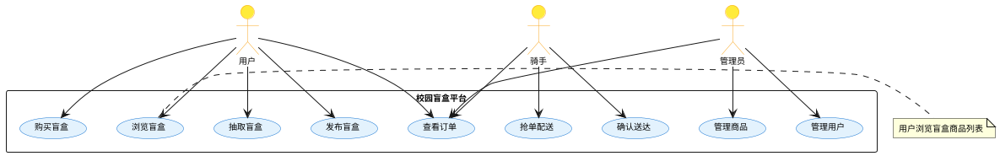

**draw.io提示词**：创建一个系统用例图。包含三个角色：用户、骑手、管理员。用例包括浏览盲盒、购买盲盒、发布盲盒、抽取盲盒、查看订单、抢单配送、确认送达、管理商品、管理用户。角色使用黄色背景(#FFEB3B)，用例使用浅蓝色背景(#E3F2FD)。整体风格简洁专业，适合学术论文使用，字体使用宋体，大小10号。

---

### 第2章 系统架构图（图2）

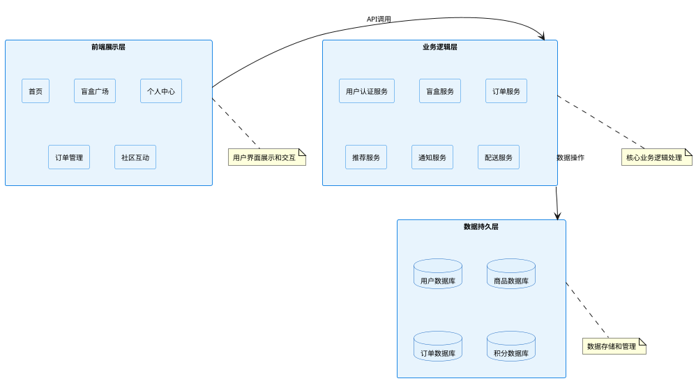

**draw.io提示词**：创建一个三层架构图。分为前端展示层（浅蓝#E8F4FD）、业务逻辑层（浅蓝#E8F4FD）、数据持久层（浅青#E3F2FD）。前端层包含首页、盲盒广场、个人中心、订单管理、社区互动；业务逻辑层包含用户认证服务、盲盒服务、订单服务、推荐服务、通知服务、配送服务；数据层包含用户数据库、商品数据库、订单数据库、积分数据库。用箭头标注调用关系。整体风格简洁专业，适合学术论文使用，字体使用宋体，大小10号。

---

### 第3章 盲盒购买流程图（图3）

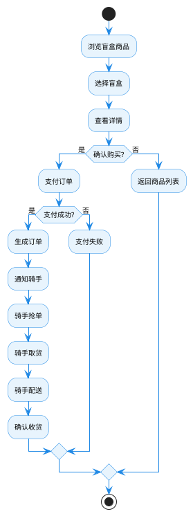

**draw.io提示词**：创建一个盲盒购买流程图。使用活动图符号，活动节点背景为浅蓝色(#E8F4FD)，边框蓝色(#1E88E5)；判断节点背景为浅橙色(#FFF3E0)，边框橙色(#FF7043)；箭头为蓝色。流程包括：浏览商品→选择盲盒→查看详情→确认购买→支付订单→生成订单→通知骑手→骑手抢单→取货→配送→确认收货。整体风格简洁专业，适合学术论文使用，字体使用宋体，大小10号。

---

### 第4章 盲盒发布流程图（图4）

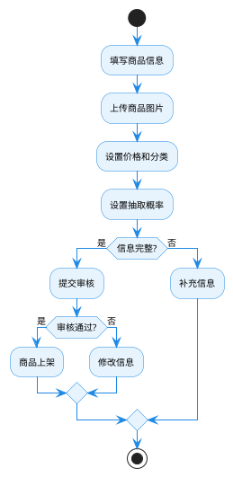

**draw.io提示词**：创建一个盲盒发布流程图。使用活动图符号，活动节点背景为浅蓝色(#E8F4FD)，边框蓝色(#1E88E5)；判断节点背景为浅橙色(#FFF3E0)，边框橙色(#FF7043)；箭头为蓝色。流程包括：填写商品信息→上传图片→设置价格分类→设置概率→信息完整检查→提交审核→审核通过→商品上架。整体风格简洁专业，适合学术论文使用，字体使用宋体，大小10号。

---

### 第5章 盲盒抽取流程图（图5）

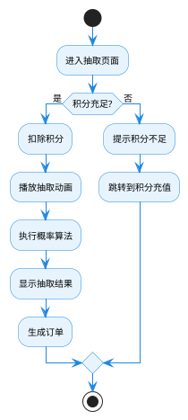

**draw.io提示词**：创建一个盲盒抽取流程图。使用活动图符号，活动节点背景为浅蓝色(#E8F4FD)，边框蓝色(#1E88E5)；判断节点背景为浅橙色(#FFF3E0)，边框橙色(#FF7043)；箭头为蓝色。流程包括：进入抽取页面→积分检查→扣除积分→播放动画→执行概率算法→显示结果→生成订单。整体风格简洁专业，适合学术论文使用，字体使用宋体，大小10号。

---

### 第6章 即时配送流程图（图6）

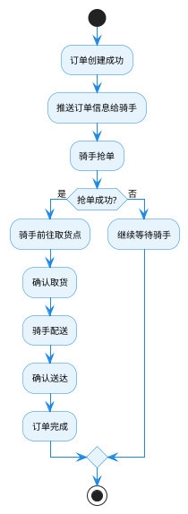

**draw.io提示词**：创建一个即时配送流程图。使用活动图符号，活动节点背景为浅蓝色(#E8F4FD)，边框蓝色(#1E88E5)；判断节点背景为浅橙色(#FFF3E0)，边框橙色(#FF7043)；箭头为蓝色。流程包括：订单创建→推送骑手→骑手抢单→前往取货→确认取货→配送→确认送达→订单完成。整体风格简洁专业，适合学术论文使用，字体使用宋体，大小10号。

---

### 第7章 订单状态流转图（图7）

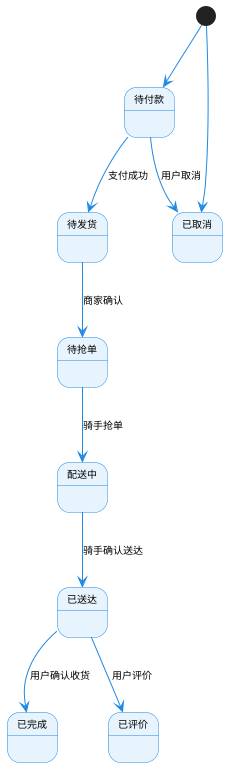

**draw.io提示词**：创建一个订单状态流转图。使用状态图符号，状态节点背景为浅蓝色(#E8F4FD)，边框蓝色(#1E88E5)；箭头为蓝色。状态包括：待付款、待发货、待抢单、配送中、已送达、已完成、已评价、已取消。标注状态转换条件。整体风格简洁专业，适合学术论文使用，字体使用宋体，大小10号。

---

### 第8章 社区互动流程图（图8）

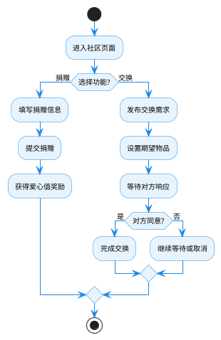

**draw.io提示词**：创建一个社区互动流程图。使用活动图符号，活动节点背景为浅蓝色(#E8F4FD)，边框蓝色(#1E88E5)；判断节点背景为浅橙色(#FFF3E0)，边框橙色(#FF7043)；箭头为蓝色。流程包括：进入社区→选择功能（捐赠/交换）→捐赠流程（填写信息→提交→获爱心值）；交换流程（发布需求→设置期望→等待响应→完成交换）。整体风格简洁专业，适合学术论文使用，字体使用宋体，大小10号。

---

### 第9章 基于内容的推荐流程图（图9）

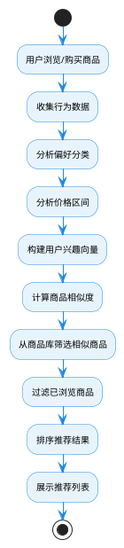

**draw.io提示词**：创建一个基于内容的推荐流程图。使用活动图符号，活动节点背景为浅蓝色(#E8F4FD)，边框蓝色(#1E88E5)；箭头为蓝色。流程包括：用户行为→收集数据→分析偏好→分析价格→构建用户兴趣向量→计算商品相似度→筛选相似商品→过滤已浏览→排序结果→展示推荐。整体风格简洁专业，适合学术论文使用，字体使用宋体，大小10号。

---

### 第10章 E-R图（图10）

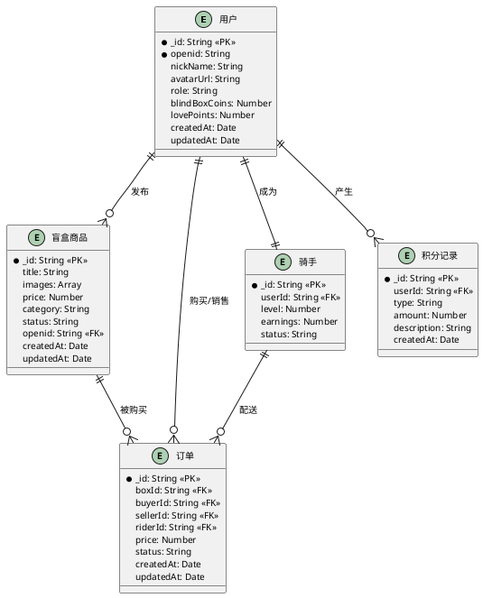

**draw.io提示词**：创建一个E-R图，包含五个实体：用户、盲盒商品、订单、骑手、积分记录。实体使用矩形，背景为浅绿色(#E8F5E9)，边框为深绿色(#388E3C)。显示各实体的属性和主键(PK)、外键(FK)。使用连线表示实体间关系：用户发布盲盒商品(一对多)、用户购买销售订单(一对多)、用户产生积分记录(一对多)、用户成为骑手(一对一)、盲盒商品被购买(一对多)、骑手配送订单(一对多)。整体风格简洁专业，适合学术论文使用，字体使用宋体，大小10号。

---

### 第11章 属性图（图11）

```plantuml
@startuml
skinparam backgroundColor #FFFFFF
skinparam handwritten false
skinparam defaultFontName "SimSun"
skinparam defaultFontSize 10
skinparam node {
  backgroundColor #E3F2FD
  borderColor #1976D2
  borderWidth 1
}
skinparam edge {
  lineColor #5D4037
  arrowHeadColor #5D4037
}
node "用户" as User {
  _id: String
  nickName: String
  role: String
  blindBoxCoins: Number
  lovePoints: Number
}
node "盲盒商品" as Box {
  _id: String
  title: String
  price: Number
  category: String
  status: String
}
node "订单" as Order {
  _id: String
  price: Number
  status: String
  createdAt: Date
}
node "骑手" as Rider {
  _id: String
  level: Number
  earnings: Number
  status: String
}
node "积分记录" as CoinLog {
  _id: String
  type: String
  amount: Number
  createdAt: Date
}
User --> Box : 发布
User --> Order : 购买
User --> CoinLog : 产生
User --> Rider : 成为
Box --> Order : 被购买
Rider --> Order : 配送
@enduml
```

**draw.io提示词**：创建一个属性图，包含五个节点：用户、盲盒商品、订单、骑手、积分记录。节点使用圆角矩形，背景为浅蓝色(#E3F2FD)，边框为蓝色(#1976D2)。显示各节点的核心属性。边使用棕色(#5D4037)箭头表示关系：用户发布盲盒商品、用户购买订单、用户产生积分记录、用户成为骑手、盲盒商品被购买、骑手配送订单。整体风格简洁专业，适合学术论文使用，字体使用宋体，大小10号。

---

### 第12章 曼哈顿距离顺路匹配算法流程图（图12）

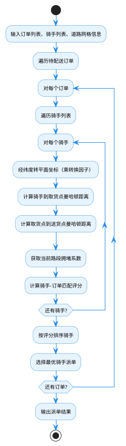

**draw.io提示词**：创建一个曼哈顿距离顺路匹配算法流程图。使用活动图符号，活动节点背景为浅蓝色(#E8F4FD)，边框蓝色(#1E88E5)；判断节点背景为浅橙色(#FFF3E0)，边框橙色(#FF7043)；箭头为蓝色。流程包括：输入数据→遍历订单→遍历骑手→经纬度转换→计算曼哈顿距离→计算拥堵系数→计算匹配评分→排序骑手→选择最优派单。整体风格简洁专业，适合学术论文使用，字体使用宋体，大小10号。

---

### 第13章 基于内容的推荐算法流程图（图13）

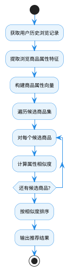

**draw.io提示词**：创建一个基于内容的推荐算法流程图。使用活动图符号，活动节点背景为浅蓝色(#E8F4FD)，边框蓝色(#1E88E5)；箭头为蓝色。流程包括：获取历史记录→提取商品属性→构建属性向量→遍历候选商品→计算相似度→排序→输出推荐。整体风格简洁专业，适合学术论文使用，字体使用宋体，大小10号。

---

### 第14章 模块调用关系图（图14）

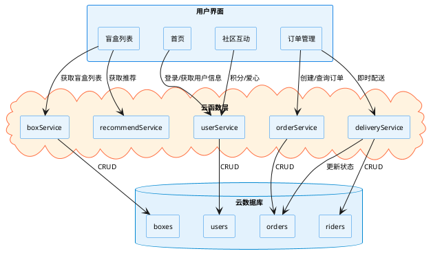

**draw.io提示词**：创建一个模块调用关系图。分为三层：用户界面层（浅蓝#E8F4FD）、云函数层（浅橙#FFF3E0）、云数据库层（浅青色#E3F2FD）。界面层包含首页、盲盒列表、订单管理、社区互动；云函数层包含userService、boxService、orderService、deliveryService、recommendService；数据库层包含users、boxes、orders、riders表。用箭头标注调用关系。整体风格简洁专业，适合学术论文使用，字体使用宋体，大小10号。

---

### 第15章 性能优化架构图（图15）

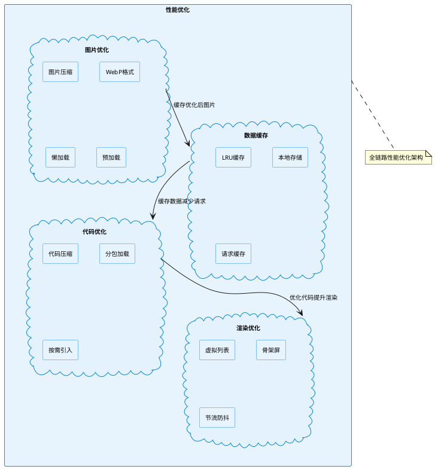

**draw.io提示词**：创建一个性能优化架构图。使用矩形和云朵符号，背景为浅蓝色(#E8F4FD)，边框蓝色(#1E88E5)。包含四大优化模块：图片优化（图片压缩、WebP格式、懒加载、预加载）、数据缓存（LRU缓存、本地存储、请求缓存）、代码优化（代码压缩、分包加载、按需引入）、渲染优化（虚拟列表、骨架屏、节流防抖）。模块间标注关联关系。整体风格简洁专业，适合学术论文使用，字体使用宋体，大小10号。

---

### 第16章 性能优化设计目标（图16）

```plantuml
@startuml
skinparam backgroundColor #FFFFFF
skinparam handwritten false
skinparam defaultFontName "SimSun"
skinparam defaultFontSize 10
title 性能优化设计目标

bar {
  "首页加载时间" - ["优化前" as Before1] 3.0
  "首页加载时间" - ["设计目标" as After1] 1.5
  "图片加载时间" - ["优化前" as Before2] 1.2
  "图片加载时间" - ["设计目标" as After2] 0.4
  "接口响应时间" - ["优化前" as Before3] 0.8
  "接口响应时间" - ["设计目标" as After3] 0.3
}
note bottom of Before1 : 单位：秒
@enduml
```

**draw.io提示词**：创建一个性能优化对比柱状图。包含三组对比数据：首页加载时间（优化前3秒，目标1.5秒）、图片加载时间（优化前1.2秒，目标0.4秒）、接口响应时间（优化前0.8秒，目标0.3秒）。使用蓝色系配色，标注单位为秒。整体风格简洁专业，适合学术论文使用，字体使用宋体，大小10号。

---

### 第3章 功能模块划分图（图3）

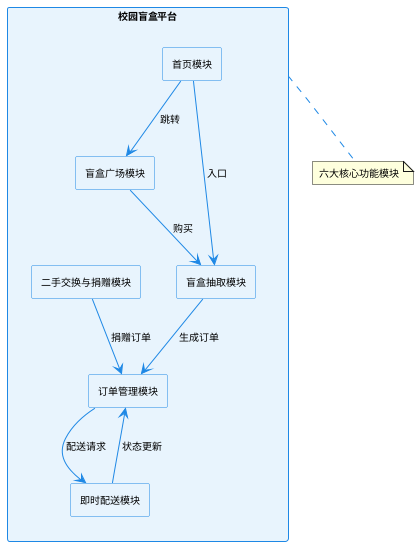

**draw.io提示词**：创建一个功能模块划分图。使用矩形符号，背景为浅蓝色(#E8F4FD)，边框蓝色(#1E88E5)。包含六个模块：首页模块、盲盒广场模块、盲盒抽取模块、订单管理模块、即时配送模块、二手交换与捐赠模块。用箭头标注模块间的调用关系。整体风格简洁专业，适合学术论文使用，字体使用宋体，大小10号。

---

### 附录 图表编号对应表

| 图号 | 图表名称 | 对应章节 |
|-----|---------|---------|
| 图1 | 系统用例图 | 4.2.1 |
| 图2 | 系统架构图 | 4.2.2 |
| 图3 | 功能模块划分图 | 4.2 |
| 图4 | 盲盒购买业务流程图 | 4.3.1 |
| 图5 | 盲盒发布业务流程图 | 4.3.2 |
| 图6 | 即时配送流程图 | 4.3.3 |
| 图7 | 订单状态流转图 | 4.3.4 |
| 图8 | 智能推荐流程图 | 4.4.4 |
| 图9 | E-R图 | 4.5.1 |
| 图10 | 属性图 | 4.5.2 |
| 图11 | 曼哈顿距离顺路匹配算法流程图 | 4.6.1 |
| 图12 | 基于内容的推荐算法流程图 | 4.6.2 |
| 图13 | 模块调用关系图 | 5.4 |
| 图14 | 性能优化架构图 | 5.4 |
| 图15 | 首页界面截图 | 5.4.1 |
| 图16 | 盲盒发布界面 | 5.4.2 |
| 图17 | 盲盒抽取界面截图 | 5.4.3 |
| 图18 | 性能优化设计目标 | 6.3.4 |

### 附录 图表代码位置说明

| 图号 | 图表名称 | 代码位置（章节） |
|-----|---------|----------------|
| 图1 | 系统用例图 | 第1章 |
| 图2 | 系统架构图 | 第2章 |
| 图3 | 功能模块划分图 | 第3章 |
| 图4 | 盲盒购买业务流程图 | 第4章 |
| 图5 | 盲盒发布业务流程图 | 第5章 |
| 图6 | 即时配送流程图 | 第6章 |
| 图7 | 订单状态流转图 | 第7章 |
| 图8 | 智能推荐流程图 | 第8章 |
| 图9 | E-R图 | 第9章 |
| 图10 | 属性图 | 第10章 |
| 图11 | 曼哈顿距离顺路匹配算法流程图 | 第11章 |
| 图12 | 基于内容的推荐算法流程图 | 第12章 |
| 图13 | 模块调用关系图 | 第13章 |
| 图14 | 性能优化架构图 | 第14章 |
| 图15 | 首页界面截图 | 第15章 |
| 图16 | 盲盒发布界面 | 第16章 |
| 图17 | 盲盒抽取界面截图 | 第17章 |
| 图18 | 性能优化设计目标 | 第18章 |
