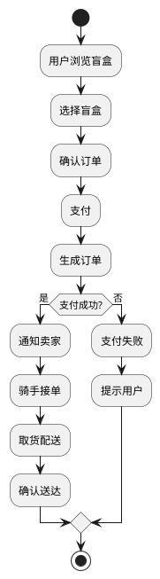
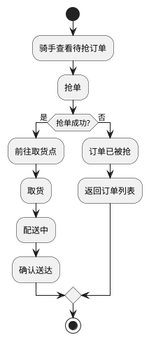
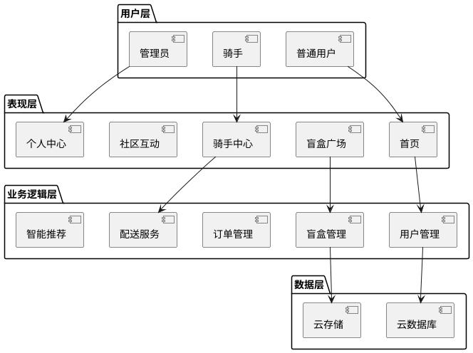

# 论文图表生成说明

本文档说明如何使用 PlantUML 和 Draw.io 生成论文所需的图表。

## 一、图表清单

| 图表编号 | 图表名称 | 类型 | 推荐工具 |
| :--- | :--- | :--- | :--- |
| 图4-1 | 系统架构图 | 架构图 | Draw.io |
| 图4-2 | 功能模块划分图 | 模块图 | Draw.io |
| 图4-3 | 盲盒购买流程图 | 流程图 | PlantUML |
| 图4-4 | 数据库ER图 | ER图 | Draw.io |

## 二、使用 Draw.io 生成图表

### 2.1 准备工作

1. 下载并安装 Draw.io（现更名为 Diagrams.net）
   - 官网：https://www.diagrams.net/
   - 支持桌面版、网页版、VS Code插件

2. 创建 images 文件夹
```bash
mkdir images
```

### 2.2 系统架构图（图4-1）

**元素说明：**
- 用户层：普通用户、骑手、管理员
- 表现层：小程序前端页面
- 业务逻辑层：用户管理、盲盒管理、订单管理、配送服务、社区互动、智能推荐
- 数据层：云数据库、云存储

**绘制步骤：**
1. 打开 Draw.io，新建空白图表
2. 使用"矩形"工具绘制四层架构
3. 使用"箭头"工具连接各层
4. 导出为 PNG 格式，命名为 `system_architecture.png`
5. 保存到 `images/` 文件夹

### 2.3 功能模块划分图（图4-2）

**元素说明：**
- 中心节点：校园盲盒交易平台
- 子模块：用户管理、盲盒管理、订单管理、配送服务、社区互动、智能推荐

**绘制步骤：**
1. 使用"圆形"工具绘制中心节点
2. 使用"矩形"工具绘制各子模块
3. 使用"箭头"工具从中心连接到各模块
4. 导出为 PNG 格式，命名为 `function_modules.png`

### 2.4 数据库ER图（图4-4）

**实体说明：**
- User（用户）：userId, nickname, avatar, phone, role
- BlindBox（盲盒）：boxId, title, description, price, images, stock, sellerId
- Order（订单）：orderId, boxId, buyerId, sellerId, price, status
- Delivery（配送）：deliveryId, orderId, riderId, pickupAddr, deliveryAddr, status

**绘制步骤：**
1. 使用"实体"形状绘制各实体
2. 添加实体属性
3. 使用"关系线"连接各实体（1:N关系）
4. 导出为 PNG 格式，命名为 `database_er.png`

## 三、使用 PlantUML 生成图表

### 3.1 准备工作

1. 安装 PlantUML
   - 方式1：安装 VS Code 插件 "PlantUML"
   - 方式2：使用在线编辑器 https://www.planttext.com/

2. 安装 Graphviz（用于渲染）
```bash
# Windows
choco install graphviz

# macOS
brew install graphviz

# Linux
sudo apt-get install graphviz
```

### 3.2 盲盒购买流程图（图4-3）

**创建 `.puml` 文件：**



**生成图片：**

1. 将上述代码保存为 `blind_box_purchase_flow.puml`
2. 使用 VS Code PlantUML 插件预览并导出
3. 或使用命令行：
```bash
plantuml blind_box_purchase_flow.puml
```
4. 将生成的 PNG 文件重命名为 `blind_box_purchase_flow.png`，保存到 `images/` 文件夹

### 3.3 更多 PlantUML 示例

**配送流程图：**


**系统分层架构图：**


## 四、导出设置

### 4.1 Draw.io 导出设置
- 格式：PNG
- 分辨率：1920x1080 或更高
- 透明背景：取消勾选（使用白色背景）

### 4.2 PlantUML 导出设置
```plantuml
skinparam dpi 150
skinparam backgroundColor #FFFFFF
```

## 五、目录结构

```
1.3/
├── 武汉生物工程学院本科毕业论文_校园盲盒交易平台的设计与实现_ForWord.md
├── images/
│   ├── system_architecture.png
│   ├── function_modules.png
│   ├── blind_box_purchase_flow.png
│   └── database_er.png
└── diagrams/
    ├── system_architecture.drawio
    ├── function_modules.drawio
    ├── database_er.drawio
    └── blind_box_purchase_flow.puml
```

## 六、注意事项

1. 图表编号要与论文中的引用一致（如图4-1、表6-1）
2. 图片命名要清晰，便于管理
3. 保持图表风格统一（颜色、字体、箭头样式）
4. 导出时确保图片清晰度足够（建议分辨率≥150dpi）
5. 在 Draw.io 中保存源文件（.drawio）以便后续修改

---

完成图表生成后，将图片放入 `images/` 文件夹即可，论文中的 Markdown 引用会自动加载图片。
