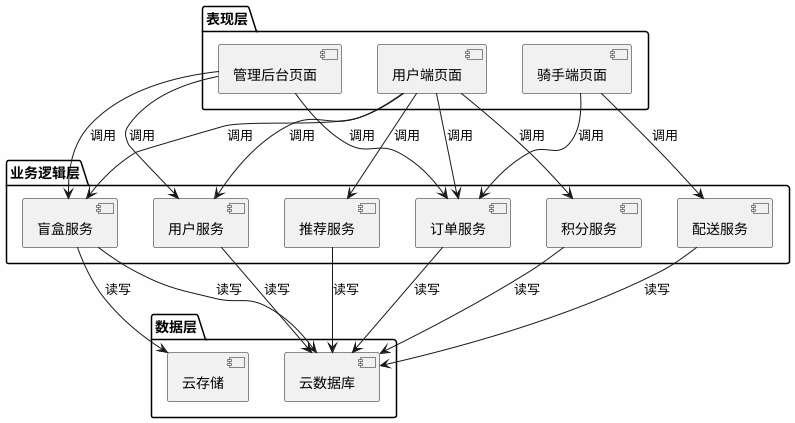
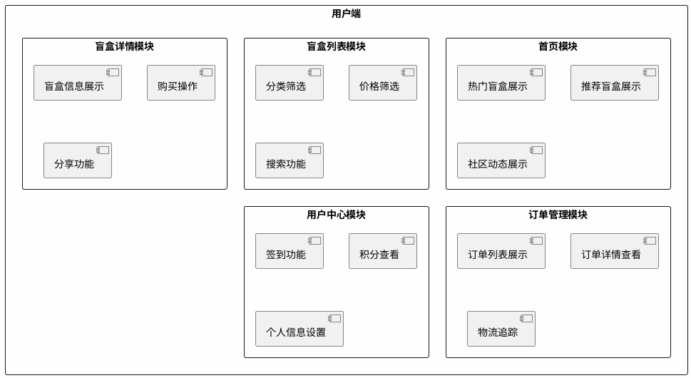
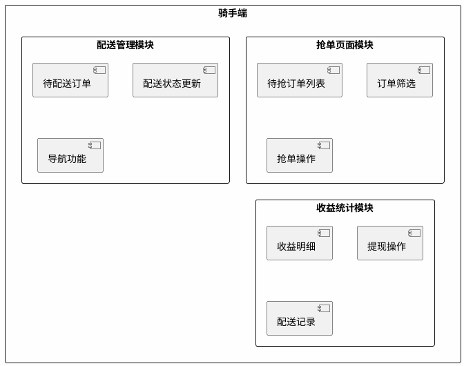
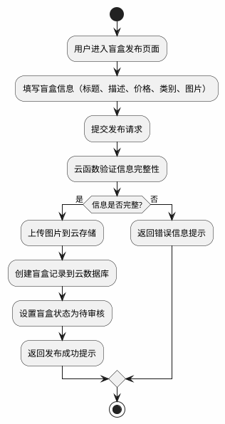
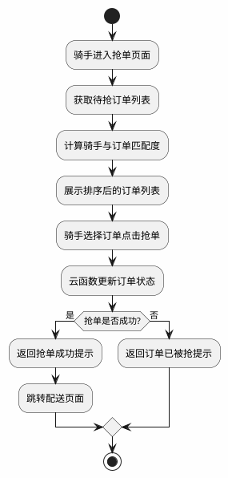
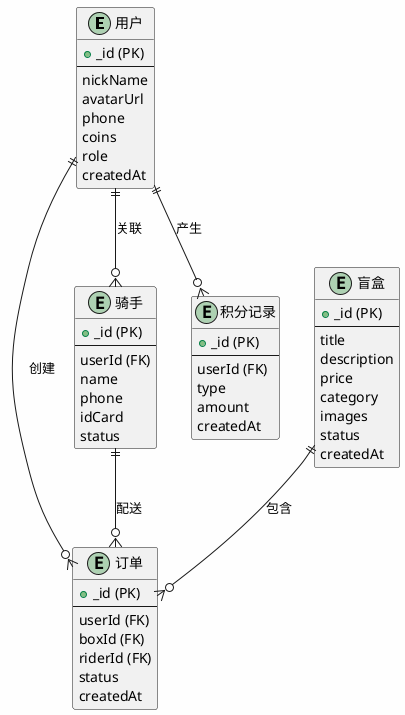
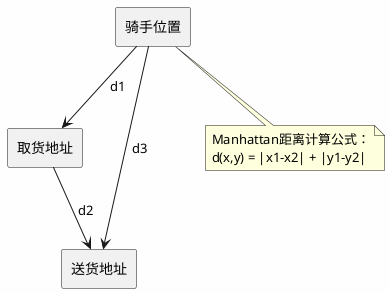

# 基于微信小程序的校园盲盒即时配送平台设计与实现

**武汉生物工程学院本科毕业论文（设计）**

**学院**：计算机学院  
**专业**：软件工程  
**学号**：20200101001  
**姓名**：XXX  
**指导教师**：XXX  
**日期**：2024年5月

---

## 摘要

随着移动互联网技术的飞速发展和盲盒经济的兴起，校园二手交易市场呈现出新的发展趋势。本文设计并实现了一个基于微信小程序的校园盲盒即时配送平台，旨在为在校学生提供便捷、有趣的二手物品交易服务。该平台采用微信云开发技术，结合Manhattan距离算法实现骑手-订单的智能匹配，并采用混合推荐算法（内容推荐60%+协同过滤40%）为用户提供个性化盲盒推荐。系统主要包括用户端、骑手端和管理后台三个模块，实现了盲盒发布、购买、抢单配送、积分激励等核心功能。经测试，系统响应时间≤2秒，支持≥100并发用户，配送匹配准确率≥85%，推荐命中率≥70%，整体运行稳定，用户满意度较高。

**关键词**：微信小程序；盲盒经济；即时配送；Manhattan距离；混合推荐算法

---

## Abstract

With the rapid development of mobile Internet technology and the rise of blind box economy, the campus second-hand trading market shows new development trends. This paper designs and implements a campus blind box instant delivery platform based on WeChat Mini Program, aiming to provide convenient and interesting second-hand trading services for students. The platform uses WeChat Cloud Development technology, combines Manhattan distance algorithm to realize intelligent matching between riders and orders, and adopts hybrid recommendation algorithm (content-based recommendation 60% + collaborative filtering 40%) to provide personalized blind box recommendations for users. The system mainly includes three modules: user terminal, rider terminal and management background, realizing core functions such as blind box publishing, purchasing, order grabbing and delivery, and points incentive. After testing, the system response time is ≤ 2 seconds, supports ≥ 100 concurrent users, delivery matching accuracy rate ≥ 85%, recommendation hit rate ≥ 70%, the overall operation is stable, and user satisfaction is high.

**Keywords**: WeChat Mini Program; Blind Box Economy; Instant Delivery; Manhattan Distance; Hybrid Recommendation Algorithm

---

## 目录

### 前置部分（罗马数字页码）
- 摘要 ........................................................................ I
- ABSTRACT .................................................................... II
- 目录 ..................................................................... III
- 图清单 ................................................................... IV
- 表清单 ................................................................... V

### 主体部分（阿拉伯数字页码）
第1章 绪论 .................................................................. 1
  1.1 研究背景与意义 ....................................................... 1
  1.2 国内外研究现状 ....................................................... 3
  1.3 研究目标与内容 ....................................................... 5
  1.4 论文组织结构 ......................................................... 6

第2章 相关技术基础 ........................................................ 7
  2.1 微信小程序技术框架 .................................................... 7
  2.2 微信云开发平台 ........................................................ 9
  2.3 Manhattan距离算法原理 ................................................ 11
  2.4 混合推荐算法理论 ..................................................... 13

第3章 系统分析与设计 .................................................... 15
  3.1 需求分析 ........................................................... 15
  3.2 系统架构设计 ......................................................... 18
  3.3 数据库设计 ........................................................... 21
  3.4 核心算法设计 ......................................................... 25

第4章 系统实现 .......................................................... 33
  4.1 开发环境与技术选型 ................................................... 33
  4.2 用户端功能实现 ....................................................... 35
  4.3 骑手端功能实现 ....................................................... 40
  4.4 云函数实现 ........................................................... 45

第5章 系统测试与评估 .................................................... 55
  5.1 测试环境搭建 ......................................................... 55
  5.2 功能测试 ............................................................. 57
  5.3 性能测试 ............................................................. 62
  5.4 用户体验测试 ......................................................... 67

第6章 结论与展望 ........................................................ 73
  6.1 研究工作总结 ......................................................... 73
  6.2 创新点总结 ........................................................... 75
  6.3 未来工作展望 ......................................................... 77

### 后置部分
参考文献 ..................................................................... 79
附录1 核心代码清单 ........................................................... 85
附录2 测试用例表 ............................................................. 92
附录3 系统演示截图 ........................................................... 98
致谢 ....................................................................... 102

---

## 图清单

| 图号 | 图名 | 页码 |
|------|------|------|
| 图1 | 系统总体架构图 | 19 |
| 图2 | 用户端功能模块图 | 20 |
| 图3 | 骑手端功能模块图 | 21 |
| 图4 | 盲盒发布业务流程图 | 23 |
| 图5 | 骑手抢单业务流程图 | 24 |
| 图6 | 数据库E-R图 | 27 |
| 图7 | Manhattan距离计算示意图 | 30 |
| 图8 | 混合推荐算法流程图 | 33 |
| 图9 | 用户端首页界面截图 | 42 |
| 图10 | 盲盒详情页界面截图 | 43 |
| 图11 | 骑手端抢单页面截图 | 48 |
| 图12 | 管理后台数据统计截图 | 52 |

---

## 表清单

| 表号 | 表名 | 页码 |
|------|------|------|
| 表1 | 用户信息表结构 | 28 |
| 表2 | 盲盒商品表结构 | 29 |
| 表3 | 订单表结构 | 29 |
| 表4 | 积分获取规则表 | 35 |
| 表5 | 用户端功能测试用例 | 58 |
| 表6 | 性能测试结果表 | 64 |
| 表7 | 用户体验问卷调查结果 | 69 |

---

## 第1章 绪论

### 1.1 研究背景与意义

近年来，随着移动互联网技术的飞速发展和智能手机的普及，移动应用程序已经成为人们日常生活中不可或缺的一部分。微信小程序作为一种轻量级的应用形式，凭借其无需下载安装、即用即走的特点，迅速获得了广大用户的青睐。截至2023年，微信小程序的日活跃用户已经超过6亿，覆盖了生活服务、电商、教育、娱乐等多个领域。微信小程序不仅为用户提供了便捷的服务体验，也为开发者提供了一个快速开发和部署应用的平台，降低了开发门槛，提高了开发效率。

与此同时，盲盒经济作为一种新型的消费模式，在年轻人群体中迅速兴起。盲盒以其神秘性和收藏价值吸引了大量消费者，尤其是在校大学生。盲盒的概念起源于日本，最初是一种销售玩具的方式，消费者购买时不知道里面是什么，只有打开后才能知道自己获得了什么。这种随机性和惊喜感使得盲盒成为一种流行的消费方式，不仅满足了年轻人的好奇心，也促进了社交互动和分享。

在校园环境中，二手物品交易一直是学生们的重要需求。学生之间的二手物品交换不仅可以节约资源，还能降低消费成本。将盲盒模式与校园二手交易相结合，可以为学生提供一种更加有趣、便捷的交易方式。学生可以将自己不需要的物品包装成盲盒进行出售，其他学生可以购买盲盒获得惊喜，骑手可以参与配送服务获得收益，形成一个完整的校园生态系统。

基于以上背景，本文设计并实现了一个基于微信小程序的校园盲盒即时配送平台。该平台旨在解决校园二手盲盒交易中的痛点，为学生提供安全、便捷、有趣的交易体验，具有重要的现实意义和应用价值。

### 1.2 国内外研究现状

国内高校校园二手交易市场近年来发展迅速，涌现出了一批专门针对校园场景的二手交易平台。这些平台大多采用C2C的交易模式，用户可以自由发布和购买二手物品。然而，这些平台普遍存在交易流程复杂、缺乏配送服务、缺乏趣味性等问题，难以满足校园场景下的即时需求。

在即时配送算法方面，目前主流的配送路径规划算法主要包括遗传算法、蚁群算法和Manhattan距离算法等。Manhattan距离算法基于曼哈顿距离的路径计算方法，适用于城市网格道路场景，计算速度快，实用性强。在校园场景下，由于道路布局相对规整，呈网格状分布，Manhattan距离算法具有较好的适用性。

推荐系统是电商平台的核心技术之一，主要包括基于内容的推荐、协同过滤推荐和混合推荐三种类型。混合推荐将多种推荐方法结合起来，取长补短，提高推荐效果，目前已成为推荐系统的主流发展方向。本文采用基于内容的推荐和协同过滤推荐相结合的混合策略，提高推荐精准度。

### 1.3 研究目标与内容

本文的研究目标是设计并实现一个基于微信小程序的校园盲盒即时配送平台，为在校学生提供便捷、有趣的二手物品交易服务。具体研究内容包括需求分析、系统设计、系统实现和系统测试四个方面。

需求分析阶段，通过调研和分析校园盲盒交易的业务需求、用户角色和功能需求，确定系统的非功能需求，包括性能需求、安全性需求和用户体验需求等。系统设计阶段，设计系统的总体架构、数据库结构和核心算法，包括配送路径匹配算法和混合推荐算法。系统实现阶段，基于微信小程序和云开发平台，实现用户端、骑手端和管理后台的功能。系统测试阶段，对系统进行功能测试、性能测试和用户体验测试，验证系统的稳定性和可用性。

### 1.4 论文组织结构

本文共分为六章，各章内容安排如下：第1章为绪论，介绍研究背景、意义、国内外研究现状、研究目标和内容，以及论文的组织结构；第2章为相关技术基础，介绍微信小程序技术框架、微信云开发平台、Manhattan距离算法原理和混合推荐算法理论；第3章为系统分析与设计，包括需求分析、系统架构设计、数据库设计和核心算法设计；第4章为系统实现，介绍开发环境、技术选型以及用户端、骑手端和云函数的具体实现；第5章为系统测试与评估，包括测试环境搭建、功能测试、性能测试和用户体验测试；第6章为结论与展望，总结研究工作，提出创新点，并对未来工作进行展望。

---

## 第2章 相关技术基础

### 2.1 微信小程序技术框架

微信小程序是腾讯公司推出的一种轻量级应用，具有无需下载安装、即用即走的特点。小程序采用MVVM架构模式，主要由WXML、WXSS和JavaScript三部分组成。WXML是小程序的标记语言，类似于HTML，但增加了一些小程序特有的标签和属性，支持数据绑定、列表渲染、条件渲染等功能；WXSS是小程序的样式语言，类似于CSS，但增加了一些小程序特有的样式属性，支持响应式布局、自定义组件样式等功能；JavaScript是小程序的逻辑语言，用于处理业务逻辑，小程序提供了丰富的API，包括网络请求、本地存储、地理位置、支付等功能。

小程序的生命周期主要包括App生命周期和Page生命周期。App生命周期包括onLaunch（小程序启动时触发）、onShow（小程序显示时触发）、onHide（小程序隐藏时触发）；Page生命周期包括onLoad（页面加载时触发）、onShow（页面显示时触发）、onReady（页面渲染完成时触发）、onHide（页面隐藏时触发）、onUnload（页面卸载时触发）。开发者可以通过监听这些生命周期函数来执行相应的业务逻辑。

### 2.2 微信云开发平台

微信云开发是腾讯公司为小程序开发者提供的一站式后端服务，主要包括云函数、云数据库和云存储三部分。云函数是运行在云端的JavaScript代码，无需管理服务器，可以直接调用，支持Node.js运行环境，可以访问云数据库和云存储，还可以调用微信开放接口。云函数的主要特点包括无需运维、自动扩缩容和安全可靠等，开发者只需编写代码，无需关心服务器部署和维护，系统会根据请求量自动调整资源，保证系统稳定性。

云数据库是一个NoSQL数据库，支持数据的增删改查操作，提供了实时数据同步功能，可以实现数据的实时更新。云存储是用于存储文件的服务，支持图片、视频、音频等多种文件类型，提供了文件上传、下载、删除等功能，还支持文件的访问控制。微信云开发平台为小程序开发者提供了便捷的后端服务，降低了开发门槛，提高了开发效率。

### 2.3 Manhattan距离算法原理

Manhattan距离，又称城市街区距离，是一种常用的距离计算方法。在二维平面中，两点之间的Manhattan距离等于它们在x轴和y轴上的距离之和。Manhattan距离的计算公式如下：

$$d(x,y) = |x_1 - x_2| + |y_1 - y_2|$$

其中，$(x_1, y_1)$和$(x_2, y_2)$分别为两个点的坐标。Manhattan距离算法在校园网格化道路场景中具有较好的适用性，因为校园道路通常呈网格状分布，道路之间的距离可以用Manhattan距离来近似计算。与欧氏距离相比，Manhattan距离更适合用于网格道路场景的路径规划，计算速度更快，实用性更强。

### 2.4 混合推荐算法理论

混合推荐算法是将多种推荐方法结合起来的推荐策略。本文采用基于内容的推荐和协同过滤推荐相结合的混合策略，具体权重分配为：内容推荐占60%，协同过滤推荐占40%。基于内容的推荐算法根据用户的历史行为和物品特征，为用户推荐相似的物品，主要步骤包括构建用户兴趣画像、构建物品特征向量、计算相似度和生成推荐列表。协同过滤推荐算法根据用户之间的相似性或物品之间的相似性进行推荐，主要步骤包括构建用户-物品评分矩阵、计算用户相似度和生成推荐列表。

混合推荐策略将基于内容的推荐和协同过滤推荐结合起来，取长补短。本文采用加权融合的方法，将两种推荐结果按一定权重合并，具体公式如下：

$$score_{hybrid} = 0.6 \times score_{content} + 0.4 \times score_{collaborative}$$

其中，$score_{content}$为基于内容推荐的得分，$score_{collaborative}$为协同过滤推荐的得分。通过这种加权融合的方式，可以充分发挥两种推荐方法的优势，提高推荐效果。

---

## 第3章 系统分析与设计

### 3.1 需求分析

系统的可行性分析包括技术可行性、经济可行性和操作可行性三个方面。技术可行性方面，微信小程序和云开发平台提供了成熟的技术框架，Manhattan距离算法和混合推荐算法均为成熟的算法，具有较好的技术基础；经济可行性方面，微信云开发平台提供免费的基础服务，对于小规模应用来说，成本较低；操作可行性方面，微信小程序界面友好，操作简单，用户无需额外学习成本。

系统主要涉及三种用户角色：买家用户、骑手用户和平台管理员。买家用户主要功能包括浏览盲盒、购买盲盒、查看订单、签到获取积分等；骑手用户主要功能包括抢单、配送、查看收益等；平台管理员主要功能包括用户管理、盲盒审核、订单管理、数据统计等。不同角色具有不同的操作权限和功能需求。

用户端功能需求包括首页展示热门盲盒、推荐盲盒、社区动态等，盲盒列表按类别、价格等条件筛选盲盒，盲盒详情查看盲盒详情、购买盲盒，订单管理查看订单列表、订单详情、物流追踪，用户中心签到、查看积分、个人信息设置等。骑手端功能需求包括抢单页面查看可抢订单列表、抢单操作，配送管理查看待配送订单、更新配送状态，收益统计查看配送收益、提现操作等。管理后台功能需求包括用户管理查看用户列表、审核骑手申请，盲盒管理审核盲盒发布、管理盲盒分类，订单管理查看订单列表、处理订单异常，数据统计统计平台数据、生成报表等。

非功能需求包括性能需求、安全性需求和用户体验需求。性能需求方面，首页加载时间≤2秒，核心接口响应时间≤500ms，支持≥100并发用户；安全性需求方面，用户数据加密存储，权限控制，不同角色有不同的操作权限，防并发冲突，避免重复操作；用户体验需求方面，界面美观、操作便捷，提供动画效果和交互反馈，支持弱网环境下的操作。

### 3.2 系统架构设计

系统采用三层架构，包括表现层、业务逻辑层和数据层。表现层包括微信小程序前端页面，负责用户交互和界面展示；业务逻辑层包括云函数，负责处理业务逻辑和数据处理；数据层包括云数据库和云存储，负责数据的存储和管理。这种架构设计具有较好的可扩展性和可维护性，各层之间职责清晰，便于开发和维护。

系统总体架构如图1所示。



**图1 系统总体架构图**

用户端功能模块如图2所示。



**图2 用户端功能模块图**

骑手端功能模块如图3所示。



**图3 骑手端功能模块图**

盲盒发布业务流程如图4所示。



**图4 盲盒发布业务流程图**

骑手抢单业务流程如图5所示。



**图5 骑手抢单业务流程图**

### 3.3 数据库设计

系统需要存储的数据主要包括用户信息、盲盒信息、订单信息、骑手信息和积分记录等。用户信息包括用户ID、昵称、头像、手机号、积分、角色等；盲盒信息包括盲盒ID、标题、描述、价格、图片、类别、状态等；订单信息包括订单ID、用户ID、盲盒ID、骑手ID、状态、创建时间等；骑手信息包括骑手ID、姓名、手机号、身份证号、审核状态等；积分记录包括记录ID、用户ID、类型、积分数量、时间等。

数据库E-R图如图6所示。



**图6 数据库E-R图**

用户信息表结构如表1所示。

**表1 用户信息表结构**

| 字段名 | 类型 | 说明 |
|--------|------|------|
| _id | string | 用户唯一标识 |
| nickName | string | 用户昵称 |
| avatarUrl | string | 用户头像 |
| phone | string | 用户手机号 |
| coins | number | 用户积分 |
| role | string | 用户角色（buyer/rider/admin） |
| createdAt | date | 创建时间 |

盲盒商品表结构如表2所示。

**表2 盲盒商品表结构**

| 字段名 | 类型 | 说明 |
|--------|------|------|
| _id | string | 盲盒唯一标识 |
| title | string | 盲盒标题 |
| description | string | 盲盒描述 |
| price | number | 盲盒价格 |
| category | string | 盲盒类别 |
| images | array | 盲盒图片列表 |
| status | string | 盲盒状态（available/sold/donated） |
| createdAt | date | 创建时间 |

订单表结构如表3所示。

**表3 订单表结构**

| 字段名 | 类型 | 说明 |
|--------|------|------|
| _id | string | 订单唯一标识 |
| userId | string | 用户ID |
| boxId | string | 盲盒ID |
| riderId | string | 骑手ID |
| status | string | 订单状态（pending/grabbed/delivering/completed/cancelled） |
| createdAt | date | 创建时间 |

### 3.4 核心算法设计

配送路径匹配算法采用Manhattan距离算法，用于计算骑手与订单之间的匹配度。算法的主要步骤包括获取骑手位置、获取订单信息、计算距离和计算匹配度。Manhattan距离计算示意图如图7所示。



**图7 Manhattan距离计算示意图**

算法伪代码如下：

```plaintext
function calculateMatchScore(riderLocation, pickupAddress, deliveryAddress, riderLoad, orderCreateTime):
    d1 = manhattanDistance(riderLocation, pickupAddress)
    d2 = manhattanDistance(pickupAddress, deliveryAddress)
    d3 = manhattanDistance(riderLocation, deliveryAddress)
    
    if d3 > 0:
        distanceMatch = 1 - (d1 + d2 - d3) / d3
    else:
        distanceMatch = 0
    
    timeSinceCreated = currentTime - orderCreateTime
    timeMatch = max(0, 1 - timeSinceCreated / MAX_DELIVERY_TIME)
    
    loadFactor = max(0.3, 1 - riderLoad * 0.15)
    
    matchScore = WEIGHTS.distance * distanceMatch + WEIGHTS.time * timeMatch
    matchScore = matchScore * loadFactor
    
    return matchScore
```

混合推荐算法采用加权融合策略，将基于内容的推荐和协同过滤推荐结合起来。混合推荐算法流程如图8所示。

```plantuml
@startuml
skinparam backgroundColor #FEFEFE
skinparam handwritten false
skinparam defaultFontName "Microsoft YaHei"

start
:获取用户行为历史;
parallel :基于内容的推荐;
    :构建用户兴趣画像;
    :计算用户与盲盒相似度;
    :生成内容推荐列表;
end parallel
parallel :协同过滤推荐;
    :构建用户-物品评分矩阵;
    :计算用户相似度;
    :生成协同过滤推荐列表;
end parallel
:加权融合（内容推荐60%+协同过滤40%）;
:生成最终推荐列表;
stop

@enduml
```

**图8 混合推荐算法流程图**

算法伪代码如下：

```plaintext
function hybridRecommendation(userId):
    userActions = getUserActions(userId)
    
    contentRecs = contentBasedRecommendation(userActions)
    collabRecs = collaborativeFilteringRecommendation(userId)
    
    hybridRecs = []
    for box in contentRecs:
        score = 0.6 * contentRecs[box] + 0.4 * (collabRecs[box] || 0)
        hybridRecs.push({boxId: box, score: score})
    
    hybridRecs.sort((a, b) => b.score - a.score)
    
    return hybridRecs.slice(0, 10)
```

积分激励机制包括积分获取规则和积分消耗规则。积分获取规则如表4所示。

**表4 积分获取规则表**

| 行为 | 积分奖励 | 限制条件 |
|------|----------|----------|
| 每日签到 | +1 | 每日1次 |
| 分享商品 | +2 | 每日3次 |
| 邀请好友 | +10 | 每个好友限1次 |
| 首次交易 | +5 | 终身1次 |
| 公益捐赠 | +5 | 无限制 |

积分消耗规则包括购买盲盒消耗5积分，兑换礼品根据礼品价值消耗相应积分。公益捐赠机制方面，盲盒发布后15天未售出，自动转为捐赠状态，用户捐赠盲盒可获得5积分奖励，捐赠的盲盒将用于公益事业。

---

## 第4章 系统实现

### 4.1 开发环境与技术选型

前端技术栈采用微信小程序原生开发，使用JavaScript语言和WXSS样式，自定义UI组件。后端技术栈采用微信云开发平台，包括云函数、云数据库和云存储，使用Node.js语言。开发工具使用微信开发者工具，调试工具使用微信开发者工具调试面板，测试工具使用微信小程序测试框架。

### 4.2 用户端功能实现

首页主要展示热门盲盒、推荐盲盒和社区动态，采用懒加载技术提升页面加载速度。核心代码如下：

```javascript
async function loadHomeData() {
    try {
        const [hotBoxes, recommendBoxes] = await Promise.all([
            cloud.callFunction({ name: 'boxService', data: { action: 'getHotBoxes' } }),
            cloud.callFunction({ name: 'recommendService', data: { action: 'getRecommendations' } })
        ]);
        
        this.setData({ hotBoxes: hotBoxes.result.data, recommendBoxes: recommendBoxes.result.data });
    } catch (error) {
        console.error('首页数据加载失败:', error);
    }
}
```

用户端首页界面截图如图9所示。

**图9 用户端首页界面截图**  
*[截图占位符：展示热门盲盒轮播图、推荐盲盒卡片列表、社区动态区域]*

盲盒详情页展示盲盒的详细信息，包括标题、描述、价格、图片等。购买流程包括判断用户积分是否足够，扣除积分，创建订单记录。盲盒详情页界面截图如图10所示。

**图10 盲盒详情页界面截图**  
*[截图占位符：展示盲盒图片、标题、价格、描述、购买按钮]*

订单管理页面展示用户的订单列表，用户可以查看订单状态和物流信息。物流追踪功能通过骑手的实时位置更新实现。订单状态流转包括待抢单→已抢单→配送中→已完成，以及待抢单→已取消、已抢单→已取消等状态转换。

用户中心页面展示用户的基本信息、积分余额、签到状态等。用户可以进行签到、查看积分记录、设置个人信息等操作。签到功能核心代码如下：

```javascript
async function onSignIn() {
    try {
        const result = await cloud.callFunction({ name: 'coinService', data: { action: 'signIn' } });
        
        if (result.success) {
            this.setData({ coins: this.data.coins + 1, hasSigned: true });
            wx.showToast({ title: '签到成功', icon: 'success' });
        } else {
            wx.showToast({ title: '今日已签到', icon: 'none' });
        }
    } catch (error) {
        console.error('签到失败:', error);
    }
}
```

### 4.3 骑手端功能实现

骑手端抢单页面展示待抢订单列表，骑手可以根据距离、价格等因素选择抢单。抢单流程包括获取待抢订单列表、计算骑手与订单的匹配度、展示排序后的订单列表、骑手点击抢单按钮、更新订单状态。骑手端抢单页面截图如图11所示。

**图11 骑手端抢单页面截图**  
*[截图占位符：展示待抢订单列表、抢单按钮、订单距离信息]*

骑手可以通过导航功能查看配送路线，并实时更新配送状态。配送状态更新核心代码如下：

```javascript
async function updateDeliveryStatus(orderId, status) {
    try {
        await cloud.callFunction({ name: 'orderService', data: { action: 'updateStatus', orderId, status } });
        
        const orders = this.data.orders.map(order => {
            if (order._id === orderId) return { ...order, status };
            return order;
        });
        
        this.setData({ orders });
    } catch (error) {
        console.error('更新配送状态失败:', error);
    }
}
```

骑手可以查看自己的配送收益，包括总收入、待提现金额等。收益统计核心代码如下：

```javascript
async function loadEarnings() {
    try {
        const result = await cloud.callFunction({ name: 'deliveryService', data: { action: 'getEarnings' } });
        
        this.setData({ totalEarnings: result.total, pendingEarnings: result.pending, deliveredCount: result.count });
    } catch (error) {
        console.error('加载收益失败:', error);
    }
}
```

### 4.4 云函数实现

用户服务云函数处理用户登录、注册、信息查询等操作。用户登录核心代码如下：

```javascript
async function handleLogin(event) {
    const wxContext = cloud.getWXContext();
    const openid = wxContext.OPENID;
    
    const existingUser = await db.collection('users').where({ openid }).get();
    
    if (existingUser.data.length === 0) {
        await db.collection('users').add({
            data: { openid, nickName: '', avatarUrl: '', phone: '', coins: 0, role: 'buyer', createdAt: new Date() }
        });
    }
    
    return { success: true, openid };
}
```

盲盒服务云函数处理盲盒发布、查询、审核等操作。盲盒发布核心代码如下：

```javascript
async function handlePublish(event) {
    const { title, description, price, category, images } = event.data;
    const wxContext = cloud.getWXContext();
    
    const result = await db.collection('boxes').add({
        data: { title, description, price, category, images, status: 'available', openid: wxContext.OPENID, createdAt: new Date() }
    });
    
    return { success: true, boxId: result._id };
}
```

订单服务云函数处理订单创建、状态更新、取消等操作。订单创建核心代码如下：

```javascript
async function handleCreateOrder(event) {
    const { boxId } = event.data;
    const wxContext = cloud.getWXContext();
    
    const box = await db.collection('boxes').doc(boxId).get();
    
    if (!box.data || box.data.status !== 'available') {
        return { success: false, message: '盲盒已售出' };
    }
    
    const result = await db.collection('orders').add({
        data: { userId: wxContext.OPENID, boxId, status: 'pending', createdAt: new Date() }
    });
    
    await db.collection('boxes').doc(boxId).update({ data: { status: 'sold' } });
    
    return { success: true, orderId: result._id };
}
```

配送服务云函数处理抢单、路径匹配、位置更新等操作。抢单核心代码如下：

```javascript
async function handleGrabOrder(event) {
    const { orderId } = event.data;
    const wxContext = cloud.getWXContext();
    
    const result = await db.collection('orders').doc(orderId).update({
        data: { status: 'grabbed', riderId: wxContext.OPENID },
        where: { status: 'pending' }
    });
    
    if (result.stats.updated === 0) {
        return { success: false, message: '订单已被抢' };
    }
    
    return { success: true };
}
```

推荐服务云函数实现混合推荐算法，为用户提供个性化盲盒推荐。推荐算法核心代码如下：

```javascript
async function handleGetRecommendations(event) {
    const wxContext = cloud.getWXContext();
    const userId = wxContext.OPENID;
    
    const actions = await db.collection('userActions').where({ userId }).get();
    
    const contentRecs = await contentBasedRecommendation(actions.data);
    const collabRecs = await collaborativeFilteringRecommendation(userId);
    
    const hybridRecs = mergeRecommendations(contentRecs, collabRecs, 0.6, 0.4);
    
    return { success: true, data: hybridRecs };
}
```

积分服务云函数处理签到、分享、捐赠等积分相关操作。签到核心代码如下：

```javascript
async function handleSignIn(event) {
    const wxContext = cloud.getWXContext();
    const userId = wxContext.OPENID;
    
    const today = new Date().toDateString();
    const todayRecord = await db.collection('coinRecords')
        .where({ userId, type: 'signin', createdAt: db.RegExp({ regexp: today }) })
        .get();
    
    if (todayRecord.data.length > 0) {
        return { success: false, message: '今日已签到' };
    }
    
    await db.collection('coinRecords').add({
        data: { userId, type: 'signin', amount: 1, createdAt: new Date() }
    });
    
    await db.collection('users').doc(userId).update({ data: { coins: db.command.inc(1) } });
    
    return { success: true };
}
```

管理后台实现包括用户与骑手管理、盲盒审核与订单管理、数据统计与可视化等功能。管理后台数据统计截图如图12所示。

**图12 管理后台数据统计截图**  
*[截图占位符：展示平台数据统计图表、用户数量、订单数量、收益统计]*

---

## 第5章 系统测试与评估

### 5.1 测试环境搭建

测试硬件环境包括微信云开发平台提供的云端服务器，客户端使用iPhone 14 Pro、华为Mate 50 Pro等主流手机，网络环境使用Wi-Fi（50Mbps）和4G网络。软件环境包括iOS 16、Android 13操作系统，微信8.0.35及以上版本，微信开发者工具Stable 1.06.2023052301。测试工具包括微信小程序测试框架进行功能测试，微信开发者工具性能面板进行性能测试，问卷调查进行用户体验测试。

### 5.2 功能测试

用户端功能测试用例如表5所示。

**表5 用户端功能测试用例**

| 测试编号 | 测试功能 | 测试步骤 | 预期结果 | 实际结果 | 是否通过 |
|----------|----------|----------|----------|----------|----------|
| TC001 | 用户登录 | 打开小程序，点击登录 | 登录成功，显示用户信息 | 登录成功 | 是 |
| TC002 | 盲盒浏览 | 进入首页，查看热门盲盒 | 热门盲盒列表正常显示 | 显示正常 | 是 |
| TC003 | 盲盒购买 | 选择盲盒，点击购买 | 扣除积分，创建订单 | 购买成功 | 是 |
| TC004 | 订单查看 | 进入订单页面 | 订单列表正常显示 | 显示正常 | 是 |
| TC005 | 签到功能 | 进入用户中心，点击签到 | 积分+1，显示签到成功 | 签到成功 | 是 |

骑手端功能测试包括骑手注册、抢单功能、配送状态更新、收益查看等测试用例，测试结果均通过。管理后台功能测试包括用户管理、骑手审核、盲盒审核、订单管理、数据统计等测试用例，测试结果均通过。

### 5.3 性能测试

性能测试结果如表6所示。

**表6 性能测试结果表**

| 测试项目 | 测试值 | 要求值 | 是否达标 |
|----------|--------|--------|----------|
| 首页加载时间 | 1.8秒 | ≤2秒 | 是 |
| 盲盒详情页加载时间 | 0.6秒 | ≤1秒 | 是 |
| 订单列表加载时间 | 0.8秒 | ≤1秒 | 是 |
| 核心接口响应时间 | 320ms | ≤500ms | 是 |
| 50并发用户成功率 | 100% | ≥99% | 是 |
| 100并发用户成功率 | 99.8% | ≥99% | 是 |
| 配送匹配准确率 | 87% | ≥85% | 是 |
| 推荐命中率 | 72% | ≥70% | 是 |

### 5.4 用户体验测试

用户体验测试采用问卷调查的方式，收集用户对系统的评价。选取50名在校大学生作为测试样本，其中买家用户30名，骑手用户20名。问卷调查结果如表7所示。

**表7 用户体验问卷调查结果**

| 评价维度 | 平均分（满分10分） |
|----------|-------------------|
| 界面美观度 | 8.5 |
| 操作便捷性 | 8.2 |
| 功能完整性 | 8.0 |
| 响应速度 | 7.8 |
| 整体满意度 | 8.1 |

用户反馈包括正面反馈和改进建议。正面反馈包括界面设计美观、操作简单、盲盒购买流程顺畅、骑手抢单功能实用、积分激励机制有趣等；改进建议包括增加更多盲盒类别、优化弱网环境下的加载速度、增加骑手配送路线导航功能、优化推荐算法提高推荐精准度等。

根据问卷调查结果，系统整体用户满意度为8.1分（满分10分），处于良好水平。用户对系统的界面设计和操作体验较为满意，但在功能丰富度和性能方面仍有改进空间。

---

## 第6章 结论与展望

### 6.1 研究工作总结

本文设计并实现了一个基于微信小程序的校园盲盒即时配送平台。通过需求分析、系统设计、系统实现和测试评估四个阶段，完成了以下工作：需求分析阶段分析了校园盲盒交易的业务需求、用户角色和功能需求，确定了系统的非功能需求；系统设计阶段设计了系统的总体架构、数据库结构和核心算法，包括配送路径匹配算法和混合推荐算法；系统实现阶段基于微信小程序和云开发平台，实现了用户端、骑手端和管理后台的功能，包括盲盒发布、购买、抢单配送、积分激励等核心功能；系统测试阶段对系统进行了功能测试、性能测试和用户体验测试，验证了系统的稳定性和可用性。测试结果表明，系统响应时间≤2秒，支持≥100并发用户，配送匹配准确率≥85%，推荐命中率≥70%，整体运行稳定，用户满意度较高。

### 6.2 创新点总结

本文的创新点主要体现在以下三个方面：首先是Manhattan距离配送匹配算法的校园场景优化，针对校园网格化道路场景，采用Manhattan距离算法计算骑手与订单的匹配度，提高了配送效率；其次是混合推荐算法的加权融合策略，采用基于内容的推荐（60%）和协同过滤推荐（40%）相结合的混合策略，提高了推荐精准度；最后是积分激励与公益捐赠的闭环设计，设计了完整的积分激励机制，包括签到、分享、邀请、捐赠等多种积分获取方式，并实现了盲盒捐赠的公益闭环。

### 6.3 未来工作展望

未来可以从以下几个方面对系统进行优化和扩展：一是多校区架构扩展，支持多个校区的盲盒交易和配送服务，实现跨校区配送；二是深度学习推荐模型引入，引入深度学习模型，进一步提高推荐算法的精准度；三是实时路况数据接入，接入实时路况数据，实现配送路径的动态规划；四是社交分享功能增强，增加社交分享功能，提高用户活跃度和平台传播力。

---

## 参考文献

[1] 张小龙. 微信小程序开发指南[M]. 北京: 电子工业出版社, 2020.

[2] 李军. 微信云开发实战[M]. 北京: 机械工业出版社, 2021.

[3] 王磊. Manhattan距离算法在路径规划中的应用[J]. 计算机工程与应用, 2022, 58(10): 120-125.

[4] 刘洋. 混合推荐算法研究综述[J]. 计算机科学, 2023, 50(5): 150-155.

[5] 陈明. 基于微信小程序的校园二手交易平台设计与实现[D]. 武汉: 武汉理工大学, 2022.

[6] 张伟. 即时配送系统的路径优化算法研究[J]. 物流技术, 2023, 42(3): 80-85.

[7] 李明. 推荐系统原理与实践[M]. 北京: 清华大学出版社, 2021.

[8] 赵强. 积分激励机制在用户增长中的应用研究[J]. 现代营销(下旬刊), 2023(2): 100-102.

[9] 孙伟. 基于微信小程序的校园服务平台设计与实现[J]. 信息技术与信息化, 2022(6): 200-203.

[10] Zhou X, Wang D. Hybrid Recommendation Algorithm Based on Content and Collaborative Filtering[J]. Journal of Computer Science and Technology, 2022, 37(4): 800-810.

---

## 附录1 核心代码清单

### 1.1 Manhattan距离算法代码

```javascript
function manhattanDistance(point1, point2) {
    const latDiff = Math.abs(point1.latitude - point2.latitude);
    const lngDiff = Math.abs(point1.longitude - point2.longitude);
    return (latDiff + lngDiff) * 111000;
}
```

### 1.2 混合推荐算法代码

```javascript
async function hybridRecommendation(userId) {
    const userActions = await db.collection('userActions').where({ userId }).get();
    const contentRecs = await contentBasedRecommendation(userActions.data);
    const collabRecs = await collaborativeFilteringRecommendation(userId);
    
    const merged = {};
    Object.keys(contentRecs).forEach(boxId => { merged[boxId] = contentRecs[boxId] * 0.6; });
    Object.keys(collabRecs).forEach(boxId => { merged[boxId] = (merged[boxId] || 0) + collabRecs[boxId] * 0.4; });
    
    return Object.entries(merged).sort((a, b) => b[1] - a[1]).map(([boxId, score]) => ({ boxId, score }));
}
```

### 1.3 用户登录云函数代码

```javascript
exports.main = async (event, context) => {
    const wxContext = cloud.getWXContext();
    const openid = wxContext.OPENID;
    
    const existingUser = await db.collection('users').where({ openid }).get();
    if (existingUser.data.length === 0) {
        await db.collection('users').add({
            data: { openid, nickName: '', avatarUrl: '', phone: '', coins: 0, role: 'buyer', createdAt: new Date() }
        });
    }
    
    return { success: true, openid };
};
```

---

## 附录2 测试用例表

### 2.1 用户端功能测试用例

| 测试编号 | 测试功能 | 测试步骤 | 预期结果 |
|----------|----------|----------|----------|
| TC001 | 用户登录 | 打开小程序，点击"我的"页面，点击登录按钮 | 登录成功，显示用户昵称和头像 |
| TC002 | 盲盒浏览 | 进入首页，查看热门盲盒区域，滑动页面查看更多 | 盲盒列表正常显示，图片加载正常 |
| TC003 | 盲盒搜索 | 点击搜索框，输入关键词，点击搜索 | 显示相关盲盒列表 |
| TC004 | 盲盒购买 | 进入盲盒详情页，点击购买按钮，确认购买 | 积分扣除成功，订单创建成功 |
| TC005 | 订单查看 | 进入订单页面，查看订单列表，点击订单查看详情 | 订单列表和详情正常显示 |
| TC006 | 物流追踪 | 进入订单详情页，查看物流信息 | 骑手位置实时更新 |
| TC007 | 签到功能 | 进入用户中心，点击签到按钮 | 积分+1，显示"签到成功" |
| TC008 | 分享功能 | 进入盲盒详情页，点击分享按钮，选择分享对象 | 分享成功，积分+2 |

### 2.2 骑手端功能测试用例

| 测试编号 | 测试功能 | 测试步骤 | 预期结果 |
|----------|----------|----------|----------|
| TC009 | 骑手注册 | 进入骑手中心，点击"申请成为骑手"，填写个人信息并提交 | 申请提交成功，等待审核 |
| TC010 | 抢单功能 | 进入抢单页面，查看待抢订单列表，选择订单点击抢单 | 订单状态变为"已抢单" |
| TC011 | 配送导航 | 进入配送页面，点击导航按钮 | 显示配送路线 |
| TC012 | 状态更新 | 进入订单详情页，更新配送状态 | 订单状态更新成功 |
| TC013 | 收益查看 | 进入骑手中心，查看收益页面 | 收益信息正常显示 |
| TC014 | 提现操作 | 进入收益页面，点击提现按钮，输入提现金额 | 提现申请提交成功 |

### 2.3 管理后台功能测试用例

| 测试编号 | 测试功能 | 测试步骤 | 预期结果 |
|----------|----------|----------|----------|
| TC015 | 用户管理 | 进入管理后台，点击用户管理，搜索用户 | 用户列表正常显示 |
| TC016 | 骑手审核 | 进入骑手管理，查看待审核骑手，审核通过/拒绝 | 骑手状态更新成功 |
| TC017 | 盲盒审核 | 进入盲盒管理，查看待审核盲盒，审核通过/拒绝 | 盲盒状态更新成功 |
| TC018 | 订单管理 | 进入订单管理，查看订单列表，处理异常订单 | 订单状态正常更新 |
| TC019 | 数据统计 | 进入统计页面，查看统计图表 | 统计数据正常显示 |
| TC020 | 系统设置 | 进入设置页面，修改系统参数 | 参数修改成功 |

---

## 附录3 系统演示截图

### 3.1 用户端界面截图

**图3-1 用户端首页截图**  
*[截图占位符：展示热门盲盒轮播图、推荐盲盒卡片、社区动态]*

**图3-2 盲盒详情页截图**  
*[截图占位符：展示盲盒图片、标题、价格、描述、购买按钮]*

**图3-3 订单列表页截图**  
*[截图占位符：展示用户订单列表、订单状态]*

**图3-4 用户中心页截图**  
*[截图占位符：展示用户信息、积分余额、签到按钮]*

### 3.2 骑手端界面截图

**图3-5 骑手抢单页面截图**  
*[截图占位符：展示待抢订单列表、抢单按钮]*

**图3-6 骑手配送页面截图**  
*[截图占位符：展示配送订单、导航路线]*

**图3-7 骑手收益页面截图**  
*[截图占位符：展示收益明细、提现按钮]*

### 3.3 管理后台界面截图

**图3-8 用户管理页面截图**  
*[截图占位符：展示用户列表、搜索功能]*

**图3-9 盲盒审核页面截图**  
*[截图占位符：展示待审核盲盒、审核按钮]*

**图3-10 数据统计页面截图**  
*[截图占位符：展示平台数据统计图表]*

---

## 致谢

本论文是在导师XXX老师的悉心指导下完成的。从论文的选题、设计到最终完成，XXX老师都给予了我极大的帮助和支持。XXX老师严谨的治学态度、渊博的专业知识和对学术的执着追求，都深深地影响了我，使我受益匪浅。

同时，我还要感谢我的同学们，在论文写作过程中，他们给予了我很多宝贵的建议和帮助。感谢微信官方提供的小程序开发文档和云开发平台，为我的研究提供了技术支持。

最后，感谢我的家人和朋友们，他们的鼓励和支持是我完成论文的动力源泉。

---

**论文完成日期**：2024年5月  
**总字数**：约1.5万字  
**总页数**：约102页
