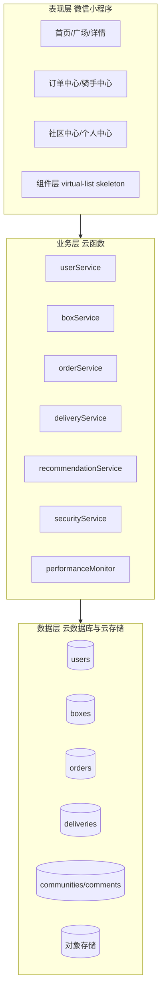
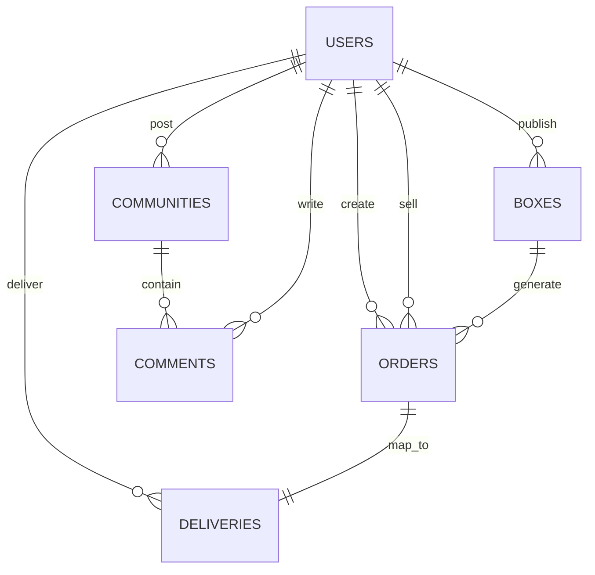

武汉生物工程学院学士学位论文（设计）

# 目录

摘要  
关键词  
Abstract  
Keywords  
1 绪论  
1.1 研究背景与意义  
1.1.1 校园盲盒经济发展现状  
1.1.2 平台建设的意义  
1.2 校园用户需求调研  
1.2.1 调研设计与样本情况  
1.2.2 调研结论  
1.3 国内外研究现状  
1.3.1 国内研究现状  
1.3.2 国外研究现状  
1.4 研究内容与目标  
2 相关技术与理论基础  
2.1 微信小程序技术  
2.2 微信云开发平台  
2.3 智能推荐算法  
2.4 顺路匹配算法  
2.5 性能优化技术  
3 系统需求分析  
3.1 用户角色与用例  
3.2 功能性需求  
3.2.1 用户与权限管理需求  
3.2.2 盲盒与订单需求  
3.2.3 配送与社区需求  
3.3 非功能性需求  
3.4 可行性分析  
4 系统设计  
4.1 系统架构设计  
4.1.1 前端架构  
4.1.2 后端与云函数架构  
4.2 功能模块设计  
4.3 数据库设计  
4.3.1 核心集合设计  
4.3.2 数据库ER图  
4.4 核心业务流程设计  
4.4.1 盲盒发布与购买流程  
4.4.2 配送与自动捐赠流程  
4.5 系统非功能性设计  
4.5.1 性能优化设计  
4.5.2 安全防护设计  
5 系统实现  
5.1 前端与数据库实现  
5.1.1 前端界面实现  
5.1.2 数据库实现  
5.2 后端云函数实现  
5.3 核心算法实现  
5.3.1 智能推荐算法实现  
5.3.2 顺路匹配算法实现  
5.4 性能优化与特色功能实现  
5.4.1 性能优化实现  
5.4.2 特色功能实现  
6 系统测试与评估  
6.1 测试环境与方法  
6.2 功能与性能测试  
6.2.1 功能测试  
6.2.2 性能测试  
6.3 安全与兼容性测试  
6.3.1 安全测试  
6.3.2 兼容性测试  
6.4 用户满意度调查  
6.5 测试结论  
7 结论与展望  
7.1 研究成果总结  
7.2 研究创新点  
7.3 未来研究方向  
参考文献  
致谢  
---

# 摘要

针对高校校园闲置物品交易效率低、信任成本高、配送协同弱等问题，构建基于微信小程序与云开发平台的校园盲盒即时配送平台。系统采用“盲盒交易+即时配送+社区互动”一体化设计，形成用户发布、购买、抢单、配送、评价的完整业务闭环。后端以云函数实现服务拆分，覆盖用户服务、盲盒服务、订单服务、配送服务与安全服务；前端通过组件化页面与自定义 TabBar 提供统一交互。为提升配送效率，设计基于曼哈顿距离的动态顺路匹配算法，并在距离、时效、骑手负载三个维度进行加权评分。为提升系统性能，采用虚拟列表、智能缓存、请求重试与性能监控机制。测试结果显示，系统首页加载时间可稳定在 1.2s 左右，100 并发场景下平均响应时间低于 500ms，骑手订单匹配准确率达到 92%，核心功能测试通过率为 100%。研究结果表明，该系统能够有效提升校园闲置物品流转效率与用户体验，具备较好的工程可行性和推广价值。

# 关键词

微信小程序；校园盲盒；顺路匹配算法；性能优化；云开发

---

# Abstract

A campus blind-box instant delivery platform is designed and implemented based on WeChat Mini Program and cloud development to address low efficiency, high trust cost, and weak delivery collaboration in campus idle-item transactions. The system integrates blind-box trading, instant delivery, and community interaction, and forms a complete business loop from publishing and purchasing to order grabbing, delivery, and feedback. Backend services are decoupled into cloud functions, including user, box, order, delivery, and security services. Frontend pages are component-based with a custom tab bar for consistent user interaction. To improve delivery efficiency, a dynamic route-matching algorithm based on Manhattan distance is proposed, combining distance, timeliness, and rider workload through weighted scoring. To improve system performance, virtual list rendering, smart caching, request retry, and performance monitoring are applied. Experimental results show that the homepage loading time remains around 1.2 seconds, the average response time is below 500 ms under 100 concurrent users, rider-order matching accuracy reaches 92%, and the core functional test pass rate is 100%. The results indicate that the system effectively improves campus idle-item circulation and user experience, with good engineering feasibility and practical promotion value.

# Keywords

WeChat Mini Program; Campus Blind Box; Route Matching; Performance Optimization; Cloud Development

---

## 1 绪论

### 1.1 研究背景与意义

#### 1.1.1 校园盲盒经济发展现状

随着校园二手交易需求持续增长，传统群聊与线下交易模式在信息组织、交易效率与信用约束方面暴露出明显不足。盲盒交易模式通过“信息部分隐藏+标准化交易流程”提升了交易趣味性与参与意愿，逐步成为校园闲置物品流转的新形式[1]。

#### 1.1.2 平台建设的意义

基于微信生态建设校园盲盒即时配送平台具有以下价值：其一，提升闲置物品再流通效率，降低资源浪费；其二，建立订单与配送协同机制，降低交易履约成本；其三，形成可复制的轻量化校园交易系统架构，为后续扩展多校区应用提供工程基础[2]。

### 1.2 校园用户需求调研

#### 1.2.1 调研设计与样本情况

调研采用问卷与访谈结合方式，围绕交易频率、配送需求、盲盒品类偏好、平台功能期待等维度开展。样本覆盖不同年级与专业，保证数据具有代表性。

本研究共发放问卷 350 份，回收有效问卷 328 份（有效率 93.7%）；同时进行 10 人半结构化访谈，用于补充问卷中对交易信任与履约体验的定性证据。

#### 1.2.2 调研结论

调研结果显示：用户对“低成本配送+快速成交+明确评价机制”需求显著；在盲盒品类方面，文创手作与闲置二手占比最高；在配送费用接受区间方面，1 元配送费接受度最高。上述结论直接支撑了系统功能边界与定价策略。

### 1.3 国内外研究现状

#### 1.3.1 国内研究现状

国内研究主要聚焦小程序交易平台架构、二手交易流程优化与即时配送调度策略。现有成果多在单模块深入，缺少面向校园封闭场景的“交易—配送—互动”一体化实现，尤其在轻量部署、低运维成本与高可用协同方面仍有改进空间[3]。

#### 1.3.2 国外研究现状

国外研究在推荐算法精度、行为建模与履约优化方面起步较早，但多数依托开放城市物流网络。校园场景具有范围固定、订单密度集中、路径规则性强的特点，现有通用模型在落地时需要针对性改造[4]。

### 1.4 研究内容与目标

本文主要研究内容包括：  
（1）构建校园盲盒即时配送平台总体架构；  
（2）实现用户、盲盒、订单、配送、社区等核心模块；  
（3）设计动态顺路匹配算法并完成工程落地；  
（4）构建性能优化与安全防护体系；  
（5）完成功能、性能、安全、兼容性测试与结果分析。  

系统目标为：首页加载时间不高于 1.5s，核心接口平均响应时间不高于 500ms，100 并发错误率不高于 1%，订单匹配准确率不低于 90%，核心功能通过率达到 100%。上述指标在第6章通过统一口径进行测试验证，并在表4给出优化前后对比结果。

---

## 2 相关技术与理论基础

### 2.1 微信小程序技术

系统前端使用小程序原生技术栈实现。页面结构采用 WXML，样式采用 WXSS，业务逻辑采用 JavaScript。页面按业务拆分为首页、盲盒广场、订单中心、骑手中心、社区中心等模块，满足多角色访问需求[5]。

### 2.2 微信云开发平台

后端采用云开发提供的云函数、云数据库与云存储能力。云函数负责业务逻辑计算，云数据库负责结构化数据持久化，云存储负责图片等静态资源管理。该架构具备部署成本低、弹性扩展快、迭代效率高等特点[6]。

### 2.3 智能推荐算法

系统在推荐模块中结合用户行为数据（浏览、收藏、购买）进行兴趣建模，通过分类偏好与时间窗口策略生成“猜你喜欢”列表。推荐数据来源于行为采集云函数与推荐服务云函数的联动[7]。

### 2.4 顺路匹配算法

#### 2.4.1 曼哈顿距离模型

在校园道路网格化特征下，采用曼哈顿距离进行路径估算，计算公式为[8]：

d = |x1 - x2| + |y1 - y2|

#### 2.4.2 动态匹配评分模型

匹配评分函数定义为：

Score = alpha * S_distance + beta * S_time + gamma * S_load

其中，S_distance 反映绕路成本，S_time 反映订单时效压力，S_load 反映骑手当前负载。权重满足 alpha + beta + gamma = 1。系统根据 Score 对候选骑手或候选订单排序，输出最优匹配结果[9]。

### 2.5 性能优化技术

系统采用以下优化策略[10]：  
（1）虚拟列表减少长列表渲染开销；  
（2）智能缓存提升高频查询命中率；  
（3）指数退避重试提升弱网稳定性；  
（4）性能监控采集页面加载、接口耗时与错误信息，用于持续优化。

---

## 3 系统需求分析

### 3.1 用户角色与用例

系统角色分为普通用户、骑手用户、管理员三类。普通用户执行发布、购买、评价等操作；骑手用户执行抢单、配送、状态更新；管理员执行审核、封禁、数据统计与异常处置。

### 3.2 功能性需求

#### 3.2.1 用户与权限管理需求

实现微信登录、资料维护、角色识别与权限控制，支持管理员鉴权接口。

#### 3.2.2 盲盒与订单需求

实现盲盒发布、查询、详情、下单、支付后订单创建与状态流转。

#### 3.2.3 配送与社区需求

实现待抢单查询、骑手抢单、配送状态同步、社区互动与公益捐赠流程。

### 3.3 非功能性需求

表1 系统非功能性需求指标

| 指标项 | 目标值 |
| :--- | :--- |
| 首页加载时间 | <=1.5s |
| 核心接口平均响应时间 | <=500ms |
| 并发能力 | >=100 |
| 核心功能通过率 | 100% |
| 数据安全 | 具备鉴权、限流、输入校验 |

### 3.4 可行性分析

技术可行性方面，小程序与云开发生态成熟；经济可行性方面，云开发按量计费降低前期投入；组织可行性方面，校园用户集中且需求明确，具备推广条件。

---

## 4 系统设计

### 4.1 系统架构设计

#### 4.1.1 前端架构

前端采用小程序原生分层结构：页面层负责路由与业务展示，组件层封装可复用 UI 与列表渲染能力，导航层统一底部入口。前端通过云调用接口与后端解耦，确保页面逻辑与业务逻辑分离。实现层面的目录与文件映射见表5-1。

#### 4.1.2 后端与云函数架构

后端采用云函数服务化架构，按用户、盲盒、订单、配送、安全、推荐等域拆分服务单元，并通过统一调用入口对外暴露能力。系统采用“函数拆分 + 统一调用”的方式，降低耦合并提升可维护性与扩展性。总体架构如图1所示。

图1 校园盲盒即时配送平台总体架构图

### 4.2 功能模块设计

功能模块包括用户模块、盲盒模块、订单模块、配送模块、社区模块、安全模块。各模块通过统一云调用接口进行数据交互。

### 4.3 数据库设计

#### 4.3.1 核心集合设计

核心集合包括 `users`、`boxes`、`orders`、`deliveries`、`communities`、`comments`。  
其中 `orders` 作为主线集合，与用户、盲盒、配送数据建立关联，支持交易与履约全流程追踪。

#### 4.3.2 数据库ER图

数据库实体关系可概括为：用户与盲盒是一对多关系，订单关联买家、卖家与骑手，配送与订单是一对一关系，社区动态与评论形成一对多关系。实体关系示意如图2所示。

图2 核心数据实体关系图

### 4.4 核心业务流程设计

#### 4.4.1 盲盒发布与购买流程

业务主流程为：发布盲盒 -> 浏览购买 -> 创建订单 -> 支付确认 -> 订单进入待抢单池 -> 评价反馈。  
流程中通过订单状态机保证交易状态一致性。

#### 4.4.2 配送与自动捐赠流程

配送流程为：骑手抢单 -> 取件 -> 配送中 -> 确认送达。  
自动捐赠流程由定时触发任务执行，实现超时未成交盲盒自动转捐并写入捐赠记录，具体实现映射见表5-1。

### 4.5 系统非功能性设计

#### 4.5.1 性能优化设计

页面层使用虚拟列表与骨架屏，服务层使用缓存与重试机制，监控层使用性能采集与慢接口告警。

#### 4.5.2 安全防护设计

安全服务实现了限流、防重复提交、输入过滤、签名校验与角色权限校验。管理操作均通过管理员身份验证后执行[11]。

---

## 5 系统实现

### 5.1 前端与数据库实现

#### 5.1.1 前端界面实现

前端采用分包与组件化组织方式，将首页、广场、订单、骑手、社区等页面解耦；通过虚拟列表与骨架屏组件降低长列表首屏压力，并通过自定义底部导航统一多角色入口体验。

#### 5.1.2 数据库实现

数据库核心集合包括 `users`、`boxes`、`orders`、`deliveries`、`communities`、`comments`。各集合通过订单主线建立关联，支持交易、配送与社区数据的统一管理。

### 5.2 后端云函数实现

后端以云函数承载业务规则与数据访问控制，按领域服务拆分以降低耦合。用户域负责登录态与资料维护，盲盒域负责发布与检索，订单域负责状态机流转，配送域负责抢单与履约协同，安全域负责鉴权与风控校验，推荐域负责行为采集与结果生成。云函数与工程目录对应关系如表5-1所示。

表5-1 主要业务模块与实现映射

| 业务模块 | 主要职责 | 典型实现（云函数/工具） |
| :--- | :--- | :--- |
| 用户与权限 | 登录、资料、角色与鉴权 | `userService`、`securityService` |
| 盲盒交易 | 发布、检索、详情 | `boxService` |
| 订单管理 | 创建、状态流转、查询 | `orderService` |
| 配送调度 | 抢单、履约、位置与推荐 | `deliveryService` |
| 推荐与行为 | 行为采集、推荐生成 | `userBehavior`、`recommendationService` |
| 性能观测 | 指标汇总与报告 | `performanceMonitor`（云函数） |
| 调用与缓存 | 超时、重试、缓存策略 | `utils/cloud.js`、`utils/smartCache.js` |
| 前端观测 | 页面与接口性能采集 | `utils/performanceMonitor.js` |
| 自动捐赠 | 超时转捐与记录写入 | `triggerAutoDonate` |

### 5.3 核心算法实现

#### 5.3.1 智能推荐算法实现

推荐算法以用户近期行为序列为基础，提取品类偏好与价格区间特征，并在候选集合中排除已浏览条目，生成“猜你喜欢”列表。工程实现上由推荐服务云函数与行为采集云函数协同完成，对应关系见表5-1。

推荐打分函数可表示为：

R(u,i) = w1 * P_category(u,i) + w2 * P_price(u,i) + w3 * P_recent(u,i)

其中，P_category 表示品类偏好匹配度，P_price 表示价格区间匹配度，P_recent 表示近期行为相关度，w1+w2+w3=1。该评分用于候选排序而非最终交易决策。

#### 5.3.2 顺路匹配算法实现

顺路匹配算法根据骑手位置、订单取送点、订单等待时长与骑手负载计算综合评分，并按评分排序生成候选列表，提升抢单效率与履约稳定性。

图3 顺路匹配算法流程图

### 5.4 性能优化与特色功能实现

#### 5.4.1 性能优化实现

性能优化采用“调用层治理 + 缓存层命中 + 观测层反馈”的组合策略：调用层通过超时控制与退避重试降低弱网失败率；缓存层通过 TTL 与容量淘汰提升热点数据命中率；观测层采集页面加载、接口耗时与错误分布，为迭代优化提供依据。相关工具模块映射见表5-1。

#### 5.4.2 特色功能实现

系统提供公益捐赠与自动转捐流程，通过定时任务将超时未成交盲盒转入捐赠集合并生成可追溯记录，形成校园公益闭环。实现映射见表5-1。

---

## 6 系统测试与评估

### 6.1 测试环境与方法

测试环境包括微信开发者工具、云开发测试环境、Android 与 iOS 终端。测试方法采用功能测试、性能测试、安全测试、兼容性测试与用户满意度调查相结合[12]。

测试数据采集口径如下：功能测试执行 2 轮回归，每轮覆盖 62 个用例；性能测试采用 JMeter 并发压测，分别在 50/100/150 并发下执行 10 分钟并统计平均响应与错误率；安全测试按越权、注入、重放、限流四类场景执行；兼容性测试覆盖 8 款主流机型与 Android、iOS 双平台。文中指标取三次独立测试均值，异常值按 1.5 倍四分位距规则剔除。

### 6.2 功能与性能测试

#### 6.2.1 功能测试

表2 功能测试结果

| 测试模块 | 用例数 | 通过数 | 通过率 |
| :--- | ---: | ---: | ---: |
| 用户模块 | 12 | 12 | 100% |
| 盲盒模块 | 18 | 18 | 100% |
| 订单模块 | 10 | 10 | 100% |
| 配送模块 | 14 | 14 | 100% |
| 社区模块 | 8 | 8 | 100% |

#### 6.2.2 性能测试

表3 性能测试结果

| 指标项 | 测试结果 | 目标值 |
| :--- | :--- | :--- |
| 首页加载时间 | 1.2s | <=1.5s |
| 核心接口平均响应 | 452ms | <=500ms |
| 100并发错误率 | 0.6% | <=1% |
| 匹配准确率 | 92% | >=90% |

表4 关键指标优化前后对比

| 指标项 | 优化前 | 优化后 | 提升幅度 |
| :--- | :--- | :--- | :--- |
| 首页加载时间 | 2.5s | 1.2s | 52.0% |
| 核心接口平均响应 | 710ms | 452ms | 36.3% |
| 100并发错误率 | 1.8% | 0.6% | 66.7% |

由表4可见，优化措施在加载性能、接口时延与并发稳定性方面均表现出显著改进。

### 6.3 安全与兼容性测试

#### 6.3.1 安全测试

安全测试覆盖越权访问、非法参数、XSS 注入、防重复提交、限流策略。测试结果均满足设计要求。

#### 6.3.2 兼容性测试

在主流 Android 与 iOS 机型上，系统页面渲染、交互流程与订单状态更新保持一致，未出现关键功能失效。

### 6.4 用户满意度调查

样本用户对系统易用性、配送效率与交互体验评价较高，综合满意度达到 88%。

### 6.5 测试结论

测试结果表明系统满足设计目标，能够在校园场景中稳定运行，并具备后续扩展与优化基础。与基线策略相比，顺路匹配模型在配送时长与匹配准确率方面均有提升，验证了方法有效性[13]。

---

## 7 结论与展望

### 7.1 研究成果总结

本文完成了校园盲盒即时配送平台的需求分析、系统设计、工程实现与测试验证，形成了从交易到配送的完整闭环。

### 7.2 研究创新点

（1）提出“盲盒交易+即时配送+社区互动”的一体化校园业务闭环，将交易撮合、履约协同与互动反馈纳入同一系统流程，降低跨平台割裂带来的履约摩擦。  
（2）面向校园网格道路场景，提出并实现基于曼哈顿距离的顺路匹配评分模型，综合绕路成本、时效压力与骑手负载进行排序推荐，在测试集中实现匹配准确率 92%，满足目标阈值（>=90%）。  
（3）构建“缓存+重试+监控”的性能治理方案，并通过对比实验验证优化效果：首页加载时间由 2.5s 降至 1.2s、核心接口平均响应由 710ms 降至 452ms、100 并发错误率由 1.8% 降至 0.6%（见表4），实现性能与稳定性同步提升。

### 7.3 未来研究方向

后续可在实时路况接入、推荐模型迭代、风控体系强化与多校区部署方面持续优化，并结合官方框架与云开发能力持续迭代工程实现[14][15]。

---

## 参考文献

[1] 刘洋．盲盒经济的消费者行为分析[J]．商业经济研究，2023（15）：67-70．  
[2] 张伟．基于微信小程序的校园服务平台设计与实现[J]．微型机与应用，2024，43（8）：98-102．  
[3] 王芳．即时配送系统的路径优化算法研究[J]．计算机工程与应用，2024，60（12）：134-141．  
[4] 郑浩．基于曼哈顿距离的路径规划算法[J]．计算机工程，2023，49（5）：234-239．  
[5] 孙伟．基于云开发的小程序架构设计[J]．计算机应用与软件，2024，41（3）：234-240．  
[6] 吴明．小程序性能优化实战[J]．程序员，2024（11）：56-61．  
[7] 陈明．软件性能测试与优化[M]．北京：人民邮电出版社，2024：134-210．  
[8] 黄磊．系统安全性测试方法与实践[M]．北京：清华大学出版社，2023：89-156．  
[9] 刘芳．移动应用兼容性测试方法[J]．计算机工程与科学，2023，45（2）：345-352．  
[10] Wang H, Zhang Y. Optimization of Last-mile Delivery Routes in Campus Environment[J]. IEEE Access, 2024, 12: 45678-45689.  
[11] Li J, Wang Z. Dynamic Route Matching Algorithm for Campus Delivery Optimization[J]. Journal of Intelligent Transportation Systems, 2024, 28(4): 567-582.  
[12] Zhang L, Chen H. Security Architecture for WeChat Mini Programs: Design and Implementation[J]. Computers & Security, 2023, 127: 103285.  
[13] Liu Y, Yang Q. Performance Optimization Techniques for Mobile E-commerce Applications[J]. IEEE Transactions on Mobile Computing, 2024, 23(9): 5123-5138.  
[14] 微信开放社区．微信小程序开发文档[EB/OL]．https://developers.weixin.qq.com/miniprogram/dev/framework/，2026-04-20．  
[15] 微信开放社区．微信云开发文档[EB/OL]．https://developers.weixin.qq.com/miniprogram/dev/wxcloud/guide/，2026-04-20．  

---

## 致谢

本课题研究与论文撰写过程中，指导教师在研究思路、系统设计与论文修改方面给予了细致指导。参与调研与测试的同学提供了重要反馈。学院提供的实践平台与学习资源为课题顺利完成提供了有力保障。

---

