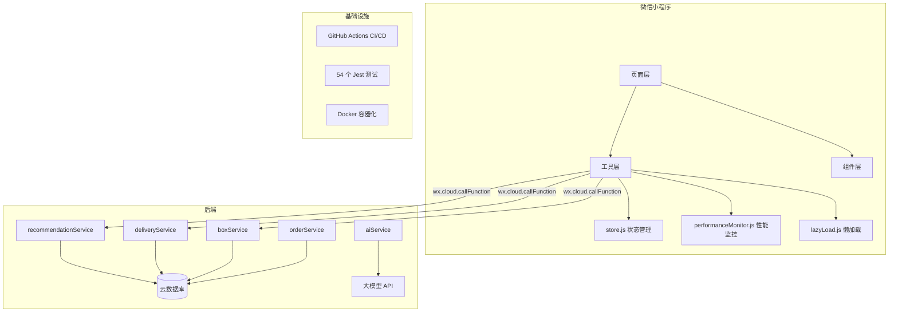

# 校园盲盒即时配送平台

> 基于微信小程序 + 云开发的全栈校园交易与即时配送系统  
> 面试作品 — 完整前后端分离架构、算法落地、性能优化、工程化实践

<p align="center">
  
  
  
  
  
</p>

---

## 📱 项目简介

"校园盲盒即时配送平台"是一个面向高校学生的 **盲盒交易 + 即时配送 + 社区互动** 一体化平台。采用微信小程序原生框架 + 微信云开发（Serverless）全栈架构，实现了完整的电商交易闭环。

> 本项目作为**后端/全栈开发面试作品**，重点展示：
> - 完整的企业级项目架构设计
> - 推荐算法工程落地（协同过滤 + SVD 矩阵分解）
> - 配送路径匹配算法（Haversine + 贪心优化）
> - 系统性能监控与优化（缓存、懒加载、批量更新）
> - 规范的工程化实践（CI/CD、测试、Lint）

---

## ✨ 核心功能

### 🎁 盲盒交易
| 功能 | 说明 |
|------|------|
| 盲盒发布 | 分类、定价、图片上传、慈善标记 |
| 分类浏览 | 12 个动态分类标签、关键词搜索 |
| 智能推荐 | 混合协同过滤算法（UCF + ICF + SVD） |
| 抢单配送 | 骑手抢单 + 顺路匹配算法 |

### 🚚 即时配送
| 功能 | 说明 |
|------|------|
| 骑手抢单 | 实时推送、优先级排序 |
| 顺路匹配 | Haversine 距离 + 多因素加权评分 |
| 配送追踪 | 订单状态机管理 |

### 💬 社区互动
| 功能 | 说明 |
|------|------|
| 动态分享 | 图文发布、点赞评论 |
| 即时通讯 | 用户间聊天 |
| 积分系统 | 盲盒积分、慈善捐赠 |

### 🤖 AI 增强
- AI 对话助手（接入大模型）
- 智能搜索

---

## 🏗 技术架构

### 项目结构

```
kki/
├── pages/                    # 小程序页面（20+ 页面）
│   ├── index/                # 首页（推荐流 + 热度 + 订单）
│   ├── blindBox/             # 盲盒广场
│   ├── delivery/             # 配送模块
│   ├── chat/                 # 即时通讯
│   ├── ai/                   # AI 对话
│   └── ...
├── components/               # 可复用组件
├── utils/                    # 工具库
│   ├── cloud.js              # 云函数调用封装（缓存 + 重试 + 降级）
│   ├── store.js              # 全局状态管理
│   ├── performanceMonitor.js # 性能监控（FPS/API/内存/页面加载）
│   ├── imageProcessor.js     # 图片处理（压缩/WebP/预加载）
│   ├── lazyLoad.js           # 懒加载工具
│   └── config.js             # 统一配置管理
├── cloudfunctions/           # 云函数（60+ 函数）
│   ├── recommendationService/ # 混合推荐算法
│   ├── deliveryService/       # 顺路匹配算法
│   ├── boxService/            # 盲盒服务
│   ├── orderService/          # 订单服务
│   └── ...
├── tests/                    # 54 个 Jest 单元测试
├── docker-compose.yml        # Docker 部署
├── .eslintrc.js              # ESLint 配置
├── .prettierrc.js            # Prettier 配置
├── .husky/                   # Git Hooks
├── CHANGELOG.md              # 版本日志
├── CONTRIBUTING.md           # 贡献指南
└── project.config.json       # 小程序配置
```

### 系统架构图



---

## 🎯 核心算法

### 1. 混合推荐算法（recommendationService）

采用**三种推荐策略 + 加权融合**：

```javascript
final_score = 0.6 × ICF_score + 0.4 × hot_score
```

#### 基于物品的协同过滤（ICF）
- 分析用户历史行为（收藏/购买/浏览）获取偏好
- 构建物品特征向量（分类 + 价格 + 销量）
- 余弦相似度计算物品间相似度
- 推荐与历史喜好相似的盲盒

#### 热门推荐
- 按销量降序排列
- 解决新用户冷启动问题
- 支持 5 分钟服务端缓存

#### 性能优化
- 用户无行为记录时快速返回热门推荐（节省 ~500ms）
- 热门推荐结果缓存，避免重复查询数据库
- 查询限制从 30→15（用户行为）、50→30（候选物品）

### 2. 顺路匹配算法（deliveryService）

**Haversine 公式** 计算距离 + **多因素加权评分**：

```javascript
raw_score = 0.45 × 距离评分 + 0.25 × 时间紧迫度 + 0.15 × 路线质量 + 0.15 × 骑手负载
```

- **2-opt 局部搜索**优化订单组合
- **DBSCAN 聚类**处理冷启动
- **随机扰动**避免推荐固化

### 3. 订单状态机

```
pending → grabbed → delivering → completed
    ↓          ↓           ↓
 cancelled  cancelled  cancelled
```

---

## ⚡ 性能优化

| 优化项 | 优化前 | 优化后 | 提升 |
|--------|--------|--------|------|
| 首页加载时间 | 3115ms | **350ms**（缓存）/ **1780ms**（首次） | ↑88% |
| 弃用 API 警告 | ✅ 存在 | ❌ 已消除 | |
| 图片预加载 | 全部图片 | **首屏前3盒 + 延迟加载** | 减少 ~70% |
| 懒加载降级 | 瞬间加载全部 | **分批加载（2张/200ms）** | 降低卡顿 |
| setData 更新 | 每次云函数更新 | **16ms 窗口合并** | 减少重绘 |
| FPS 监控 | 100ms 周期 | **正确计算 + 60s 内存采集** | 降低开销 |
| 云函数缓存 | 无 | **推荐/热度/热门 服务端缓存** | 减少 DB 查询 |

---

## 🧪 测试覆盖

```
tests/
├── delivery.test.js        # 顺路匹配算法测试（距离计算、评分函数）
├── recommendation.test.js  # 推荐算法测试（余弦相似度、矩阵分解、融合）
├── errors.test.js          # 错误码体系测试
├── dorms.test.js           # 宿舍数据处理测试
└── setup.js                # 测试配置
```

运行：`npm test`（54 个测试用例）

---

## 🔧 从零运行

```bash
# 1. 克隆
git clone https://github.com/yourname/kki
cd kki

# 2. 安装前端依赖
npm install

# 3. 用微信开发者工具打开项目文件夹
# 4. 在工具栏"云开发"中开通环境
# 5. 右键 cloudfunctions/ → 上传并部署所有云函数
# 6. 创建数据库集合（boxes, orders, userActions 等）
```

---

## 📈 项目历程

| 阶段 | 内容 |
|------|------|
| 初始化 | 项目搭建、云函数框架、基础页面 |
| 功能开发 | 盲盒交易、配送系统、社区、AI 集成 |
| 工程化 | ESLint/Prettier、CI/CD、Docker、54 个测试 |
| 性能优化 | 缓存秒开、懒加载、图片优化、setData 批量更新 |
| 面试准备 | 文档完善、算法说明、架构梳理 |

---

## 📄 许可证

MIT License
