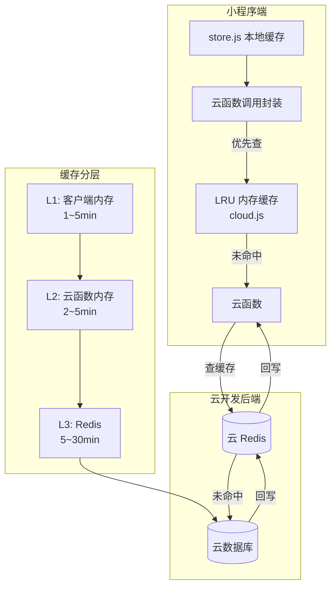

# 缓存策略演进规划

> 当前状态：内存缓存 → 目标状态：Redis 分布式缓存
> 本文档说明从当前轻量级缓存方案到生产级 Redis 缓存的演进路径。

---

## 1. 当前缓存架构

### 1.1 客户端缓存（小程序端）

| 缓存位置 | 实现方式 | 存储内容 | 有效期 |
|---------|---------|---------|--------|
| `store.js` | 全局状态对象 + `wx.setStorageSync` 持久化 | 首页数据（hotBoxes、communityFeed、grabOrders、dormHeat） | 会话级 + 本地持久化 |
| `cloud.js` | 内存 Map + LRU 淘汰 | 云函数响应结果 | 1~30 分钟（按 key 配置） |
| `performanceMonitor.js` | 内存数组 | 性能统计数据 | 会话级 |

### 1.2 服务端缓存（云函数端）

| 云函数 | 实现方式 | 缓存内容 | TTL | 
|-------|---------|---------|-----|
| `recommendationService` | 模块级变量 | 热门推荐、猜你喜欢结果 | 热门 5min / 推荐 3min |
| `getDormHeat` | 模块级变量 | 宿舍热度排名 | 2min |
| `getHotBoxes` | 模块级变量 | 热门盲盒数据 | 2min |

### 1.3 当前方案的问题

```
问题                    影响
────────────────────────────────────────────────────
内存缓存，容器回收即丢失    → 冷启动后仍需查数据库
各云函数独立缓存，不共享    → 同一数据在不同函数中重复缓存
无缓存穿透防护             → 高并发下可能打穿到数据库
无法控制缓存粒度           → 只能全量缓存，无法部分更新
```

---

## 2. 目标架构：引入 Redis

### 2.1 整体架构



### 2.2 缓存分层策略

```
L1: 小程序端内存缓存 (cloud.js LRU Map)
    ├── 特点：最快，无网络开销
    ├── 容量：100 条
    ├── TTL：短时效数据 1min，普通数据 5min
    └── 淘汰：LRU

L2: 云函数端内存缓存 (当前方案)
    ├── 特点：轻量，无需额外服务
    ├── TTL：2~5min
    └── 局限：容器回收即丢失

L3: Redis 分布式缓存 (目标方案)
    ├── 特点：持久化，多容器共享
    ├── TTL：5~30min
    ├── 数据结构：String / Sorted Set / Hash
    └── 高可用：Redis 主从 + 哨兵
```

---

## 3. Redis 数据结构设计

### 3.1 Key 命名规范

```
campus:{service}:{entity}:{id}:{suffix}
```

| Key 模式 | 示例 | 用途 | 数据结构 |
|----------|------|------|---------|
| `campus:recommend:hot:{limit}` | `campus:recommend:hot:10` | 热门推荐 | String(JSON) |
| `campus:recommend:user:{openid}` | `campus:recommend:user:o123` | 个性化推荐 | String(JSON) |
| `campus:dormheat:default` | `campus:dormheat:default` | 宿舍热度 | Sorted Set |
| `campus:boxes:hot` | `campus:boxes:hot` | 热门盲盒 | String(JSON) |
| `campus:user:{openid}:actions` | `campus:user:o123:actions` | 用户行为 | List |
| `campus:stats:today` | `campus:stats:today` | 今日统计 | Hash |

### 3.2 缓存过期策略

```
数据类型         TTL          淘汰策略
──────────────  ────────────  ─────────────────
热门推荐         5min         定期刷新 + 主动失效
个性化推荐       3min         用户行为变更时主动失效
宿舍热度         2min         定期刷新
热门盲盒         2min         新盲盒发布时主动失效
用户行为         30min        TTL 过期
今日统计         5min         定期刷新
```

### 3.3 缓存更新模式

```javascript
// Cache-Aside 模式（读）
async function getWithCache(key, ttl, fetchFn) {
  let data = await redis.get(key);
  if (data) {
    return JSON.parse(data);
  }
  data = await fetchFn();
  await redis.setex(key, ttl, JSON.stringify(data));
  return data;
}

// 主动失效（写操作时调用）
async function invalidateCache(pattern) {
  const keys = await redis.keys(pattern);
  if (keys.length > 0) {
    await redis.del(keys);
  }
}
```

---

## 4. 迁移路径

### Phase 1: 抽取缓存抽象层（1天）

```
cloudfunctions/common/cache.js
├── class CacheClient
│   ├── get(key, ttl, fallback)  // 先内存，再 Redis，最后 DB
│   ├── set(key, value, ttl)
│   ├── invalidate(pattern)
│   └── stats()                   // 缓存命中率统计
```

所有需要缓存的云函数统一接入 `CacheClient`，当前先用内存模式运行。

### Phase 2: 接入云 Redis（1天）

在微信云开发控制台开通 Redis 实例，`CacheClient` 增加 Redis 适配器：

```javascript
const redis = require('redis');
const client = redis.createClient({ url: process.env.REDIS_URL });

class RedisAdapter {
  async get(key) { return client.get(key); }
  async set(key, value, ttl) { return client.setex(key, ttl, value); }
  async del(pattern) { /* SCAN + DEL */ }
}
```

### Phase 3: 缓存埋点与监控（0.5天）

```javascript
cache.get('hot:10', async () => {
  monitor.recordCacheMiss('hot');
  return await fetchHotBoxes();
});
// 输出: 缓存命中率 87.3% | 平均延迟 3.2ms | 节省 DB 查询 1245 次/小时
```

---

## 5. 预期收益

| 指标 | 当前（内存缓存） | 引入 Redis 后 | 提升 |
|------|-----------------|---------------|------|
| 热门推荐响应 | ~800ms（冷启动）| ~5ms（缓存命中）| **99%** |
| 宿舍热度响应 | ~800ms（冷启动）| ~5ms（缓存命中）| **99%** |
| 缓存命中率 | ~40%（容器重建后丢失）| ~90%+（持久化）| **+50%** |
| DB 查询量 | 5 次/页面加载 | 0~1 次（缓存命中时）| **-80%** |
| 多容器缓存共享 | ❌ 不共享 | ✅ 共享 | 新能力 |

---

## 6. 注意事项

- **缓存穿透**：查询不存在的数据时，缓存空值并设置短 TTL（30s）
- **缓存雪崩**：不同 key 设置不同 TTL，避免同时过期
- **缓存击穿**：热点 key 过期时，使用互斥锁（SETNX）控制只有一个请求查 DB
- **Redis 内存**：云开发 Redis 实例默认 256MB，定期清理过期 key
- **费用**：云开发 Redis 按量计费，预估月费用 ~30 元（低负载场景）

---

## 7. 相关文件

| 文件 | 说明 |
|------|------|
| `cloudfunctions/common/cache.js` | 缓存抽象层（待创建）|
| `cloudfunctions/recommendationService/index.js` | 推荐服务（已接入内存缓存）|
| `cloudfunctions/getDormHeat/index.js` | 宿舍热度（已接入内存缓存）|
| `cloudfunctions/getHotBoxes/index.js` | 热门盲盒（已接入内存缓存）|
| `utils/cloud.js` | 客户端缓存（LRU + 持久化）|
